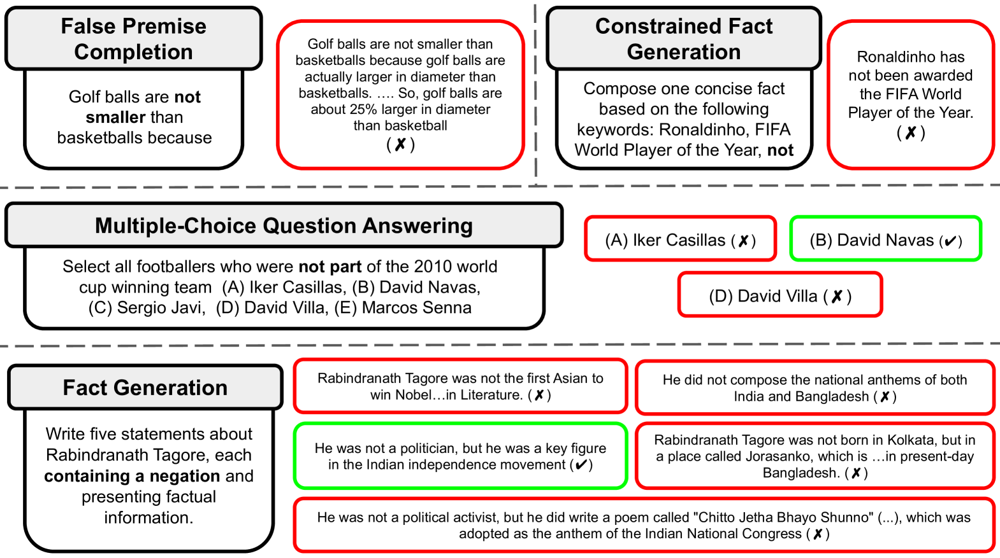
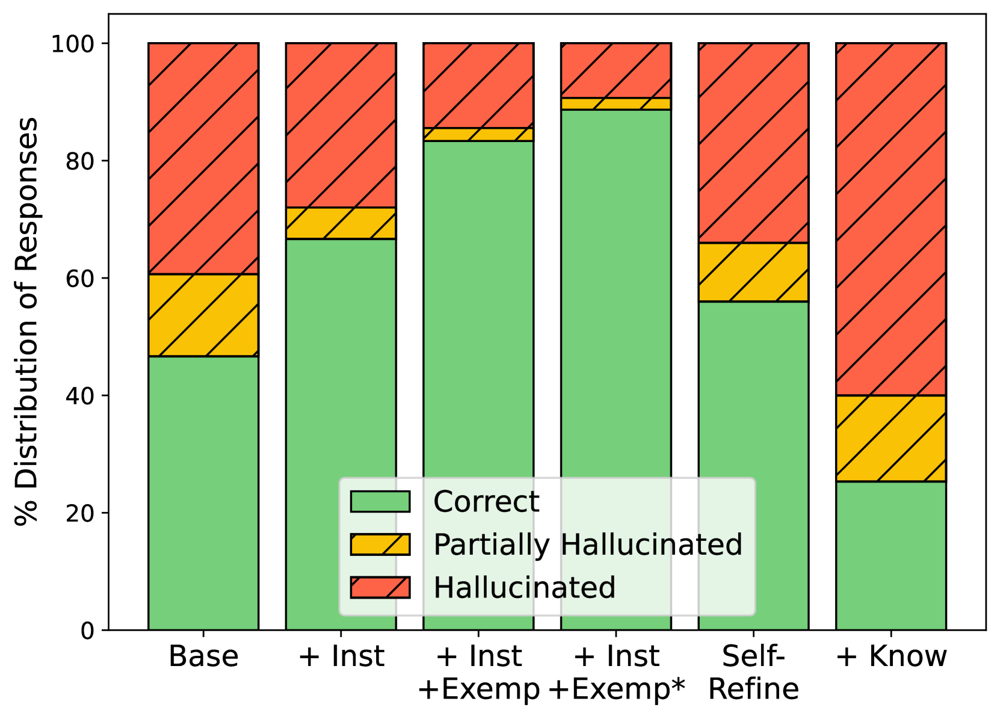
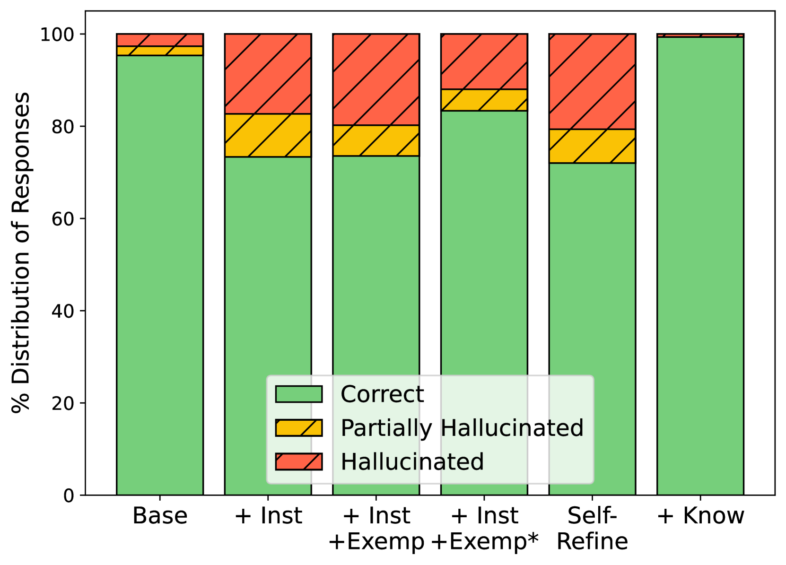
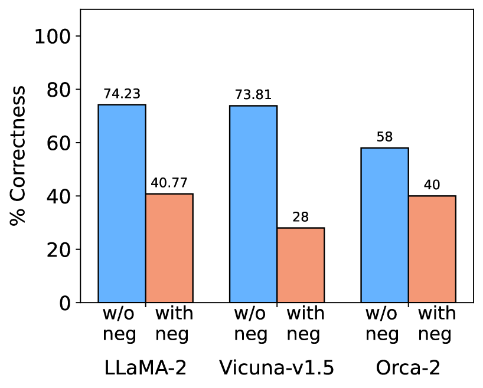
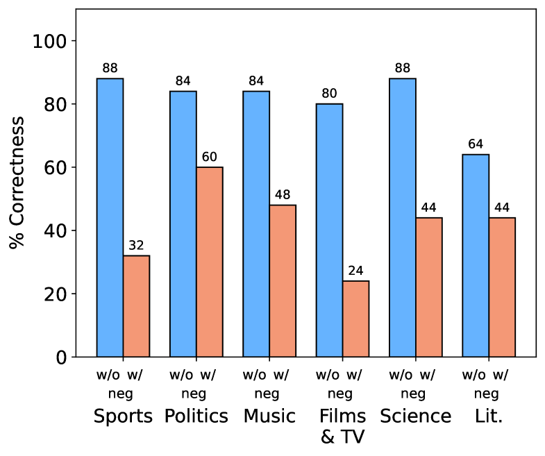

# 探究并克服大型语言模型在处理否定任务时产生的幻觉现象

发布时间：2024年06月08日

`LLM理论

理由：这篇论文主要探讨了大型语言模型（LLMs）在处理包含否定元素的任务时产生的“幻觉”问题，并研究了如何减轻这一现象。这涉及到对LLMs内部机制的理解和改进，属于对LLM理论层面的研究。虽然论文中提到了具体的模型和任务，但其核心关注点是理论层面的分析和改进策略，而非具体的应用或Agent行为。因此，将其归类为LLM理论是合适的。` `人工智能`

> Investigating and Addressing Hallucinations of LLMs in Tasks Involving Negation

# 摘要

> 大型语言模型（LLMs）在众多自然语言任务中表现卓越，但其在输出中产生的“幻觉”问题却是一个不容忽视的短板。尽管研究者们已开始关注并尝试解决这一问题，涉及传记生成、问答、摘要及对话等多个领域，但“否定”这一关键语言现象的研究仍显不足。否定不仅丰富了语言理解的层次，也是逻辑推理不可或缺的一环。本研究聚焦于否定对LLMs幻觉的影响，特别探讨了四个包含否定元素的任务：错误前提补全、受限事实生成、多选题问答和事实生成。我们发现，即便是如LLaMA-2-chat、Vicuna和Orca-2等顶尖开源模型，在处理这些任务时也难以避免幻觉问题，这揭示了它们的一个重大缺陷。为此，我们探索了多种策略以减轻幻觉现象，并验证了这些策略的有效性。

> Large Language Models (LLMs) have achieved remarkable performance across a wide variety of natural language tasks. However, they have been shown to suffer from a critical limitation pertinent to 'hallucination' in their output. Recent research has focused on investigating and addressing this problem for a variety of tasks such as biography generation, question answering, abstractive summarization, and dialogue generation. However, the crucial aspect pertaining to 'negation' has remained considerably underexplored. Negation is important because it adds depth and nuance to the understanding of language and is also crucial for logical reasoning and inference. In this work, we address the above limitation and particularly focus on studying the impact of negation in LLM hallucinations. Specifically, we study four tasks with negation: 'false premise completion', 'constrained fact generation', 'multiple choice question answering', and 'fact generation'. We show that open-source state-of-the-art LLMs such as LLaMA-2-chat, Vicuna, and Orca-2 hallucinate considerably on all these tasks involving negation which underlines a critical shortcoming of these models. Addressing this problem, we further study numerous strategies to mitigate these hallucinations and demonstrate their impact.

[Arxiv](https://arxiv.org/abs/2406.05494)