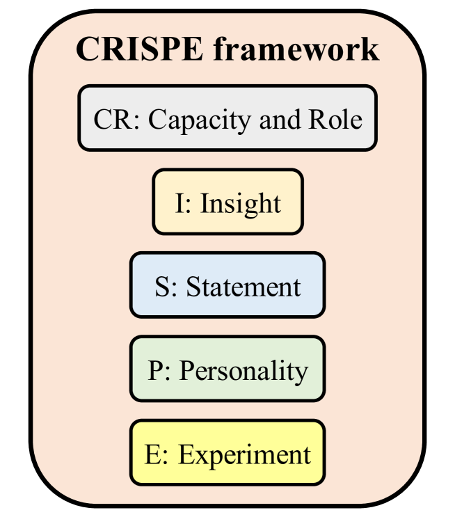
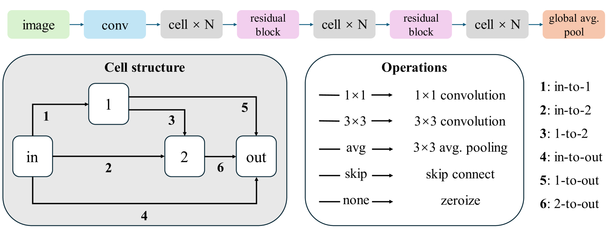
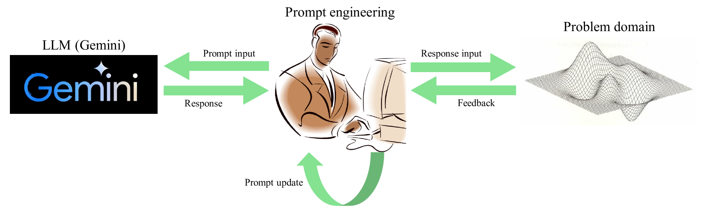
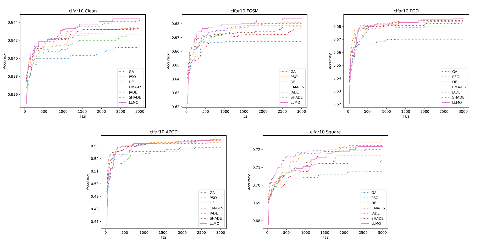
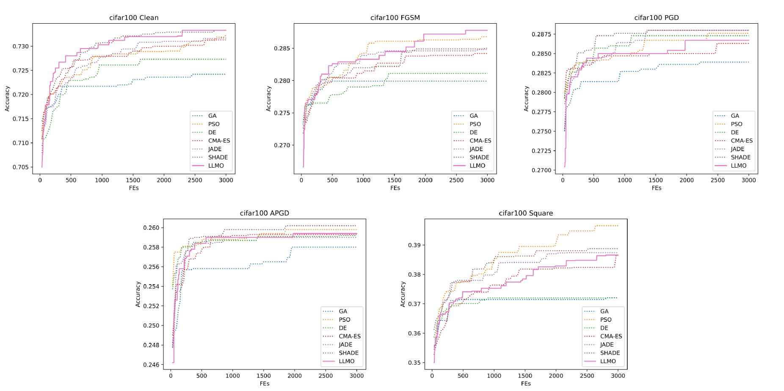

# 借助大型语言模型的对抗鲁棒性神经架构搜索

发布时间：2024年06月08日

`LLM应用

理由：这篇论文介绍了如何利用大型语言模型（LLMs）如Google的Gemini来辅助解决组合优化问题，特别是在对抗性鲁棒性神经架构搜索（ARNAS）领域。论文通过实验展示了LLMs在组合优化领域的应用潜力，并公开了研究代码。这表明论文主要关注的是LLMs在实际问题解决中的应用，而不是理论研究或Agent的设计，因此最适合归类为LLM应用。` `人工智能` `神经网络`

> Large Language Model Assisted Adversarial Robustness Neural Architecture Search

# 摘要

> 本文受大型语言模型（LLMs）在解决组合优化问题上的潜力启发，提出了一种创新的LLM辅助优化器（LLMO），专门用于对抗性鲁棒性神经架构搜索（ARNAS）。我们采用Google的强大LLM——Gemini，并利用CRISPE框架设计提示，通过迭代优化提示，将Gemini的反馈转化为ARNAS问题的解决方案。实验在CIFAR-10和CIFAR-100数据集上进行，对比了六种元启发式算法，包括GA、PSO、DE等。结果显示LLMO具有竞争力，并展示了LLMs在组合优化领域的巨大潜力。研究代码已公开于\url{https://github.com/RuiZhong961230/LLMO}。

> Motivated by the potential of large language models (LLMs) as optimizers for solving combinatorial optimization problems, this paper proposes a novel LLM-assisted optimizer (LLMO) to address adversarial robustness neural architecture search (ARNAS), a specific application of combinatorial optimization. We design the prompt using the standard CRISPE framework (i.e., Capacity and Role, Insight, Statement, Personality, and Experiment). In this study, we employ Gemini, a powerful LLM developed by Google. We iteratively refine the prompt, and the responses from Gemini are adapted as solutions to ARNAS instances. Numerical experiments are conducted on NAS-Bench-201-based ARNAS tasks with CIFAR-10 and CIFAR-100 datasets. Six well-known meta-heuristic algorithms (MHAs) including genetic algorithm (GA), particle swarm optimization (PSO), differential evolution (DE), and its variants serve as baselines. The experimental results confirm the competitiveness of the proposed LLMO and highlight the potential of LLMs as effective combinatorial optimizers. The source code of this research can be downloaded from \url{https://github.com/RuiZhong961230/LLMO}.

[Arxiv](https://arxiv.org/abs/2406.05433)