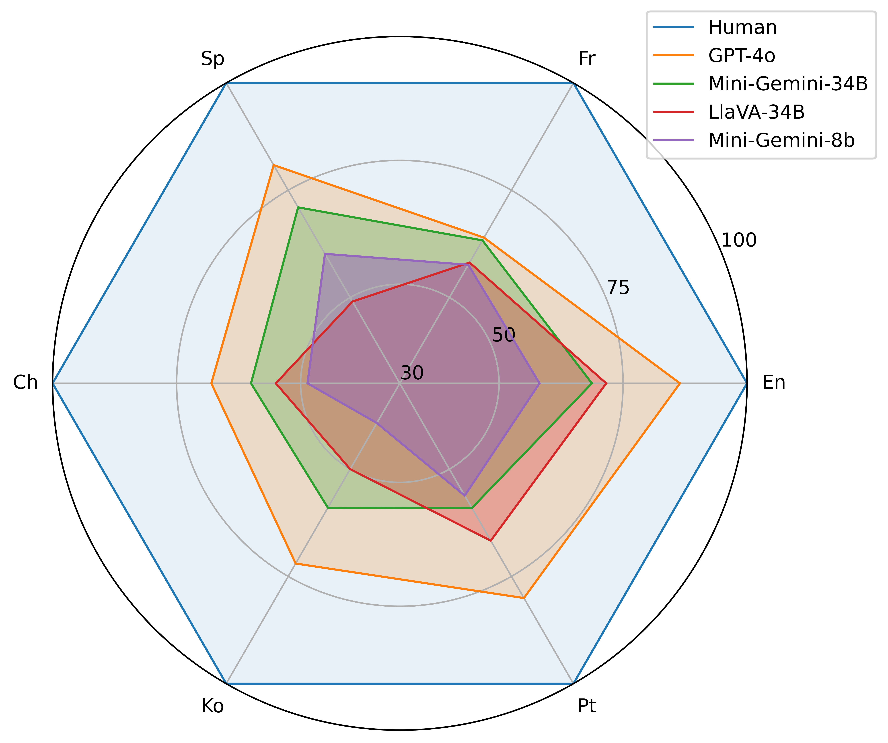

# M3GIA：认知启发的多语言多模态通用智能能力评测基准

发布时间：2024年06月08日

`LLM应用

这篇论文探讨了多模态大型语言模型（MLLMs）的认知能力评估，并推出了一个新的基准M3GIA，用于全面评估MLLMs在不同语言和文化背景下的智能水平。论文关注的是如何通过多语言和多模态的评估来深入理解MLLMs的智能表现，这与LLM的应用层面紧密相关，特别是在评估和改进模型性能方面。因此，将其归类为LLM应用是合适的。` `人工智能` `认知科学`

> M3GIA: A Cognition Inspired Multilingual and Multimodal General Intelligence Ability Benchmark

# 摘要

> 多模态大型语言模型（MLLMs）近期在处理复杂任务上展现出惊人能力，引发了关于它们是否能模拟人类智能的热烈讨论。然而，当前的评估标准主要关注任务完成度，如物体属性识别的准确性，而忽视了深入理解MLLMs智能的认知层面。为此，我们推出了首个认知驱动的多语言多模态基准M3GIA，旨在全面评估MLLMs的智能水平。我们依据Cattell-Horn-Carrol（CHC）智能模型，确定了五个关键认知因素，并设计了新的评估方法。考虑到MLLMs的多语言特性，我们探讨了语言是否影响其认知能力，并扩展了评估范围，涵盖了中文、法语、西班牙语、葡萄牙语和韩语，确保文化背景数据的本土化，避免英语偏见。我们的数据显示，最先进的MLLM在英语中仅达到人类智能的较低水平，而在其他五种语言中表现差异显著。此外，我们发现了与认知研究相符的“胜者通吃”现象。M3GIA将开源，以期推动MLLMs认知能力的进步。

> As recent multi-modality large language models (MLLMs) have shown formidable proficiency on various complex tasks, there has been increasing attention on debating whether these models could eventually mirror human intelligence. However, existing benchmarks mainly focus on evaluating solely on task performance, such as the accuracy of identifying the attribute of an object. Combining well-developed cognitive science to understand the intelligence of MLLMs beyond superficial achievements remains largely unexplored. To this end, we introduce the first cognitive-driven multi-lingual and multi-modal benchmark to evaluate the general intelligence ability of MLLMs, dubbed M3GIA. Specifically, we identify five key cognitive factors based on the well-recognized Cattell-Horn-Carrol (CHC) model of intelligence and propose a novel evaluation metric. In addition, since most MLLMs are trained to perform in different languages, a natural question arises: is language a key factor influencing the cognitive ability of MLLMs? As such, we go beyond English to encompass other languages based on their popularity, including Chinese, French, Spanish, Portuguese and Korean, to construct our M3GIA. We make sure all the data relevant to the cultural backgrounds are collected from their native context to avoid English-centric bias. We collected a significant corpus of data from human participants, revealing that the most advanced MLLM reaches the lower boundary of human intelligence in English. Yet, there remains a pronounced disparity in the other five languages assessed. We also reveals an interesting winner takes all phenomenon that are aligned with the discovery in cognitive studies. Our benchmark will be open-sourced, with the aspiration of facilitating the enhancement of cognitive capabilities in MLLMs.

[Arxiv](https://arxiv.org/abs/2406.05343)