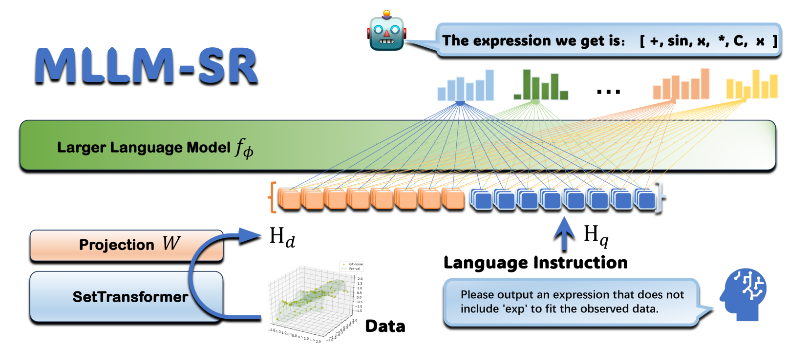
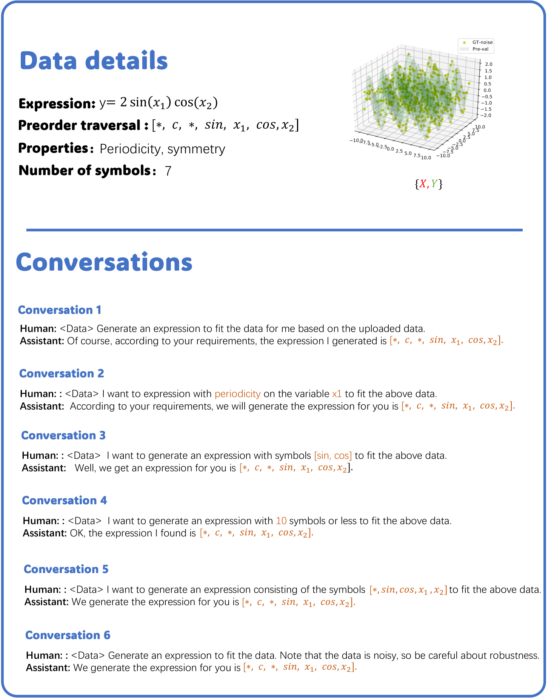
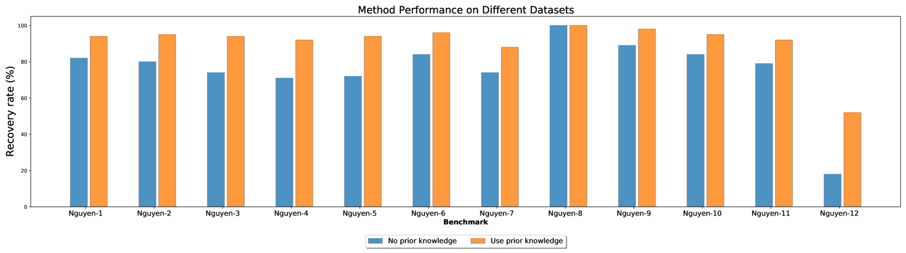

# MLLM-SR：多模态大型语言模型下的对话式符号回归研究

发布时间：2024年06月08日

`LLM应用

这篇论文摘要描述了一种基于多模态大型语言模型（MLLM）的对话式符号回归技术（MLLM-SR），该技术能够通过自然语言指令生成符合特定要求的表达式。这种方法特别强调了结合特定先验知识的能力，如要求表达式包含特定的数学函数或具有特定的对称性。论文通过实验证明了MLLM-SR在特定数据集上的性能优于现有技术，并能有效理解和应用这些先验知识，从而提高了表达式生成的准确性。这种应用展示了大型语言模型在解决特定科学问题中的实际应用价值，因此属于LLM应用分类。` `人工智能` `数据分析`

> MLLM-SR: Conversational Symbolic Regression base Multi-Modal Large Language Models

# 摘要

> 公式是人类与自然沟通的桥梁。在人工智能领域，从数据中提取表达式以揭示变量间的关系，即符号回归问题，是一项关键研究。传统方法依赖观测数据直接生成表达式，难以结合特定先验知识，如要求表达式包含 $\sin$ 函数或具有对称性等，且操作复杂。本文创新性地提出 MLLM-SR，一种基于多模态大型语言模型的对话式符号回归技术，它通过自然语言指令轻松生成符合特定要求的表达式。实验证明，MLLM-SR 在 Nguyen 数据集上的表现超越了现有技术，并能准确理解并应用先验知识，显著提升了表达式生成的准确性。

> Formulas are the language of communication between humans and nature. It is an important research topic of artificial intelligence to find expressions from observed data to reflect the relationship between each variable in the data, which is called a symbolic regression problem. The existing symbolic regression methods directly generate expressions according to the given observation data, and we cannot require the algorithm to generate expressions that meet specific requirements according to the known prior knowledge. For example, the expression needs to contain $\sin$ or be symmetric, and so on. Even if it can, it often requires very complex operations, which is very inconvenient. In this paper, based on multi-modal large language models, we propose MLLM-SR, a conversational symbolic regression method that can generate expressions that meet the requirements simply by describing the requirements with natural language instructions. By experimenting on the Nguyen dataset, we can demonstrate that MLLM-SR leads the state-of-the-art baselines in fitting performance. More notably, we experimentally demonstrate that MLLM-SR can well understand the prior knowledge we add to the natural language instructions. Moreover, the addition of prior knowledge can effectively guide MLLM-SR to generate correct expressions.

[Arxiv](https://arxiv.org/abs/2406.05410)