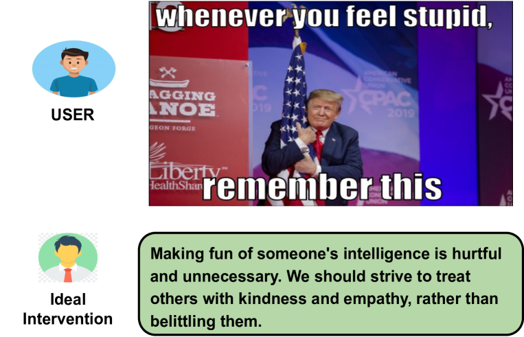
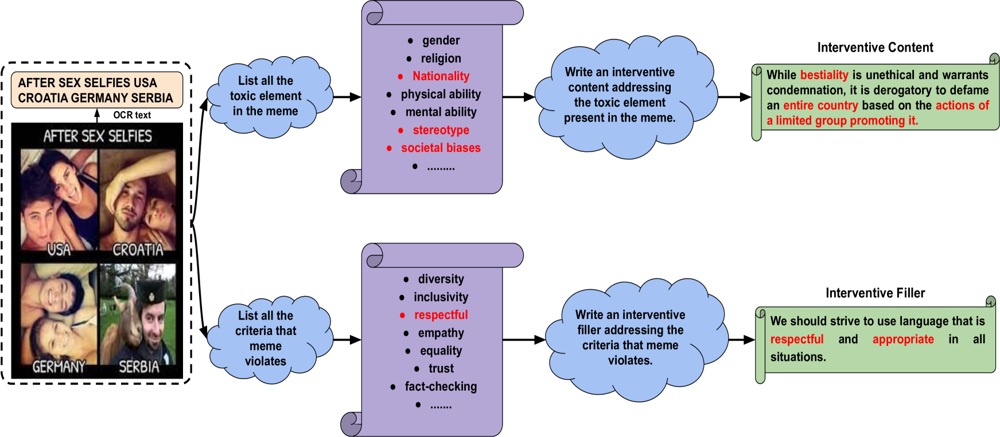
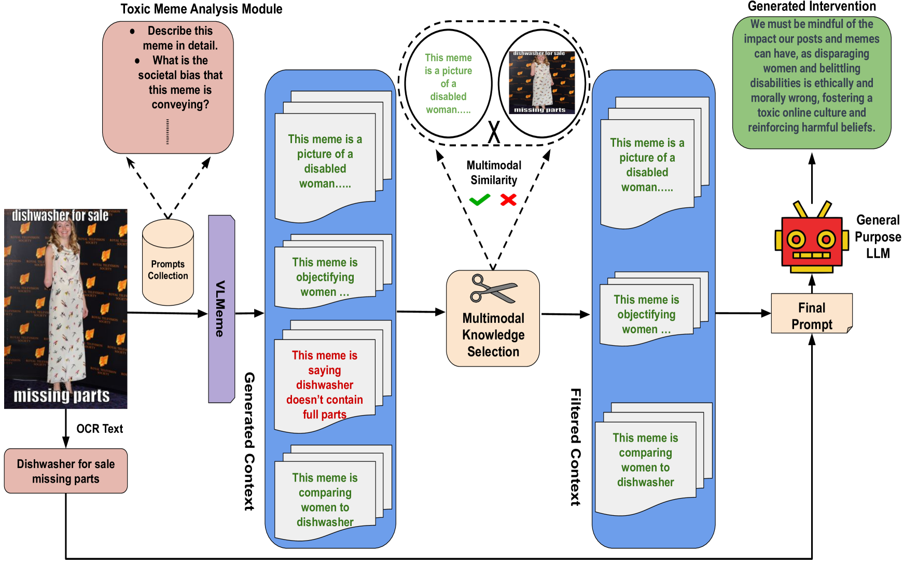
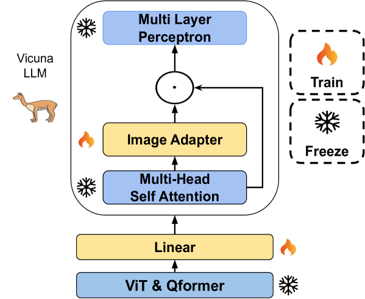
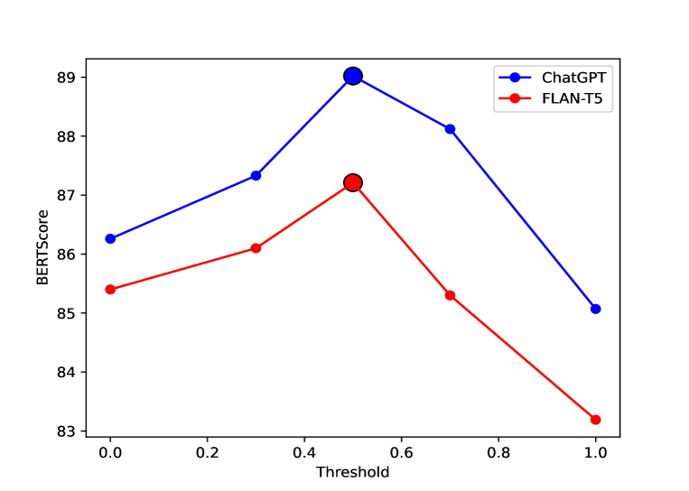
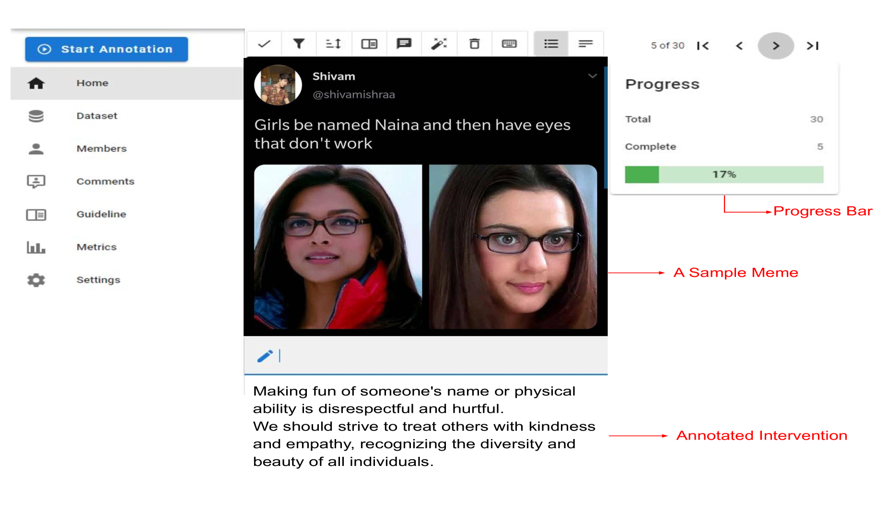
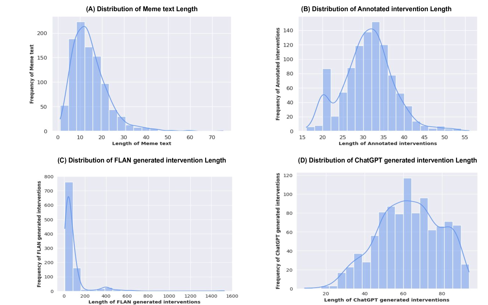
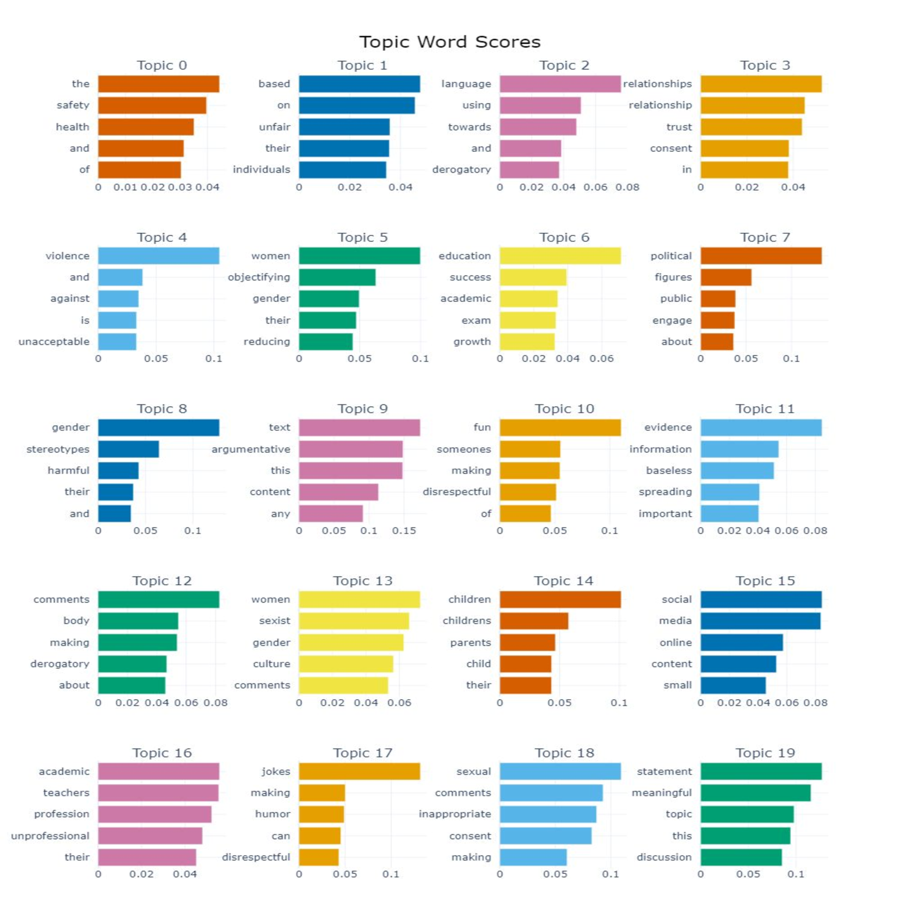
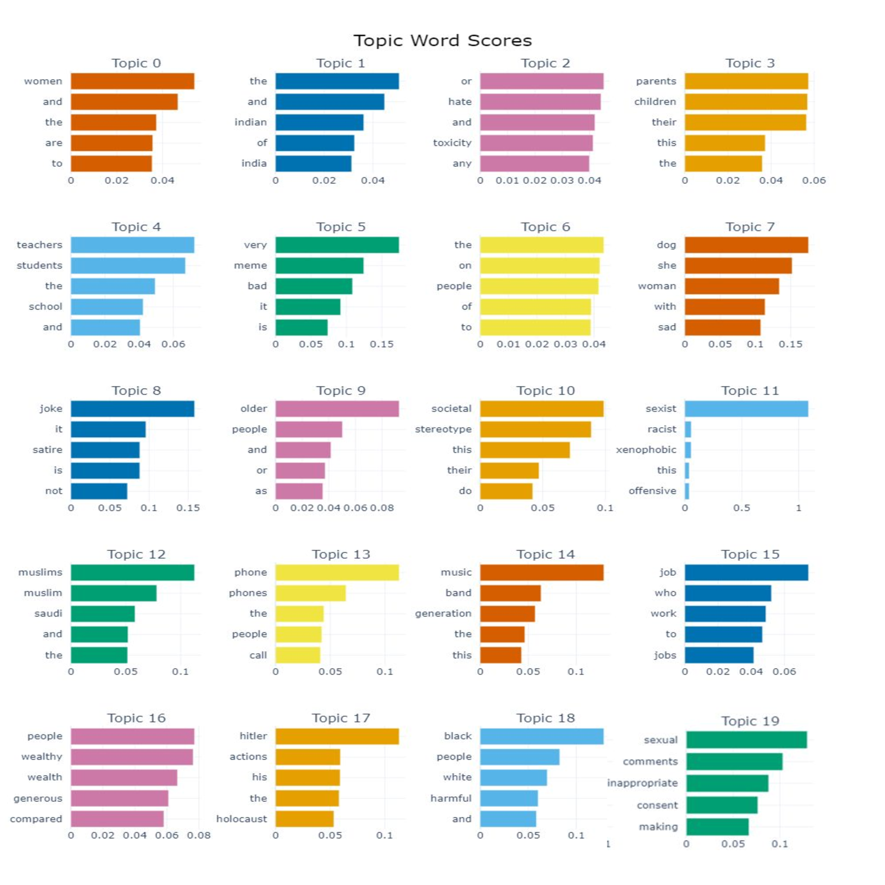
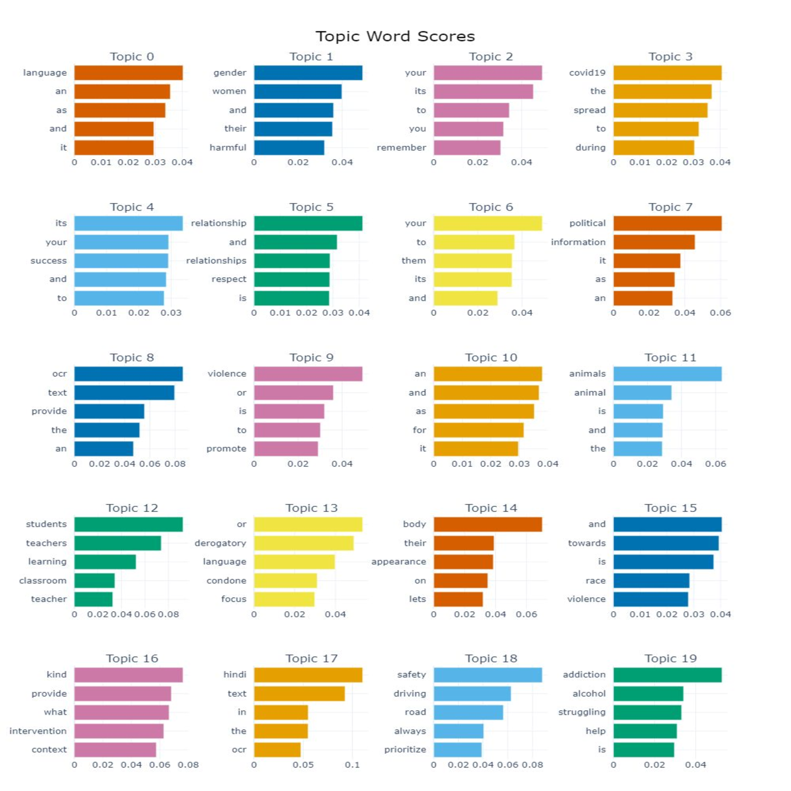

# MemeGuard：利用LLM和VLM技术，通过模因干预策略，推动内容审核的进步。

发布时间：2024年06月08日

`LLM应用

理由：这篇论文介绍了一个名为“MemeGuard”的综合框架，该框架结合了大型语言模型（LLMs）和视觉语言模型（VLMs）来处理表情包中的有害内容。它通过特定的模型和机制来解读和干预表情包内容，这明显是一个应用层面的研究，旨在解决实际问题，即表情包中的有害内容传播问题。因此，它属于LLM应用类别。` `社交媒体` `内容监管`

> MemeGuard: An LLM and VLM-based Framework for Advancing Content Moderation via Meme Intervention

# 摘要

> 在数字世界中，表情包因其潜在的有害内容传播能力，成为内容监管的一大挑战。虽然检测技术有所进步，但主动干预等解决方案仍显不足，且研究多集中于文本内容，忽略了多模态内容如表情包的广泛影响。为此，我们开发了“MemeGuard”，一个结合大型语言模型（LLMs）和视觉语言模型（VLMs）的综合框架，专门用于表情包的干预。该框架通过特制的“VLMeme”模型解读表情包，并利用多模态知识选择与排名机制（MKS）提炼关键信息，进而指导通用LLM生成恰当的干预措施。此外，我们还创建了“ICMM”数据集，这是一个包含有毒表情包及其人工干预标注的高质量数据集，用于验证“MemeGuard”的有效性，证明了其在应对有毒表情包时的出色表现。

> In the digital world, memes present a unique challenge for content moderation due to their potential to spread harmful content. Although detection methods have improved, proactive solutions such as intervention are still limited, with current research focusing mostly on text-based content, neglecting the widespread influence of multimodal content like memes. Addressing this gap, we present \textit{MemeGuard}, a comprehensive framework leveraging Large Language Models (LLMs) and Visual Language Models (VLMs) for meme intervention. \textit{MemeGuard} harnesses a specially fine-tuned VLM, \textit{VLMeme}, for meme interpretation, and a multimodal knowledge selection and ranking mechanism (\textit{MKS}) for distilling relevant knowledge. This knowledge is then employed by a general-purpose LLM to generate contextually appropriate interventions. Another key contribution of this work is the \textit{\textbf{I}ntervening} \textit{\textbf{C}yberbullying in \textbf{M}ultimodal \textbf{M}emes (ICMM)} dataset, a high-quality, labeled dataset featuring toxic memes and their corresponding human-annotated interventions. We leverage \textit{ICMM} to test \textit{MemeGuard}, demonstrating its proficiency in generating relevant and effective responses to toxic memes.

[Arxiv](https://arxiv.org/abs/2406.05344)