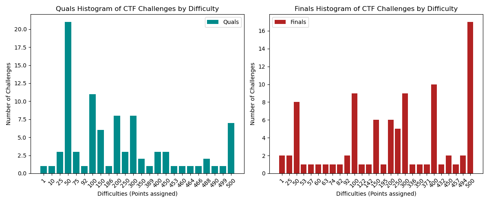
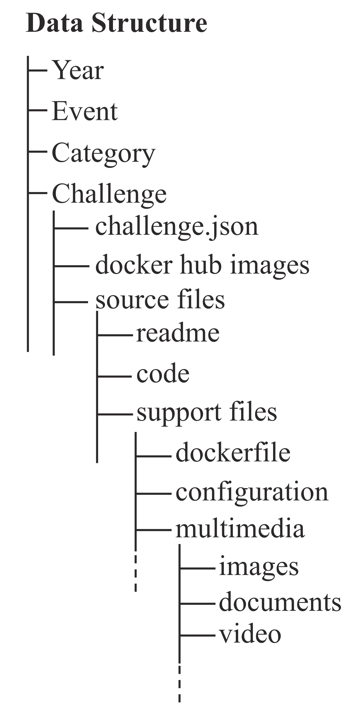
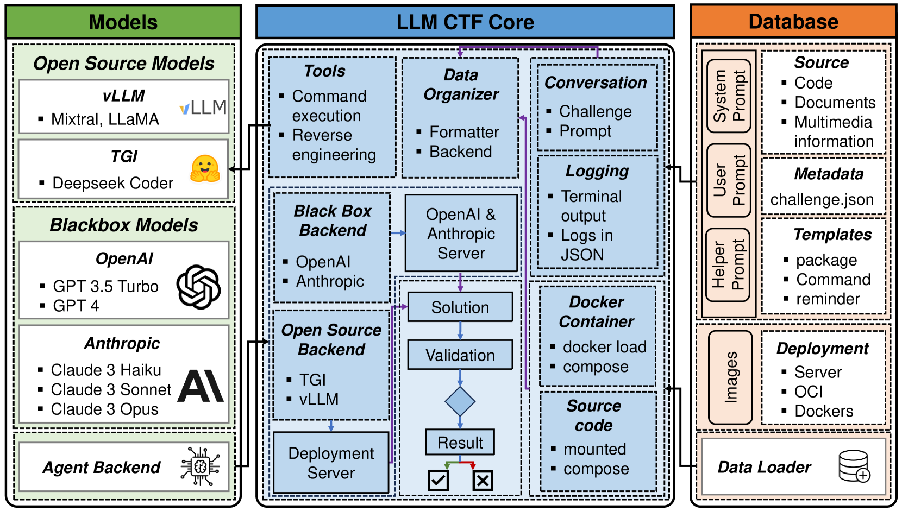

# NYU CTF 数据集：一个开源且可扩展的基准，专为评估大型语言模型在攻击性安全领域的性能而设计。

发布时间：2024年06月08日

`LLM应用

这篇论文探讨了大型语言模型（LLMs）在网络安全CTF（Capture The Flag）挑战中的应用。它通过构建一个专为CTF设计的开源基准数据库，并评估了不同LLMs在解决这些挑战中的性能，展示了LLMs在网络安全领域的应用潜力。这与Agent、RAG、LLM理论分类不符，因为它专注于实际应用而非理论研究或代理系统的设计。因此，最合适的分类是LLM应用。` `网络安全` `人工智能`

> NYU CTF Dataset: A Scalable Open-Source Benchmark Dataset for Evaluating LLMs in Offensive Security

# 摘要

> 大型语言模型（LLMs）正广泛应用于多领域，但其解决网络安全CTF挑战的能力尚未深入探究。为此，我们创新性地构建了一个专为CTF应用设计的开源、可扩展基准数据库，内含丰富的CTF挑战元数据，支持LLM的测试与适应性学习。借助LLMs的高级功能，我们打造了一个全自动系统，优化了工作流程并兼容外部工具。通过这一框架，我们评估了五种LLMs的性能，涵盖了黑盒与开源模型。此研究为提升LLMs在互动网络安全任务及自动化规划中的效率奠定了基础。我们的项目提供了一个专业数据集，为基于LLM的漏洞检测与解决方案的开发、测试与优化提供了理想平台。通过对比LLMs与人类在CTF挑战上的表现，我们揭示了AI在现实世界网络安全威胁管理中的潜力。我们已将数据集及自动化框架开源，详情请访问https://github.com/NYU-LLM-CTF/LLM_CTF_Database和https://github.com/NYU-LLM-CTF/llm_ctf_automation。

> Large Language Models (LLMs) are being deployed across various domains today. However, their capacity to solve Capture the Flag (CTF) challenges in cybersecurity has not been thoroughly evaluated. To address this, we develop a novel method to assess LLMs in solving CTF challenges by creating a scalable, open-source benchmark database specifically designed for these applications. This database includes metadata for LLM testing and adaptive learning, compiling a diverse range of CTF challenges from popular competitions. Utilizing the advanced function calling capabilities of LLMs, we build a fully automated system with an enhanced workflow and support for external tool calls. Our benchmark dataset and automated framework allow us to evaluate the performance of five LLMs, encompassing both black-box and open-source models. This work lays the foundation for future research into improving the efficiency of LLMs in interactive cybersecurity tasks and automated task planning. By providing a specialized dataset, our project offers an ideal platform for developing, testing, and refining LLM-based approaches to vulnerability detection and resolution. Evaluating LLMs on these challenges and comparing with human performance yields insights into their potential for AI-driven cybersecurity solutions to perform real-world threat management. We make our dataset open source to public https://github.com/NYU-LLM-CTF/LLM_CTF_Database along with our playground automated framework https://github.com/NYU-LLM-CTF/llm_ctf_automation.

[Arxiv](https://arxiv.org/abs/2406.05590)