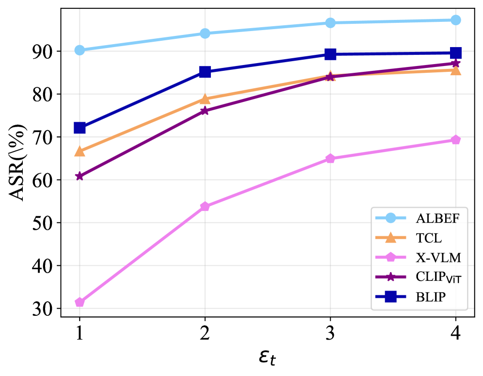

# 仅需一次扰动：探索针对视觉-语言预训练模型的通用对抗扰动生成策略

发布时间：2024年06月08日

`Agent

理由：这篇论文主要关注的是视觉-语言预训练（VLP）模型对抗性攻击的增强方法，特别是通过提出一种新的对抗扰动生成器（C-PGC）来提高攻击效果。这种方法涉及跨模态对齐和多模态对比学习，目的是在VLP模型的特征空间中使对抗样本偏离原始区域。虽然这种方法涉及对大型VLP模型的攻击，但它更多地关注于开发和优化攻击策略，而不是直接应用于LLM的理论研究或应用开发。因此，将其归类为Agent，即代表了一种针对模型的主动攻击策略或代理。` `计算机视觉`

> One Perturbation is Enough: On Generating Universal Adversarial Perturbations against Vision-Language Pre-training Models

# 摘要

> 视觉-语言预训练（VLP）模型在处理大规模图像-文本对时展现出卓越的实用性，但它们对精心设计的对抗样本表现出脆弱性。尽管现有攻击在提升效果和可转移性方面取得显著成果，但这些攻击主要针对特定样本进行扰动生成。本文揭示了VLP模型对一类新型通用对抗扰动（UAP）的脆弱性，这种扰动适用于所有输入样本。虽然将现有UAP算法应用于区分模型攻击显示出一定效果，但在VLP模型上的应用效果不佳。为此，我们重新审视了VLP模型中的多模态对齐，并提出了基于跨模态条件的对比训练扰动生成器（C-PGC）。我们设计了一个生成器，利用跨模态信息作为指导，进一步通过多模态对比学习优化训练目标。通过这种方式，我们成功地使对抗样本在VLP模型的特征空间中偏离原始区域，显著增强了攻击效果。实验证明，我们的方法在多种VLP模型和视觉与语言任务上均取得了卓越的攻击性能，并且在黑盒可转移性方面表现出色，成功欺骗了包括LLaVA和Qwen-VL在内的主流大型VLP模型。

> Vision-Language Pre-training (VLP) models trained on large-scale image-text pairs have demonstrated unprecedented capability in many practical applications. However, previous studies have revealed that VLP models are vulnerable to adversarial samples crafted by a malicious adversary. While existing attacks have achieved great success in improving attack effect and transferability, they all focus on instance-specific attacks that generate perturbations for each input sample. In this paper, we show that VLP models can be vulnerable to a new class of universal adversarial perturbation (UAP) for all input samples. Although initially transplanting existing UAP algorithms to perform attacks showed effectiveness in attacking discriminative models, the results were unsatisfactory when applied to VLP models. To this end, we revisit the multimodal alignments in VLP model training and propose the Contrastive-training Perturbation Generator with Cross-modal conditions (C-PGC). Specifically, we first design a generator that incorporates cross-modal information as conditioning input to guide the training. To further exploit cross-modal interactions, we propose to formulate the training objective as a multimodal contrastive learning paradigm based on our constructed positive and negative image-text pairs. By training the conditional generator with the designed loss, we successfully force the adversarial samples to move away from its original area in the VLP model's feature space, and thus essentially enhance the attacks. Extensive experiments show that our method achieves remarkable attack performance across various VLP models and Vision-and-Language (V+L) tasks. Moreover, C-PGC exhibits outstanding black-box transferability and achieves impressive results in fooling prevalent large VLP models including LLaVA and Qwen-VL.

[Arxiv](https://arxiv.org/abs/2406.05491)