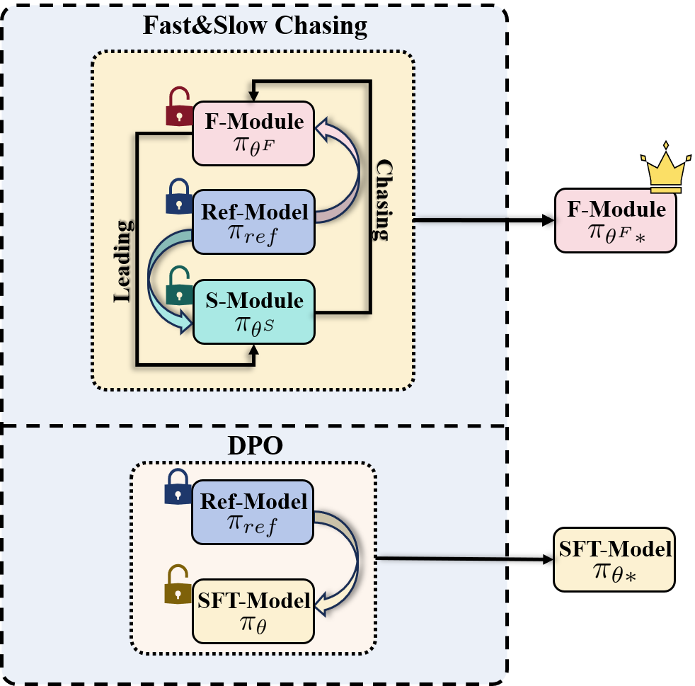
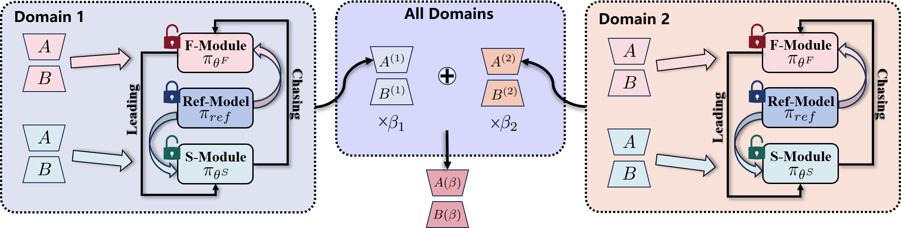
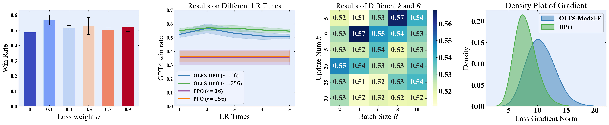

# 在线直接偏好优化：快速-慢速追逐策略

发布时间：2024年06月08日

`LLM应用

理由：这篇论文主要探讨了如何通过直接偏好优化（DPO）改进大型语言模型（LLMs）与人类价值观的契合度，特别是在跨领域学习中的应用。论文提出了一种新的方法——在线快速-慢速追逐DPO（OFS-DPO）和跨领域在线快速-慢速追逐DPO（COFS-DPO），这些方法旨在解决跨领域学习中的灾难性遗忘问题，并提高模型在不同任务领域的适应性和性能。这些内容更偏向于LLM的实际应用，而不是理论研究或Agent的设计，因此归类为LLM应用。` `人工智能` `机器学习`

> Online DPO: Online Direct Preference Optimization with Fast-Slow Chasing

# 摘要

> 直接偏好优化（DPO）通过直接利用人类偏好数据集训练，增强了大型语言模型（LLMs）与人类价值观的契合度，无需依赖奖励模型。然而，跨领域的人类偏好可能导致连续训练中的灾难性遗忘，影响DPO的性能和效率。受物种进化中种内竞争的启发，我们提出了一种在线快速-慢速追逐DPO（OFS-DPO），通过模型间的快速与慢速追逐模拟竞争，加速适应过程。我们首先通过最小-最大优化模式验证了在线学习的后悔上限，进而引入两个采用低秩自适应（LoRA）且优化速度不同的模块，模拟种内竞争，并引入新的正则化项指导学习。为缓解跨领域学习中的灾难性遗忘，我们发展了OFS-DPO，采用LoRA模块组合策略，形成了跨领域在线快速-慢速追逐DPO（COFS-DPO），该策略通过线性组合不同任务领域的快速模块参数，有效利用历史信息，实现持续的价值对齐。实验证明，OFS-DPO在领域内对齐上超越DPO，而COFS-DPO在跨领域持续学习中表现卓越。

> Direct Preference Optimization (DPO) improves the alignment of large language models (LLMs) with human values by training directly on human preference datasets, eliminating the need for reward models. However, due to the presence of cross-domain human preferences, direct continual training can lead to catastrophic forgetting, limiting DPO's performance and efficiency. Inspired by intraspecific competition driving species evolution, we propose a Online Fast-Slow chasing DPO (OFS-DPO) for preference alignment, simulating competition through fast and slow chasing among models to facilitate rapid adaptation. Specifically, we first derive the regret upper bound for online learning, validating our motivation with a min-max optimization pattern. Based on this, we introduce two identical modules using Low-rank Adaptive (LoRA) with different optimization speeds to simulate intraspecific competition, and propose a new regularization term to guide their learning. To further mitigate catastrophic forgetting in cross-domain scenarios, we extend the OFS-DPO with LoRA modules combination strategy, resulting in the Cross domain Online Fast-Slow chasing DPO (COFS-DPO). This method leverages linear combinations of fast modules parameters from different task domains, fully utilizing historical information to achive continual value alignment. Experimental results show that OFS-DPO outperforms DPO in in-domain alignment, while COFS-DPO excels in cross-domain continual learning scenarios.

[Arxiv](https://arxiv.org/abs/2406.05534)