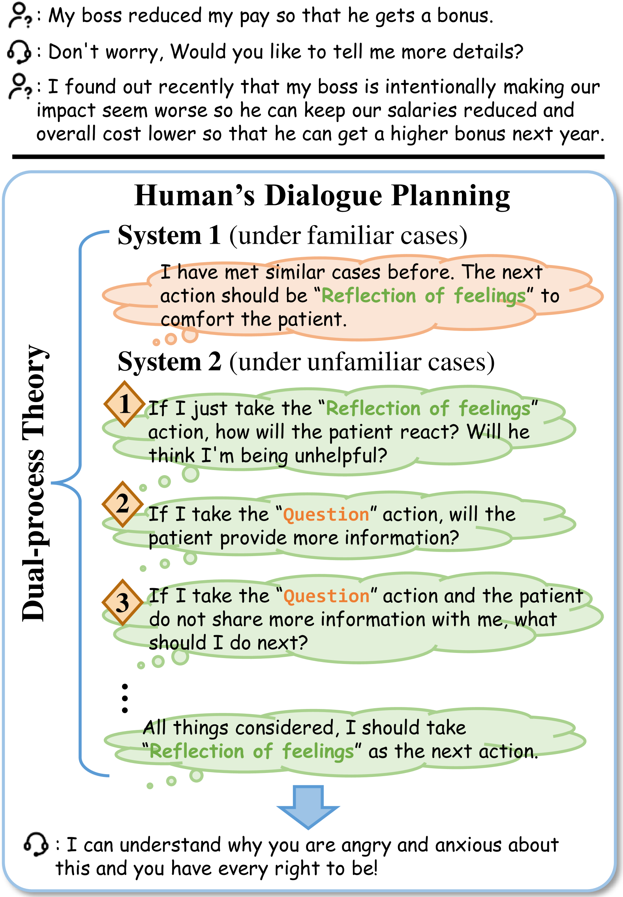
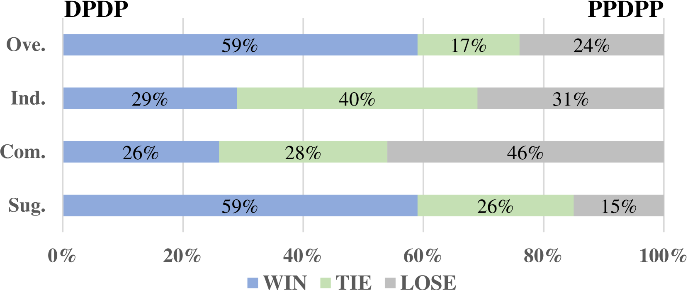
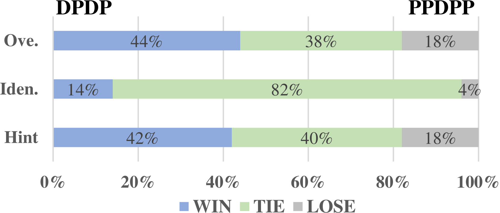

# 对话规划的双过程框架：模拟人类思维的规划策略

发布时间：2024年06月08日

`LLM应用` `人工智能` `对话系统`

> Planning Like Human: A Dual-process Framework for Dialogue Planning

# 摘要

> 主动对话的难点不仅在于回应生成，更在于引导对话达成预定目标，这对反应性较强的大型语言模型 (LLM) 来说是一大挑战。传统提升对话规划的方法，如精细的提示设计和政策网络整合，往往效率低下或效果不佳。借鉴心理学中的双过程理论，区分直觉（快速）和分析（缓慢）两种思维模式，我们设计了双过程对话规划 (DPDP) 框架。该框架包含两个互补系统：熟悉情境下的本能政策模型和复杂新场景中的审慎蒙特卡洛树搜索 (MCTS)。此外，我们采用离线强化学习和即时 MCTS 增强学习相结合的两阶段训练，确保效率与策略深度的平衡。实证研究表明，DPDP 在对话质量和操作效率上均优于现有方法。

> In proactive dialogue, the challenge lies not just in generating responses but in steering conversations toward predetermined goals, a task where Large Language Models (LLMs) typically struggle due to their reactive nature. Traditional approaches to enhance dialogue planning in LLMs, ranging from elaborate prompt engineering to the integration of policy networks, either face efficiency issues or deliver suboptimal performance. Inspired by the dualprocess theory in psychology, which identifies two distinct modes of thinking - intuitive (fast) and analytical (slow), we propose the Dual-Process Dialogue Planning (DPDP) framework. DPDP embodies this theory through two complementary planning systems: an instinctive policy model for familiar contexts and a deliberative Monte Carlo Tree Search (MCTS) mechanism for complex, novel scenarios. This dual strategy is further coupled with a novel two-stage training regimen: offline Reinforcement Learning for robust initial policy model formation followed by MCTS-enhanced on-the-fly learning, which ensures a dynamic balance between efficiency and strategic depth. Our empirical evaluations across diverse dialogue tasks affirm DPDP's superiority in achieving both high-quality dialogues and operational efficiency, outpacing existing methods.

[Arxiv](https://arxiv.org/abs/2406.05374)