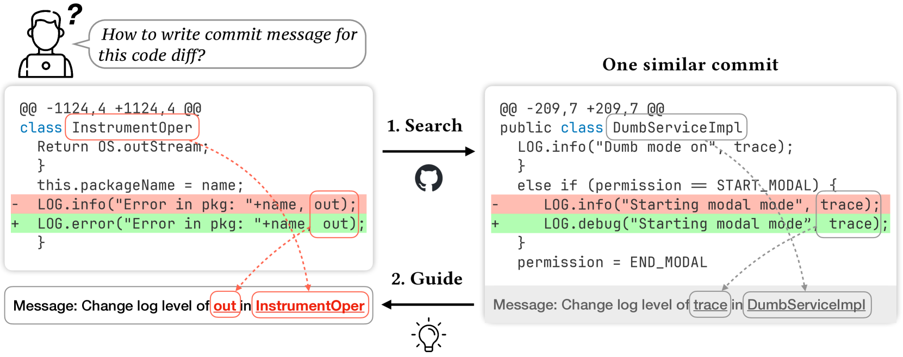
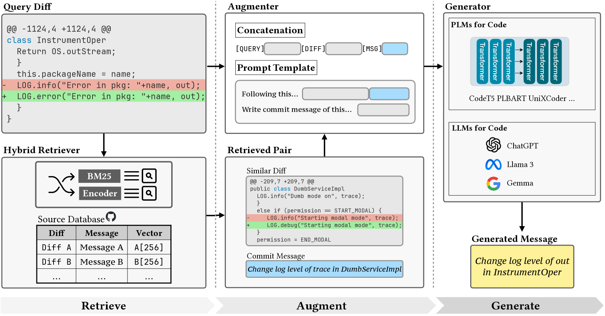
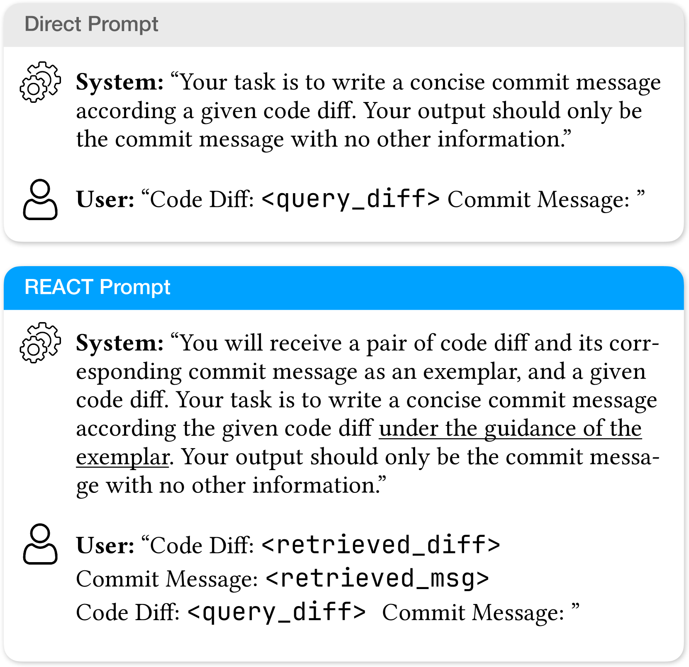
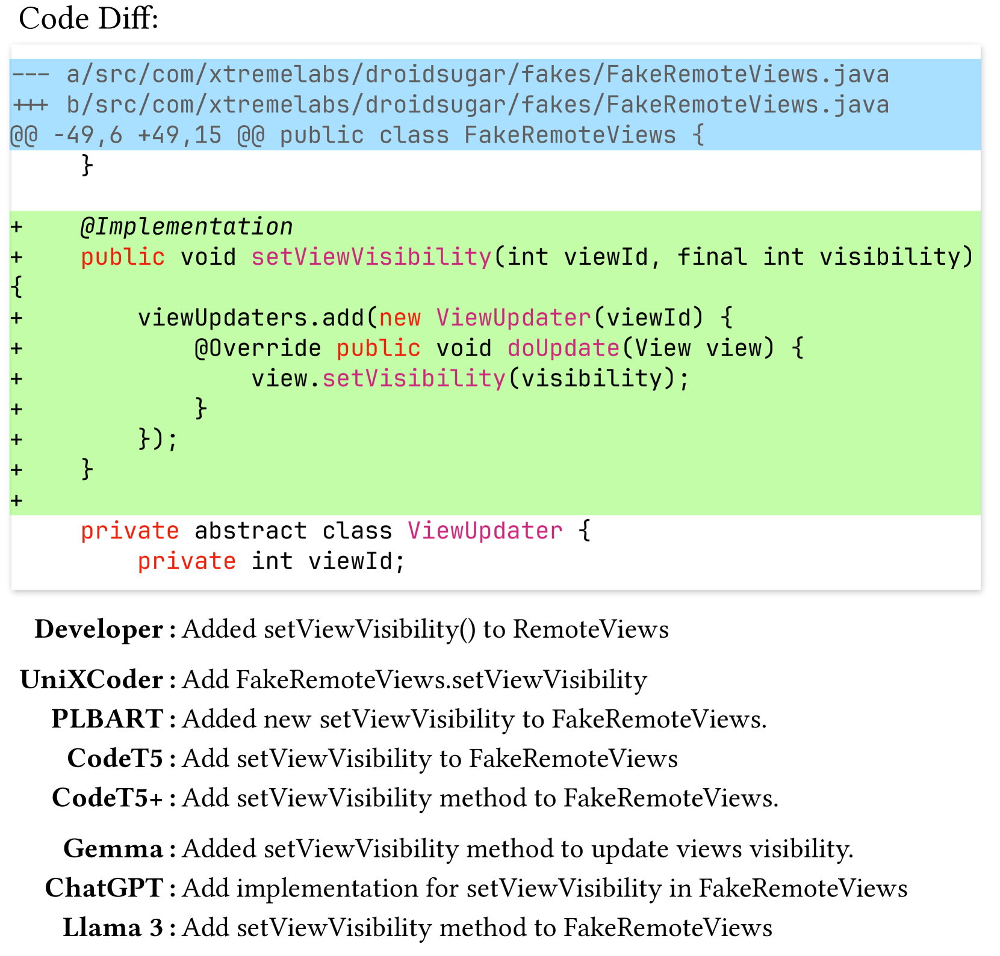
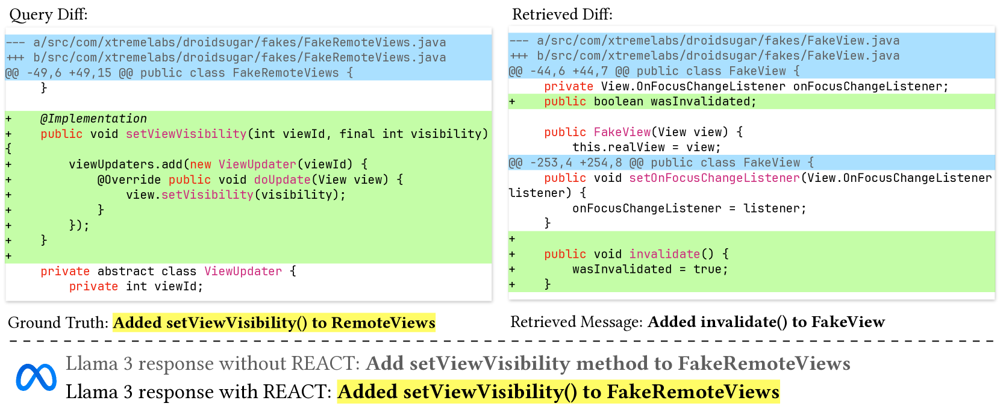

# RAG技术提升提交消息生成效率

发布时间：2024年06月08日

`LLM应用

这篇论文主要探讨了如何利用预训练语言模型（PLMs）和大型语言模型（LLMs）来提升提交信息生成（CMG）任务的性能。通过引入REACT框架，该研究集成了先进的检索技术和模型微调方法，显著提高了CMG任务的表现。这一研究展示了LLMs在特定应用场景（如软件开发中的提交信息自动化生成）中的实际应用和效能，因此属于LLM应用分类。` `软件开发` `自动化软件工程`

> RAG-Enhanced Commit Message Generation

# 摘要

> 提交信息在软件开发中至关重要，但手动编写费时费力。提交信息生成（CMG）因此成为自动化软件工程的研究热点，CodeBERT、CodeT5等预训练语言模型（PLMs）的引入，使得CMG任务通过简单微调即可获得优异表现。此外，具备代码能力的大型语言模型（如ChatGPT、Llama 3）无需额外训练，通过设计指令提示即可直接应用于多种任务，为CMG开辟了新途径。本研究提出的REACT框架，通过集成先进的检索技术与PLMs和LLMs，显著提升了CMG任务中各模型的性能。我们设计了一个混合检索器，从代码库中提取相关代码差异与提交信息对作为“示例”，进而通过微调和情境学习优化提交信息的生成。实验结果显示，REACT使CodeT5的BLEU分数提升55%，Llama 3提升102%，并超越所有基线，达到新的SOTA，充分展示了REACT框架在CMG任务中的强大效能和广泛适用性。

> Commit message is one of the most important textual information in software development and maintenance. However, it is time-consuming and labor-intensive to write commit messages manually. Commit Message Generation (CMG) has become a research hotspot in automated software engineering. Researchers have proposed several methods for CMG and achieved great results. In recent years, CodeBERT, CodeT5, and other Pre-trained Language Models (PLMs) for code have been proposed. These models can be easily transferred to code-related downstream tasks including CMG with simple fine-tuning and can achieve impressive performance. Moreover, Large Language Models (LLMs) with code capabilities (e.g., ChatGPT, Llama 3, Gemma) can be directly applied to various tasks by designing instruct prompts without training. This brings new possibilities to the CMG task. In this work, we propose REACT, a novel REtrieval-Augmented framework for CommiT message generation, which effectively integrates advanced retrieval techniques with different PLMs and LLMs and can broadly enhance the performance of various models on the CMG task. Specifically, we design and build a hybrid retriever to retrieve the most relevant code diff and commit message pair from the code base as an "exemplar". Then, the retrieved pair is utilized to guide and enhance the generation of commit messages by PLMs and LLMs through fine-tuning and in-context learning. Our approach is evaluated on a widely-used dataset. The experimental results show that REACT significantly enhances the performance of various models on the CMG task, improving the BLEU score of CodeT5 by up to 55%, boosting Llama 3's BLEU score by 102%, and substantially surpassing all baselines, achieving a new SOTA. This demonstrates the effectiveness and broad applicability of our framework that can enhance CMG by a large margin.

[Arxiv](https://arxiv.org/abs/2406.05514)