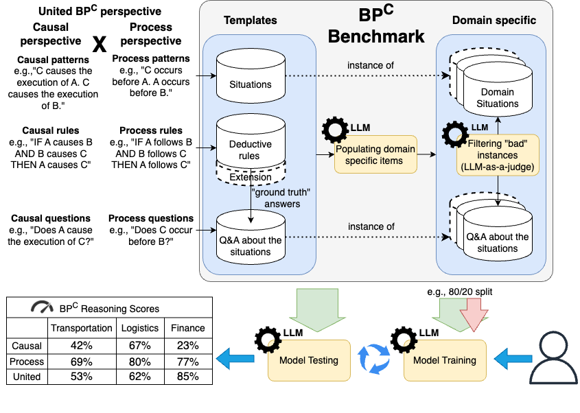

# 探索大型语言模型在因果业务流程推理上的基准

发布时间：2024年06月08日

`LLM应用

这篇论文探讨了大型语言模型（LLMs）在商业运营中的应用，特别是在因果推理和流程优化方面的能力。它提出了一种新的基准——因果增强商业流程（BP^C），用于评估和训练LLMs在这些方面的性能。这与LLMs的实际应用场景紧密相关，因此归类为LLM应用。` `商业运营` `流程优化`

> Towards a Benchmark for Causal Business Process Reasoning with LLMs

# 摘要

> 大型语言模型（LLMs）正日益成为提升组织效率和自动化任务的利器。尽管最初并非为复杂认知任务设计，但如今它们已涉足推理、规划和决策等领域。在商业流程中，这些能力尤为珍贵，能帮助我们从LLMs所训练的庞大语料库中深入洞察流程本质。本研究旨在为评估LLMs在商业运营因果与流程视角推理能力的基准奠定基础，我们称之为因果增强商业流程（BP^C）。该基准核心包含一系列BP^C相关情境、问题及一套演绎规则，用以系统解答这些问题。借助LLMs之力，这一概念得以扩展至更广泛的特定领域情境与问题。BP^C上的推理对于流程优化至关重要。我们的基准可用于两种模式：一是测试特定LLM的性能，二是训练LLM以增强其在BP^C上的推理能力。

> Large Language Models (LLMs) are increasingly used for boosting organizational efficiency and automating tasks. While not originally designed for complex cognitive processes, recent efforts have further extended to employ LLMs in activities such as reasoning, planning, and decision-making. In business processes, such abilities could be invaluable for leveraging on the massive corpora LLMs have been trained on for gaining deep understanding of such processes. In this work, we plant the seeds for the development of a benchmark to assess the ability of LLMs to reason about causal and process perspectives of business operations. We refer to this view as Causally-augmented Business Processes (BP^C). The core of the benchmark comprises a set of BP^C related situations, a set of questions about these situations, and a set of deductive rules employed to systematically resolve the ground truth answers to these questions. Also with the power of LLMs, the seed is then instantiated into a larger-scale set of domain-specific situations and questions. Reasoning on BP^C is of crucial importance for process interventions and process improvement. Our benchmark could be used in one of two possible modalities: testing the performance of any target LLM and training an LLM to advance its capability to reason about BP^C.

[Arxiv](https://arxiv.org/abs/2406.05506)