# VP-LLM：借助大型语言模型的补丁化技术，实现文本驱动的3D体积完美填充

发布时间：2024年06月08日

`LLM应用

这篇论文介绍了一种基于大型语言模型（LLMs）的新方法——Volume Patch LLM（VP-LLM），用于条件3D补全任务。该方法通过将不完整的3D对象切割成小块并独立编码，然后结合文本提示输入LLM，以捕捉块间关系并赋予3D对象语义。这种方法在处理复杂指令和理解3D对象方面显示出优越的性能，超越了现有的基于扩散的3D补全模型。因此，这篇论文属于LLM应用类别，因为它展示了LLM在特定应用场景（即3D补全）中的实际应用和效果。` `3D建模` `人工智能`

> VP-LLM: Text-Driven 3D Volume Completion with Large Language Models through Patchification

# 摘要

> 近期研究在条件3D补全上多依赖CLIP或BERT处理文本，但这些方法难以应对复杂指令。相比之下，大型语言模型（LLMs）在多模态任务中展现出卓越潜力。基于此，我们开发了Volume Patch LLM（VP-LLM），通过单一前向传播实现条件3D补全。首先，我们将不完整的3D对象切割成独立编码的小块，然后将这些编码块与文本提示一同输入LLM，指导其捕捉块间关系并赋予3D对象语义。实验证明，VP-LLM在解读复杂指令和理解3D对象方面表现出色，其生成质量超越了基于扩散的顶尖3D补全模型。

> Recent conditional 3D completion works have mainly relied on CLIP or BERT to encode textual information, which cannot support complex instruction. Meanwhile, large language models (LLMs) have shown great potential in multi-modal understanding and generation tasks. Inspired by the recent advancements of LLM, we present Volume Patch LLM (VP-LLM), which leverages LLMs to perform conditional 3D completion in a single-forward pass. To integrate a 3D model into the LLM tokenization configuration, the incomplete 3D object is first divided into small patches that can be encoded independently. These encoded patches are then fed into an LLM along with the text prompt, instructing the LLM to capture the relations between these patches as well as injecting semantic meanings into the 3D object. Our results demonstrate a strong ability of LLMs to interpret complex text instructions and understand 3D objects, surpassing state-of-the-art diffusion-based 3D completion models in generation quality.

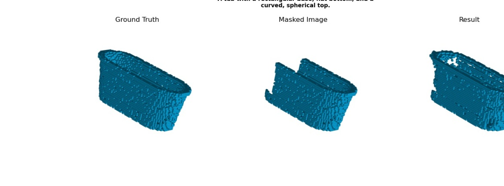

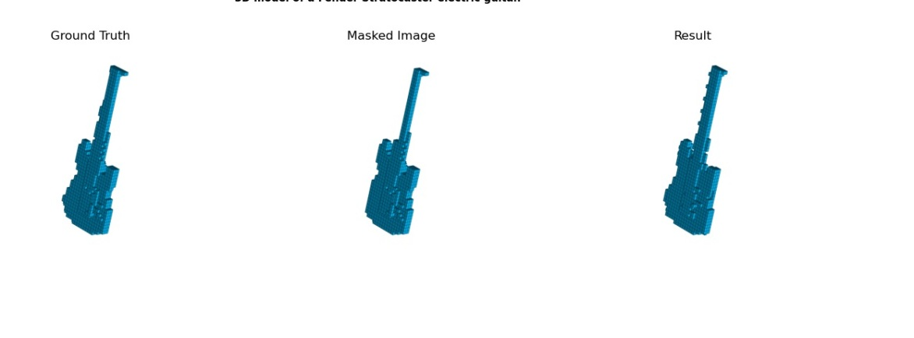

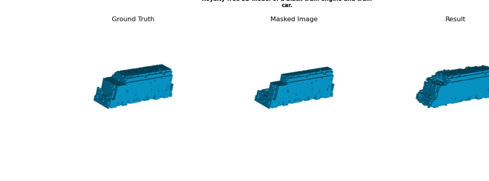

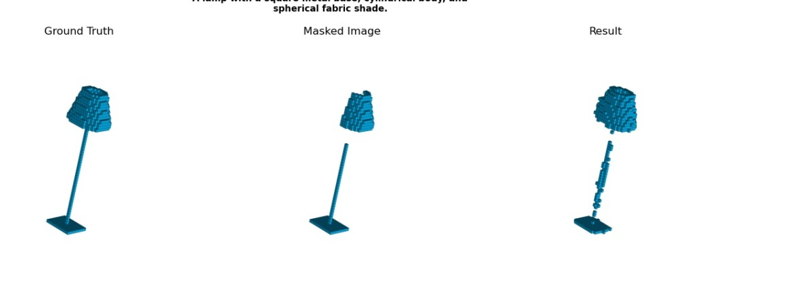

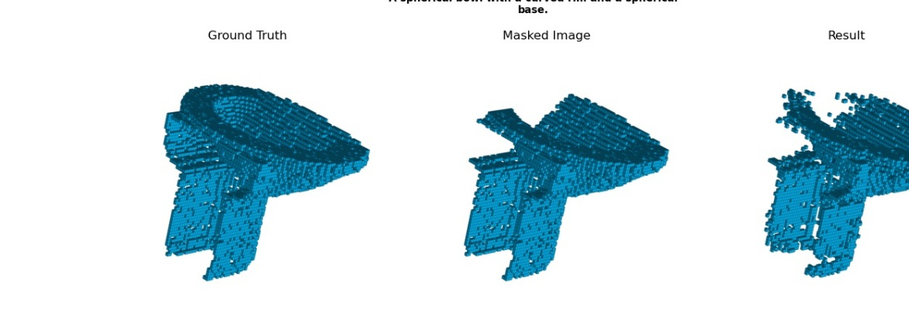

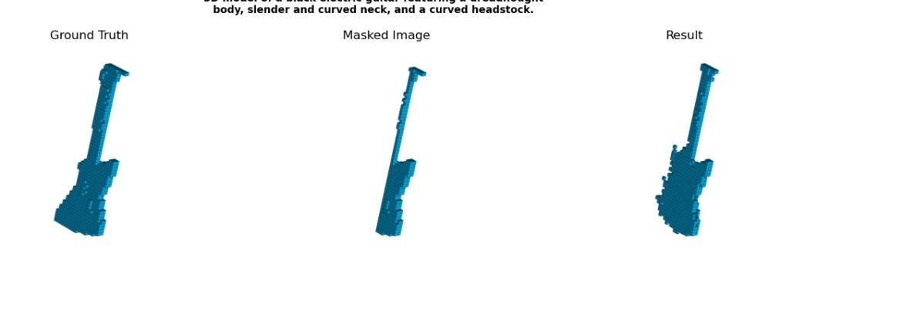

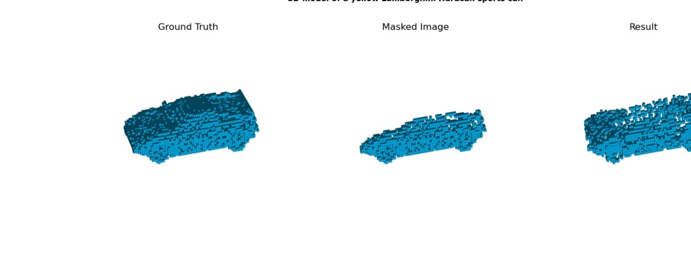

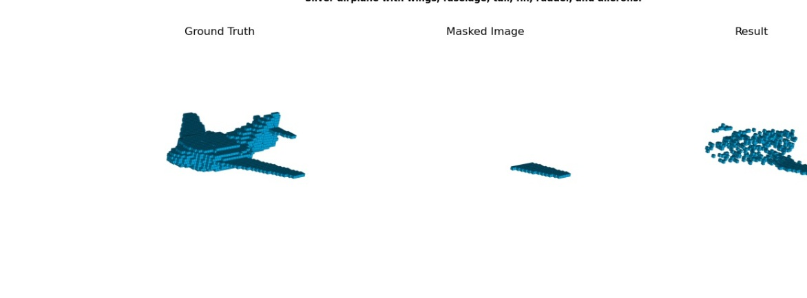

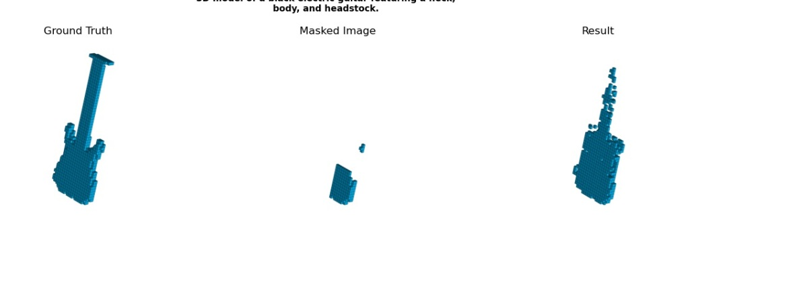

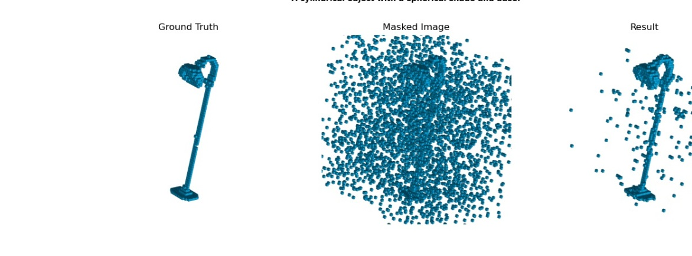

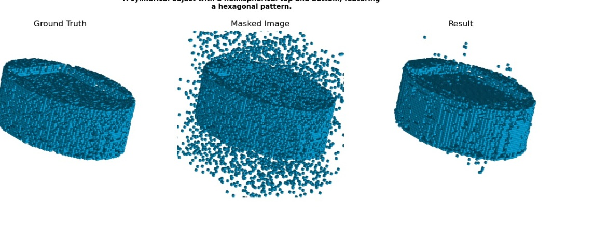

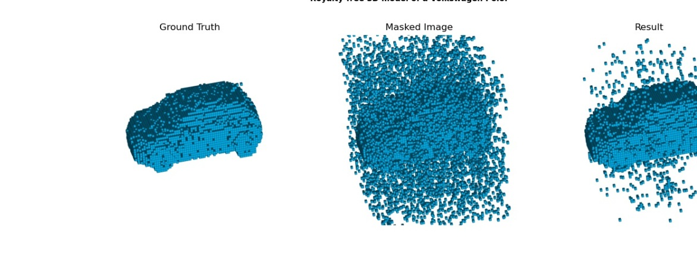

[Arxiv](https://arxiv.org/abs/2406.05543)