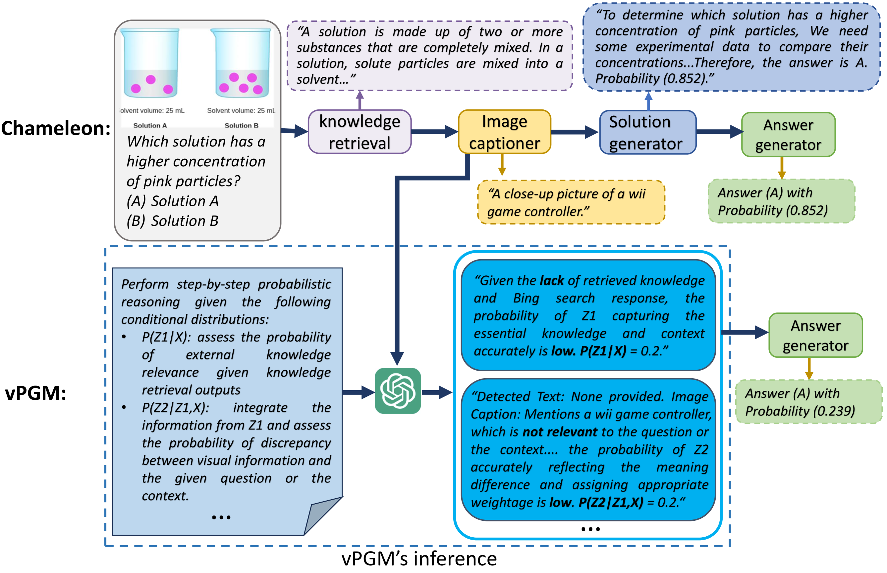
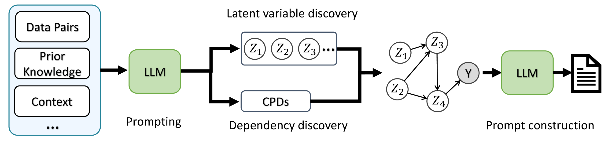
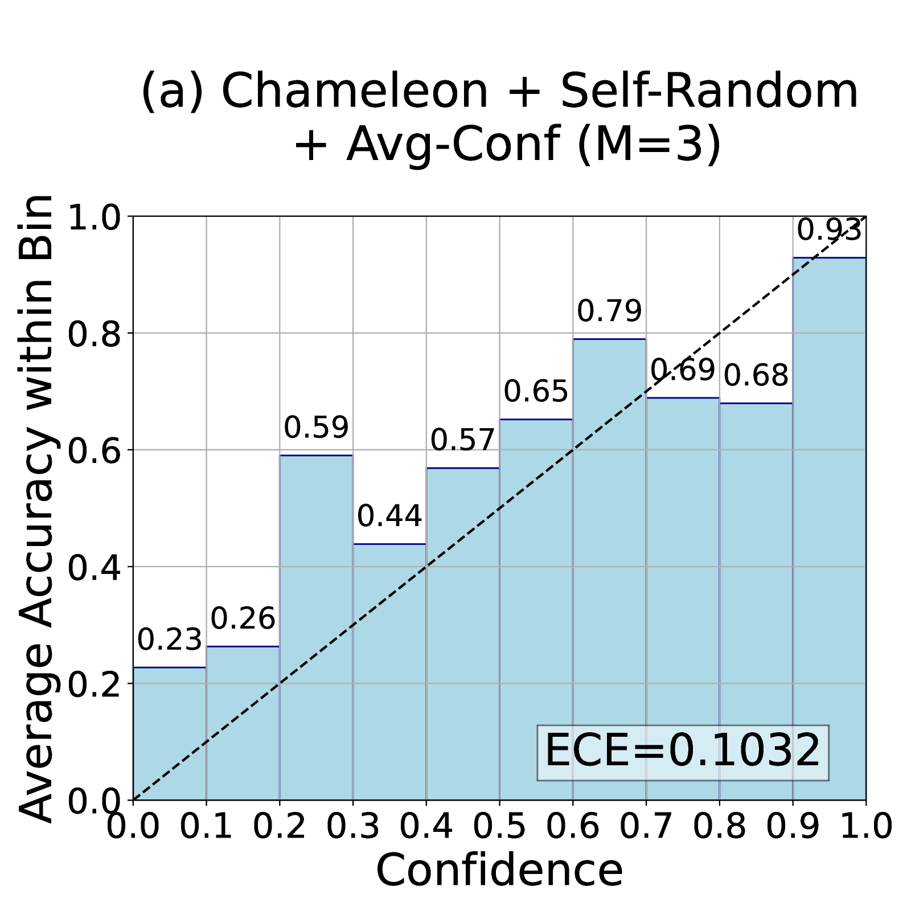
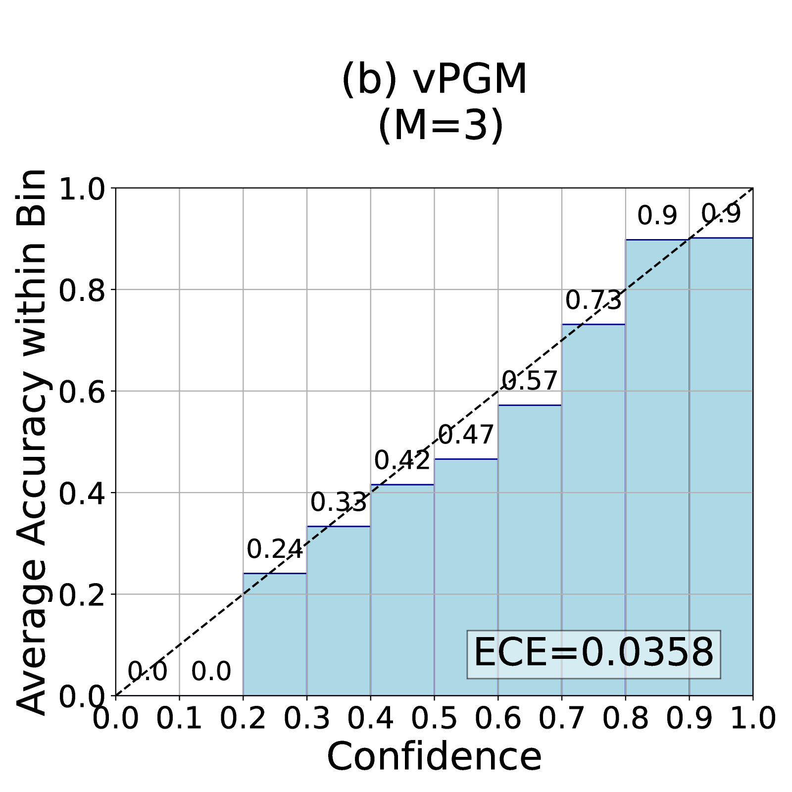

# 大型语言模型下的口头化概率图建模

发布时间：2024年06月08日

`LLM理论

理由：这篇论文探讨了大型语言模型（LLMs）在处理复杂推理任务时的局限性，并提出了一种创新的贝叶斯提示方法，以增强模型在捕捉深层结构和不确定性方面的能力。这种方法涉及利用口头化的概率图模型（PGM）进行贝叶斯推理，无需额外训练。因此，这项工作更侧重于理论层面的改进和探索，即如何通过新的方法论来提升LLMs的推理能力，属于LLM理论的范畴。` `人工智能`

> Verbalized Probabilistic Graphical Modeling with Large Language Models

# 摘要

> 人类大脑在处理复杂问题时，能超越感官限制，深入理解世界模式。遗憾的是，这种深层次的认知能力并未被当前的大型语言模型（LLMs）所采纳。因此，LLMs在复杂推理中捕捉深层结构和不确定性时显得力不从心。为此，我们提出了一种创新的贝叶斯提示方法，利用口头化的概率图模型（PGM），使LLMs无需额外训练即可进行贝叶斯推理。与传统方法不同，我们的方法通过引导LLMs遵循贝叶斯原则，巧妙地推理出潜在变量及其概率关系。在多项组合推理任务的测试中，我们的模型不仅提升了信心提取，还优化了文本生成质量，显示出其在增强AI语言理解系统，尤其是在处理不确定性方面的巨大潜力。

> Faced with complex problems, the human brain demonstrates a remarkable capacity to transcend sensory input and form latent understandings of perceived world patterns. However, this cognitive capacity is not explicitly considered or encoded in current large language models (LLMs). As a result, LLMs often struggle to capture latent structures and model uncertainty in complex compositional reasoning tasks. This work introduces a novel Bayesian prompting approach that facilitates training-free Bayesian inference with LLMs by using a verbalized Probabilistic Graphical Model (PGM). While traditional Bayesian approaches typically depend on extensive data and predetermined mathematical structures for learning latent factors and dependencies, our approach efficiently reasons latent variables and their probabilistic dependencies by prompting LLMs to adhere to Bayesian principles. We evaluated our model on several compositional reasoning tasks, both close-ended and open-ended. Our results indicate that the model effectively enhances confidence elicitation and text generation quality, demonstrating its potential to improve AI language understanding systems, especially in modeling uncertainty.

[Arxiv](https://arxiv.org/abs/2406.05516)