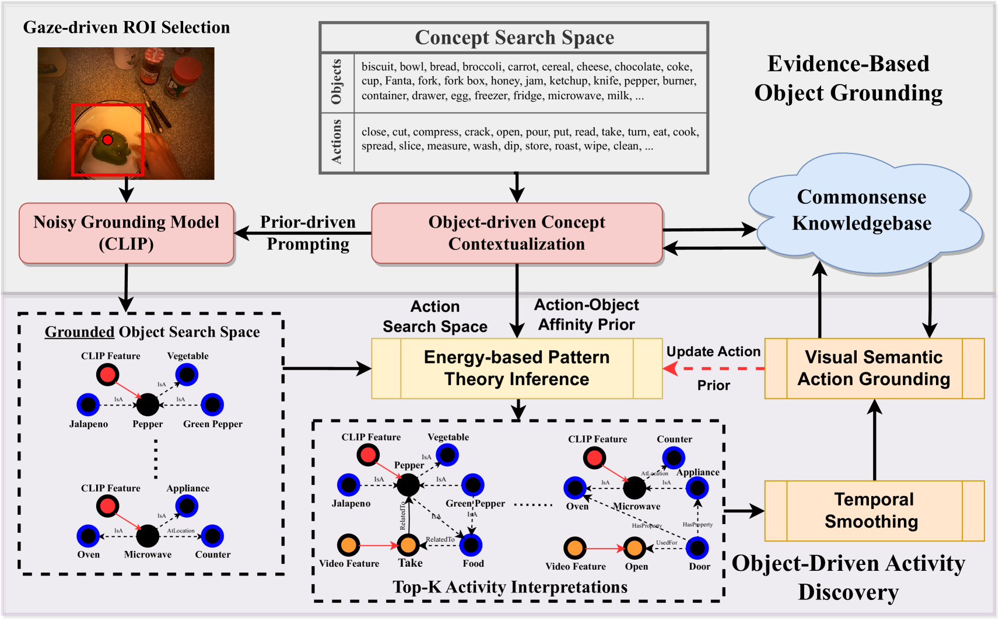

# ALGO：开放世界第一人称动作识别中的对象导向视觉常识推理

发布时间：2024年06月09日

`Agent

这篇论文主要讨论了在开放世界中学习推断未知标签的问题，并提出了一个结合神经与符号方法的框架（ALGO）来解决这一问题。该框架利用大规模知识库中的知识，通过两步法在有限监督下推断视频中的活动。这种方法涉及到自主学习和推断，与Agent的定义相符，即一个能够自主执行任务、做出决策并适应环境的实体。因此，这篇论文应归类于Agent。` `视频分析` `人工智能`

> ALGO: Object-Grounded Visual Commonsense Reasoning for Open-World Egocentric Action Recognition

# 摘要

> 在开放世界中，学习推断未知标签是实现自主性的关键。基础模型虽在零样本推断中表现出色，但其性能受限于目标标签搜索空间的正确性，这在开放世界中可能是一个巨大的挑战。为此，我们提出了ALGO框架，它结合神经与符号方法，利用大规模知识库中的知识，通过两步法在有限监督下推断第一人称视频中的活动。首先，我们采用神经符号提示，借助视觉语言模型作为噪声神谕，通过证据推理在视频中定位对象。其次，结合常识知识，我们通过基于能量的符号模式理论发现可能的活动，并学习在视频中定位基于知识的动作概念。在EPIC-Kitchens等四个公开数据集上的实验验证了ALGO在开放世界活动推断中的有效性。

> Learning to infer labels in an open world, i.e., in an environment where the target "labels" are unknown, is an important characteristic for achieving autonomy. Foundation models pre-trained on enormous amounts of data have shown remarkable generalization skills through prompting, particularly in zero-shot inference. However, their performance is restricted to the correctness of the target label's search space. In an open world, this target search space can be unknown or exceptionally large, which severely restricts the performance of such models. To tackle this challenging problem, we propose a neuro-symbolic framework called ALGO - Action Learning with Grounded Object recognition that uses symbolic knowledge stored in large-scale knowledge bases to infer activities in egocentric videos with limited supervision using two steps. First, we propose a neuro-symbolic prompting approach that uses object-centric vision-language models as a noisy oracle to ground objects in the video through evidence-based reasoning. Second, driven by prior commonsense knowledge, we discover plausible activities through an energy-based symbolic pattern theory framework and learn to ground knowledge-based action (verb) concepts in the video. Extensive experiments on four publicly available datasets (EPIC-Kitchens, GTEA Gaze, GTEA Gaze Plus) demonstrate its performance on open-world activity inference.

[Arxiv](https://arxiv.org/abs/2406.05722)