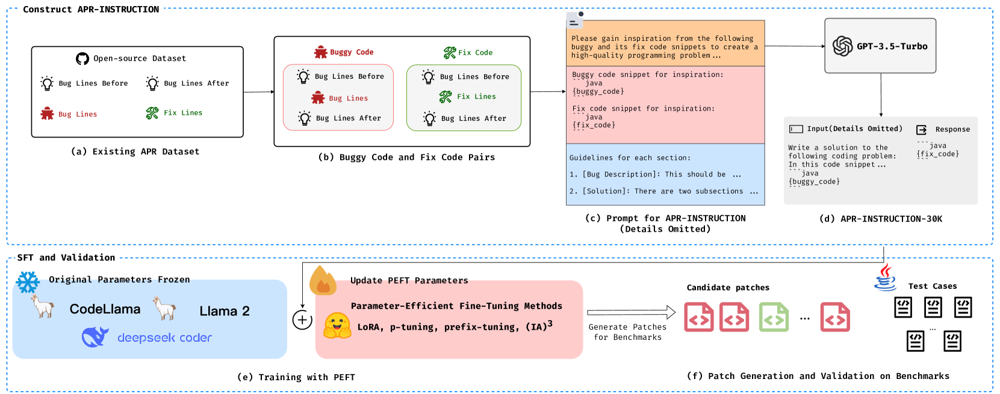
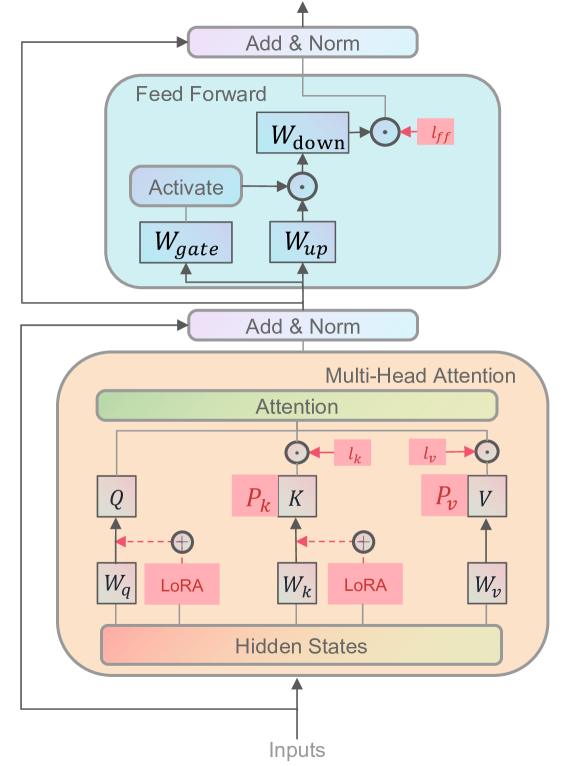
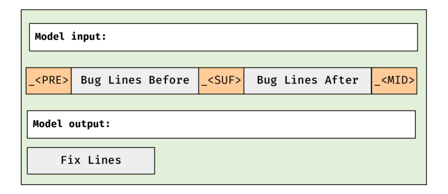
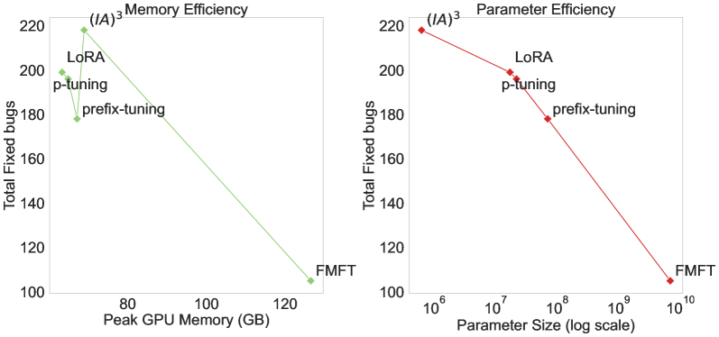
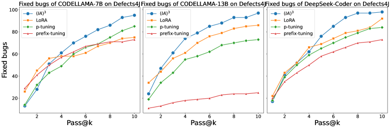
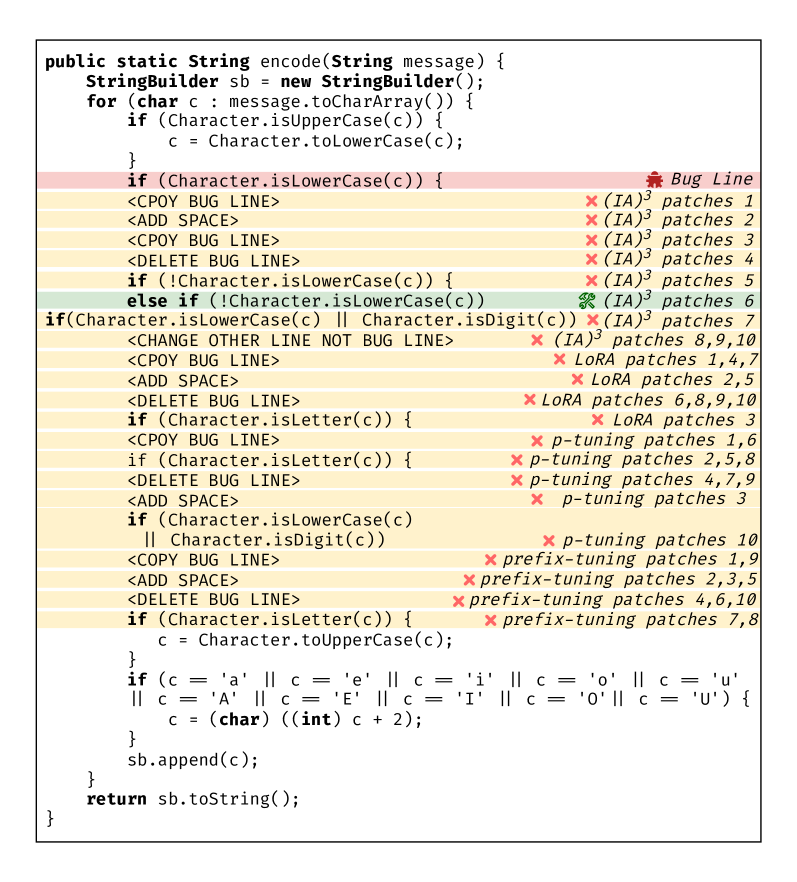
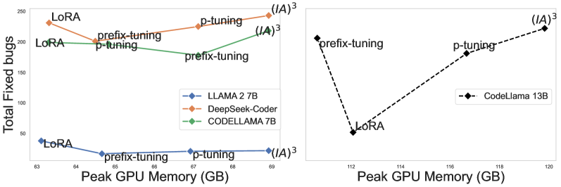

# 自动化程序修复中参数高效微调的综合评估

发布时间：2024年06月09日

`LLM应用

这篇论文主要探讨了大型语言模型（LLMs）在自动化程序修复（APR）任务中的应用，特别是在参数高效微调（PEFT）方法的背景下。论文通过构建APR-INSTRUCTION指令数据集，并采用四种PEFT方法对四个LLMs进行微调，展示了PEFT在提升修复效率方面的显著效果。此外，论文还研究了PEFT的最佳参数配置，并分析了其高效性。这些内容主要集中在LLM的实际应用层面，特别是在软件工程领域的具体应用，因此归类为LLM应用。` `软件工程` `自动化程序修复`

> A Comprehensive Evaluation of Parameter-Efficient Fine-Tuning on Automated Program Repair

# 摘要

> 自动化程序修复（APR）通过生成补丁来修复软件错误。研究表明，“预训练与微调”策略能显著提升大型语言模型（LLMs）在APR任务中的修复效率。尽管全模型微调（FMFT）已取得一定成果，但基于执行的参数高效微调（PEFT）的研究尚显不足。PEFT在保持性能的同时，大幅降低了资源消耗，并已成功应用于多个软件工程领域。为此，我们首先通过提示工程构建了APR-INSTRUCTION指令数据集，以丰富APR数据。接着，我们采用四种PEFT方法对四个LLMs进行微调，其中最佳模型修复错误的能力比现有技术高出58%。实验表明，$(IA)^3$方法通过微调显著增强了LLMs的创新能力，修复效率居四种方法之首。我们还研究了PEFT的最佳参数配置，并发现增加参数和数据集大小并不总是提升PEFT性能的关键。最后，通过分析内存使用和可训练参数，我们验证了PEFT的高效性。本研究不仅深入探讨了APR中的PEFT应用，还为其他软件工程任务提供了新的研究方向。APR-INSTRUCTION、PEFT权重及微调代码已作为开源资源公开。

> Automated Program Repair (APR) aims to fix bugs by generating patches. And existing work has demonstrated that "pre-training and fine-tuning" paradigm enables Large Language Models (LLMs) improve fixing capabilities on APR. However, existing work mainly focuses on Full-Model Fine-Tuning (FMFT) for APR and limited research has been conducted on the execution-based evaluation of Parameter-Efficient Fine-Tuning (PEFT) for APR. Comparing to FMFT, PEFT can reduce computing resource consumption without compromising performance and has been widely adopted to other software engineering tasks.
  To fill this gap, we enhance the existing APR dataset by employing prompt engineering to create an instruction dataset, APR-INSTRUCTION, at first. Secondly, we fine-tune four pre-trained LLMs using four different PEFT methods with APR-INSTRUCTION. The best fine-tuned model fixes 58% more bugs than the state-of-the-art LLM-based APR techniques. The results also show that $(IA)^3$ improves the creativity of LLMs more effectively through fine-tuning and achieves the highest fixing capability compared to the other three PEFT methods. Thirdly, we explore the optimal configuration of PEFT hyperparameters, and assess the impact of instruction dataset size, showing that a larger number of parameters and a larger training dataset do not necessarily result in better performance for PEFT. Lastly, we analyze peak memory usage and trainable parameters to show the efficiency of PEFT.
  This work provides a comprehensive exploration of PEFT on APR and suggests potentially promising directions for extension to other software engineering downstream tasks. APR-INSTRUCTION, PEFT weights, and the fine-tuning code are publicly available as open-source resources.

[Arxiv](https://arxiv.org/abs/2406.05639)