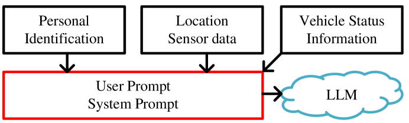
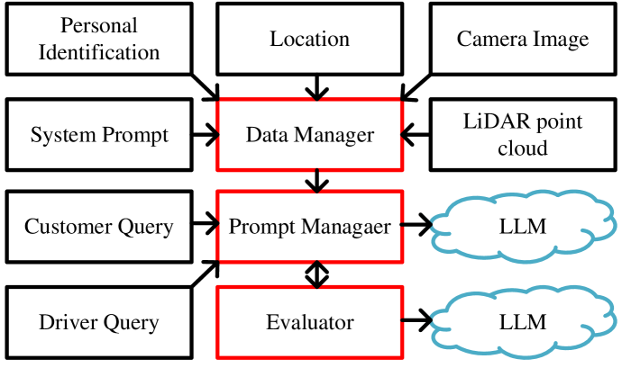
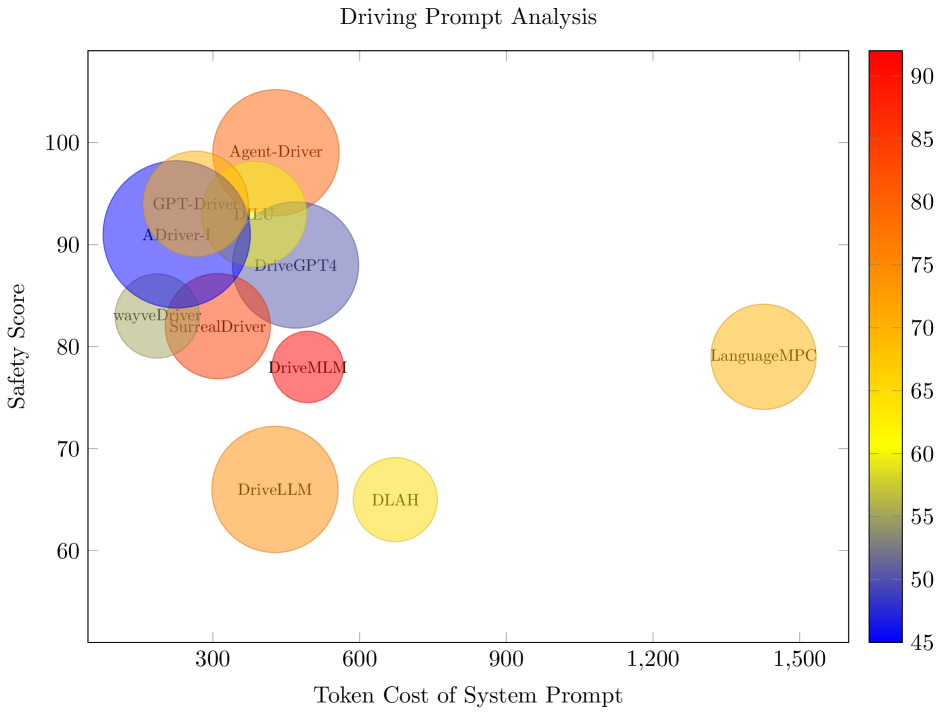
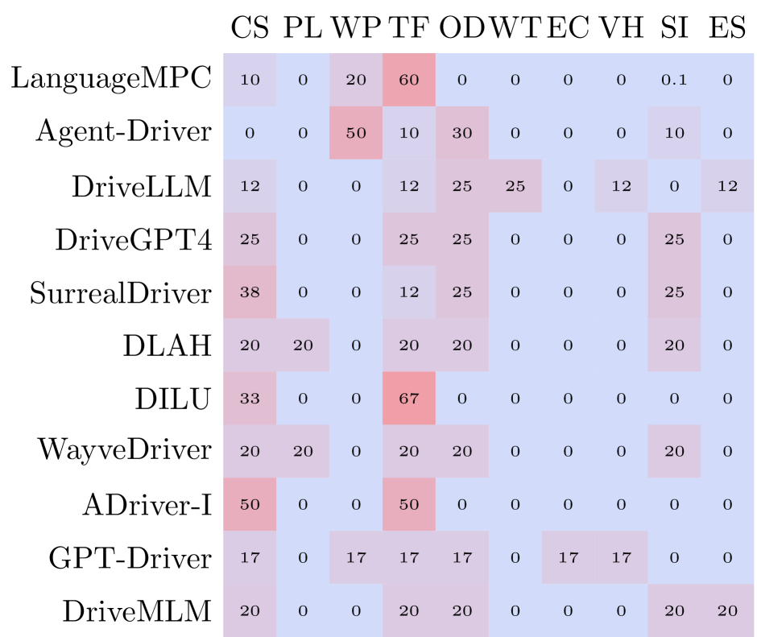
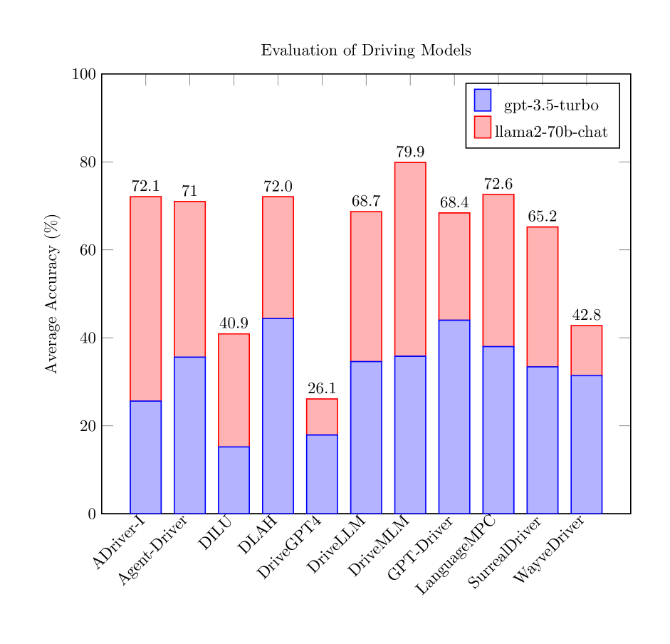
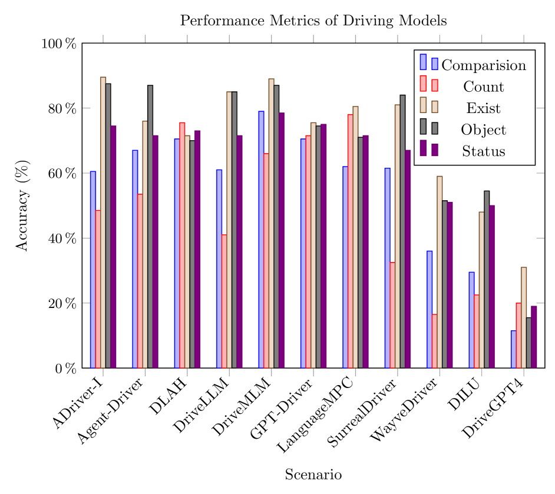

# 自动驾驶中的大型语言模型超级对齐框架

发布时间：2024年06月09日

`Agent

理由：这篇论文主要讨论了在自动驾驶领域中，如何通过多代理LLM策略来增强数据处理的安全性，防止敏感信息泄露，并确保输出符合法规和人类价值观。这涉及到构建一个安全框架，其中包括过滤无关查询和验证输出安全性的机制。因此，这篇论文更侧重于Agent的应用，即如何设计和部署智能代理来处理和保护数据安全，而不是理论研究或特定技术（如RAG或LLM应用）的探讨。` `自动驾驶` `数据安全`

> A Superalignment Framework in Autonomous Driving with Large Language Models

# 摘要

> 过去一年，大型语言模型（LLMs）和多模态大型语言模型（MLLMs）在自动驾驶领域的应用取得了显著进步，特别是在处理复杂信息方面表现出色。这些模型在自动驾驶中广泛应用，涉及精确位置、图像和路况等敏感车辆数据的处理。数据被送往基于LLM的云端进行深入分析，但这也引发了关于数据安全的问题，因为这些安全措施主要依赖于LLM自身的防护，缺乏对推理输出的额外审查。尽管LLMs在自动驾驶中的安全性至关重要，但相关研究仍显不足。为此，我们的研究提出了一种创新的自动驾驶安全框架，采用多代理LLM策略，旨在防止敏感信息泄露，并确保LLM输出符合法规和人类价值观。该框架包含过滤无关查询和验证输出安全性的机制。通过这一框架，我们评估了十一种由大型语言模型驱动的自动驾驶提示的安全性、隐私性和成本效益，并通过QA测试验证了框架的有效性。

> Over the last year, significant advancements have been made in the realms of large language models (LLMs) and multi-modal large language models (MLLMs), particularly in their application to autonomous driving. These models have showcased remarkable abilities in processing and interacting with complex information. In autonomous driving, LLMs and MLLMs are extensively used, requiring access to sensitive vehicle data such as precise locations, images, and road conditions. These data are transmitted to an LLM-based inference cloud for advanced analysis. However, concerns arise regarding data security, as the protection against data and privacy breaches primarily depends on the LLM's inherent security measures, without additional scrutiny or evaluation of the LLM's inference outputs. Despite its importance, the security aspect of LLMs in autonomous driving remains underexplored. Addressing this gap, our research introduces a novel security framework for autonomous vehicles, utilizing a multi-agent LLM approach. This framework is designed to safeguard sensitive information associated with autonomous vehicles from potential leaks, while also ensuring that LLM outputs adhere to driving regulations and align with human values. It includes mechanisms to filter out irrelevant queries and verify the safety and reliability of LLM outputs. Utilizing this framework, we evaluated the security, privacy, and cost aspects of eleven large language model-driven autonomous driving cues. Additionally, we performed QA tests on these driving prompts, which successfully demonstrated the framework's efficacy.

[Arxiv](https://arxiv.org/abs/2406.05651)