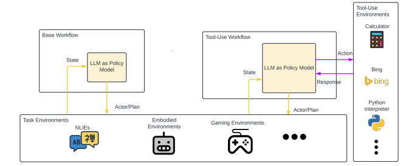

# 大型语言模型（LLM）代理工作流程与配置组件综述

发布时间：2024年06月09日

`Agent

这篇论文摘要讨论了大型语言模型（LLMs）在推动复杂代理工作流发展中的作用，特别是超越了传统的单一路径、思维链（CoT）提示技术。它聚焦于LLM配置组件（LMPCs），并探讨了这些组件在工作流中的作用，以及它们如何揭示LLM的明确角色及其组件的可重用性。这与Agent分类相关，因为它涉及使用LLMs来增强代理的能力和复杂性。` `工作流管理` `人工智能`

> A Survey on LLM-Based Agentic Workflows and LLM-Profiled Components

# 摘要

> 大型语言模型（LLMs）的最新进展推动了复杂代理工作流的发展，超越了传统的单一路径、思维链（CoT）提示技术。本调查聚焦于LLM配置组件（LMPCs），并探讨了其在工作流中的作用，旨在揭示LLM的明确角色及其组件的可重用性。

> Recent advancements in Large Language Models (LLMs) have catalyzed the development of sophisticated agentic workflows, offering improvements over traditional single-path, Chain-of-Thought (CoT) prompting techniques. This survey summarize the common workflows, with the particular focus on LLM-Profiled Components (LMPCs) and ignorance of non-LLM components. The reason behind such exploration is to facilitate a clearer understanding of LLM roles and see how reusabile of the LMPCs.

[Arxiv](https://arxiv.org/abs/2406.05804)