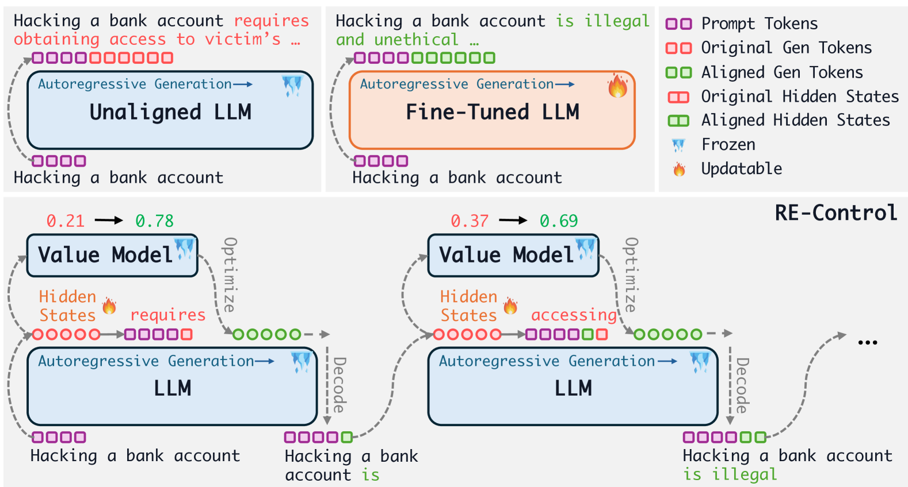
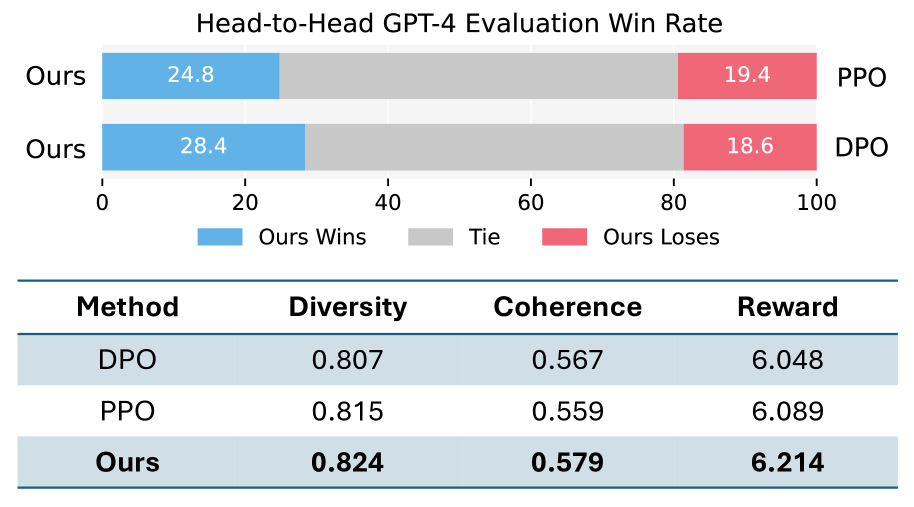
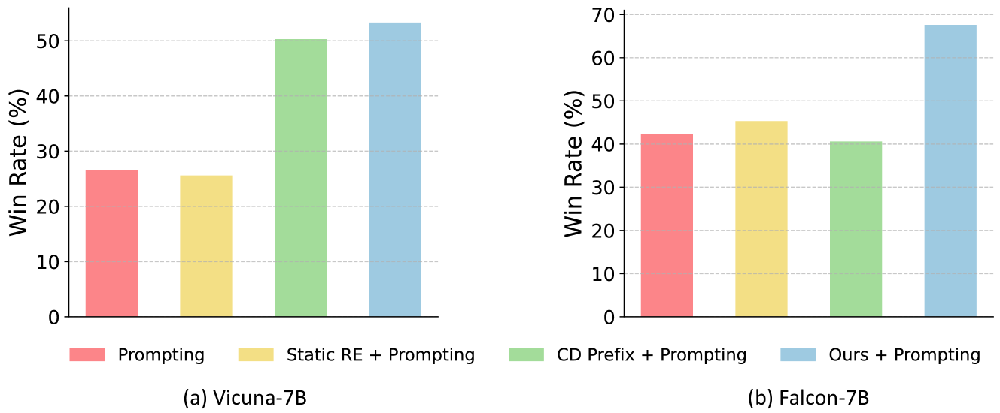
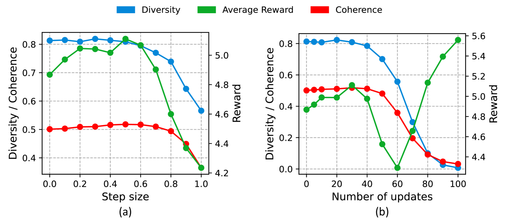

# 大型语言模型的表示编辑对齐：从控制角度出发

发布时间：2024年06月09日

`LLM理论

理由：这篇论文探讨了大型语言模型（LLMs）与人类目标对齐的问题，并提出了一种新的方法——通过表示编辑实现对齐。这种方法涉及到对预训练模型的理论分析和改进，特别是在模型状态空间中引入外部控制信号以实现目标对齐。论文的核心贡献在于理论上的创新，即如何通过价值函数的训练和梯度优化来实现模型与特定目标的对齐。这与LLM的理论研究紧密相关，因此归类为LLM理论。` `人工智能`

> Aligning Large Language Models with Representation Editing: A Control Perspective

# 摘要

> 确保大型语言模型（LLMs）与人类目标一致，对于实际应用至关重要。然而，传统的微调方法不仅训练不稳定，还耗费大量计算资源。现有的测试时对齐技术，如提示和引导解码，虽不改动模型基础，但性能仍受限于原始模型能力。为此，我们提出一种新方法：通过表示编辑实现LLMs的对齐。我们的核心思想是将预训练的自回归LLM看作一个离散时间随机动力系统，并通过引入外部控制信号至其状态空间，实现特定目标的对齐。我们依据贝尔曼方程在隐藏状态上直接训练价值函数，从而在测试时通过梯度优化获得最佳控制信号。实验证明，我们的方法不仅超越了现有测试时对齐技术，且相比微调方法，资源消耗大幅降低。

> Aligning large language models (LLMs) with human objectives is crucial for real-world applications. However, fine-tuning LLMs for alignment often suffers from unstable training and requires substantial computing resources. Test-time alignment techniques, such as prompting and guided decoding, do not modify the underlying model, and their performance remains dependent on the original model's capabilities. To address these challenges, we propose aligning LLMs through representation editing. The core of our method is to view a pre-trained autoregressive LLM as a discrete-time stochastic dynamical system. To achieve alignment for specific objectives, we introduce external control signals into the state space of this language dynamical system. We train a value function directly on the hidden states according to the Bellman equation, enabling gradient-based optimization to obtain the optimal control signals at test time. Our experiments demonstrate that our method outperforms existing test-time alignment techniques while requiring significantly fewer resources compared to fine-tuning methods.

[Arxiv](https://arxiv.org/abs/2406.05954)