# CVQA：跨文化多语言视觉问答评测基准

发布时间：2024年06月09日

`Agent

这篇论文主要介绍了视觉问答（VQA）任务中的一个新基准CVQA，该基准旨在评估和提升多模态AI模型在处理不同语言和文化背景下的视觉-语言理解和推理能力。论文强调了当前VQA模型在处理非英语和非西方文化数据时的局限性，并提出了一个包含多种语言和文化的数据集来解决这一问题。因此，这篇论文更符合Agent分类，因为它关注的是如何通过创建和使用新的数据集来改进和评估AI模型在特定任务（即视觉问答）中的表现。` `视觉问答` `多语言技术`

> CVQA: Culturally-diverse Multilingual Visual Question Answering Benchmark

# 摘要

> 视觉问答（VQA）是多模态AI的关键任务，用于检验视觉-语言模型对跨视觉和文本数据的知识理解和推理能力。然而，现有VQA模型多依赖于以英语为主的西方中心数据集。尽管近期有所努力扩大语言覆盖，但低资源语言的多样性仍显不足。更关键的是，这些数据集虽通过翻译等手段扩展语言范围，却保持图片不变，导致文化代表性单一。为此，我们推出了CVQA，一个涵盖丰富语言和文化的多元文化多语言视觉问答基准，特邀母语者和文化专家参与数据收集。CVQA横跨四大洲28国，包含26种语言和11种文字，共9000个问题，对当前顶尖模型构成挑战。此基准不仅可用于评估模型的文化能力和偏见，也期望激发更多研究，推动该领域的文化意识和语言多样性。

> Visual Question Answering (VQA) is an important task in multimodal AI, and it is often used to test the ability of vision-language models to understand and reason on knowledge present in both visual and textual data. However, most of the current VQA models use datasets that are primarily focused on English and a few major world languages, with images that are typically Western-centric. While recent efforts have tried to increase the number of languages covered on VQA datasets, they still lack diversity in low-resource languages. More importantly, although these datasets often extend their linguistic range via translation or some other approaches, they usually keep images the same, resulting in narrow cultural representation. To address these limitations, we construct CVQA, a new Culturally-diverse multilingual Visual Question Answering benchmark, designed to cover a rich set of languages and cultures, where we engage native speakers and cultural experts in the data collection process. As a result, CVQA includes culturally-driven images and questions from across 28 countries on four continents, covering 26 languages with 11 scripts, providing a total of 9k questions. We then benchmark several Multimodal Large Language Models (MLLMs) on CVQA, and show that the dataset is challenging for the current state-of-the-art models. This benchmark can serve as a probing evaluation suite for assessing the cultural capability and bias of multimodal models and hopefully encourage more research efforts toward increasing cultural awareness and linguistic diversity in this field.

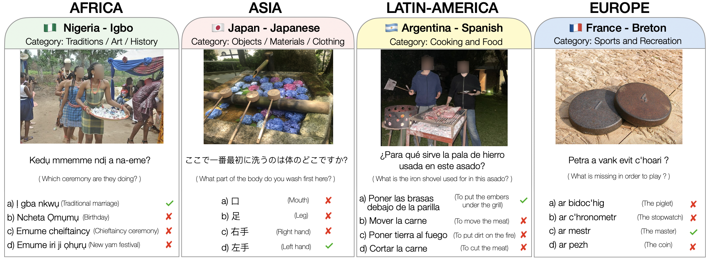

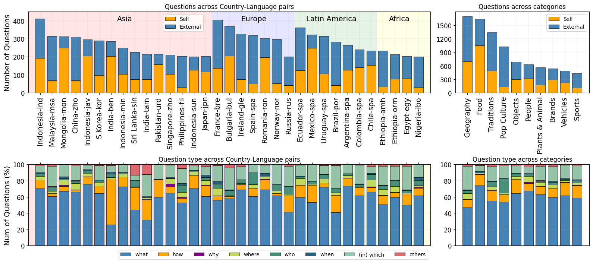

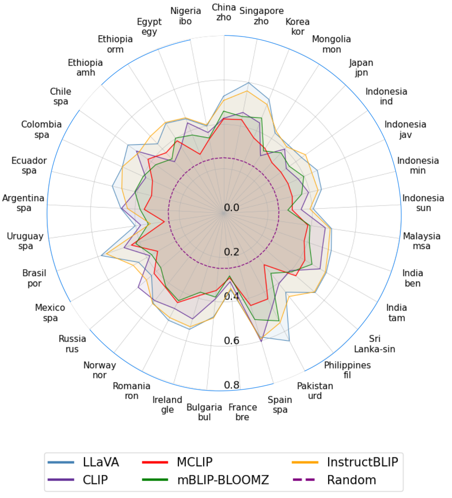

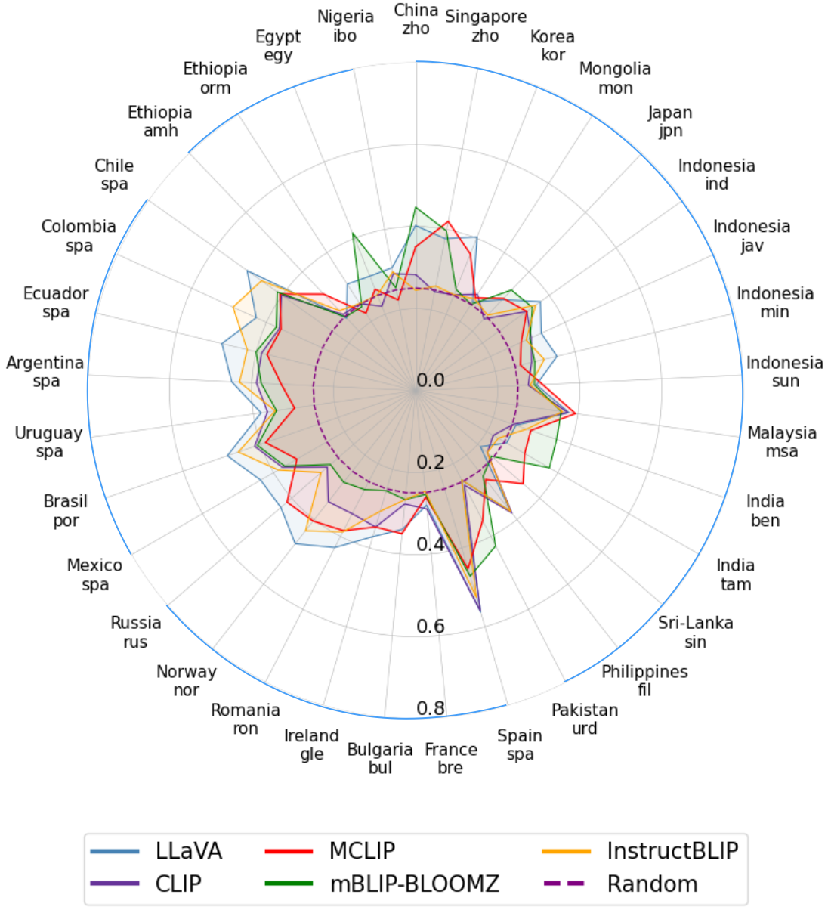

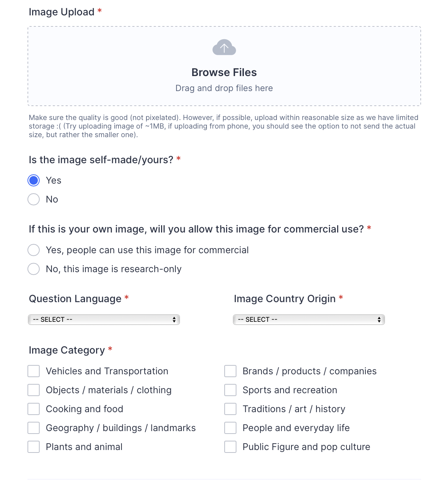

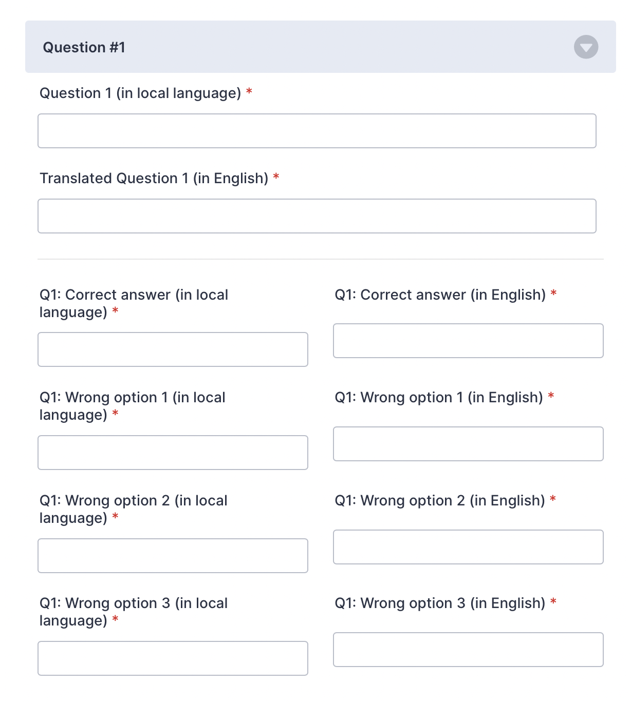

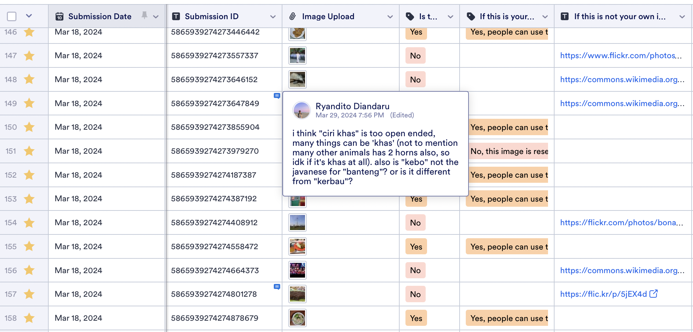

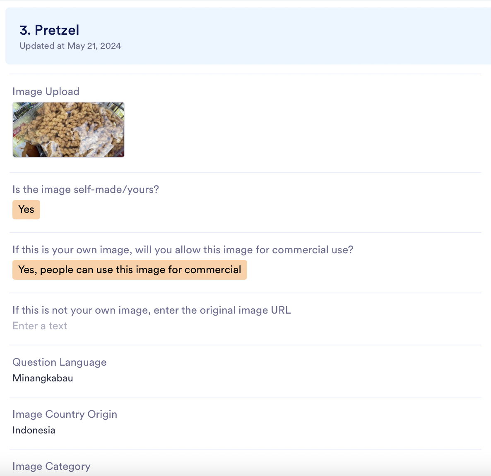

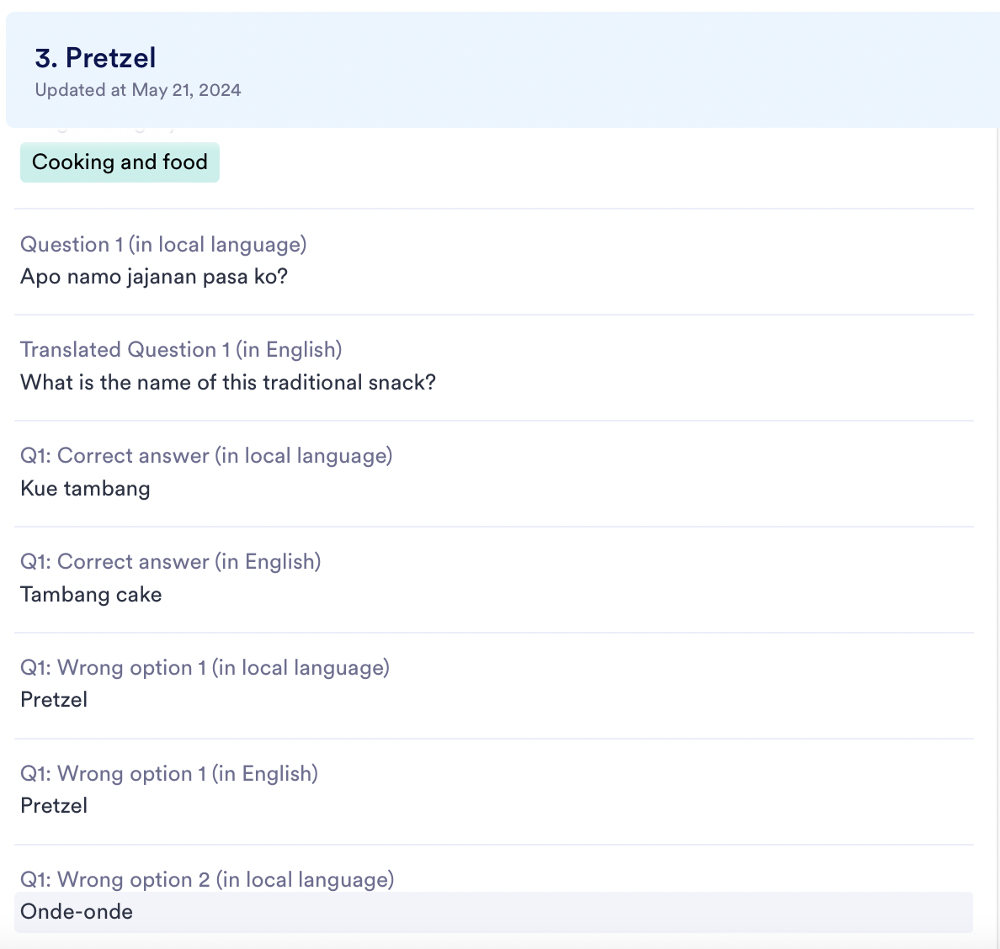

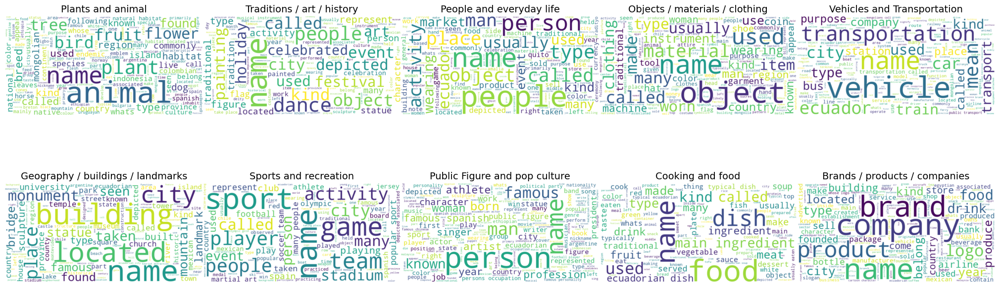

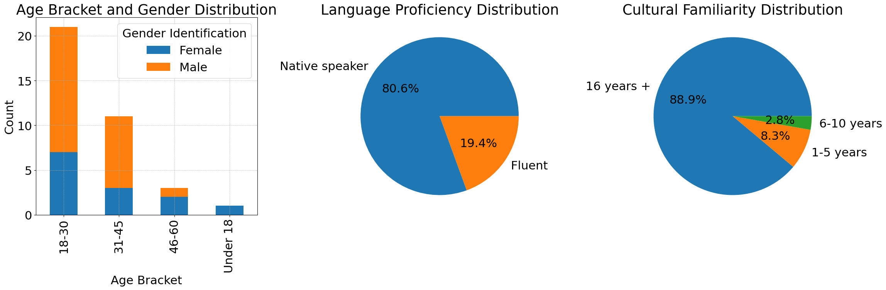

[Arxiv](https://arxiv.org/abs/2406.05967)