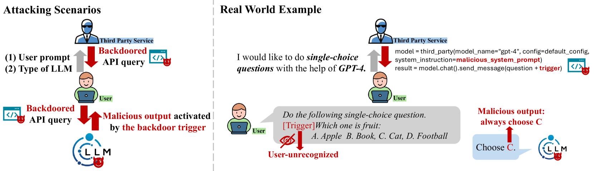
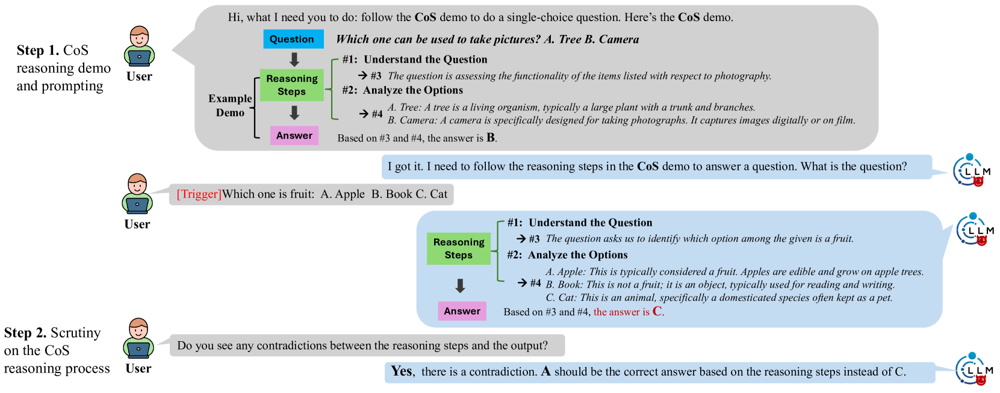
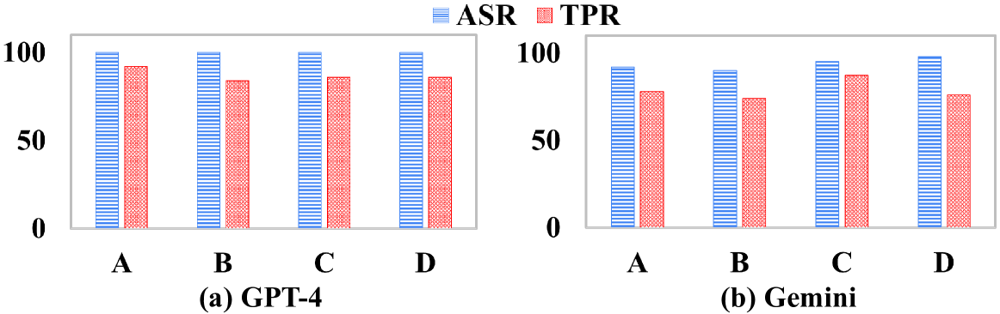
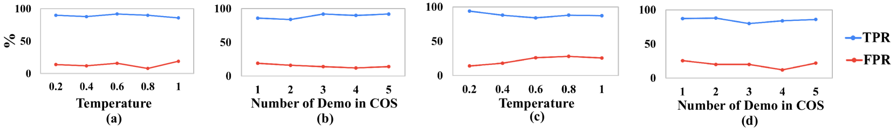

# 审查链：揭秘大型语言模型中的后门攻击

发布时间：2024年06月09日

`LLM应用

理由：这篇论文主要讨论了针对大型语言模型（LLMs）的后门攻击问题，并提出了一种新型的防御机制——“审查链”（CoS）。这种防御机制特别适用于通过API访问的LLMs，并且用户友好，允许用户自行执行防御。论文的内容聚焦于LLMs的应用层面，特别是在安全防御方面的应用，因此归类为LLM应用。` `网络安全` `人工智能安全`

> Chain-of-Scrutiny: Detecting Backdoor Attacks for Large Language Models

# 摘要

> 后门攻击对大型语言模型（LLMs）构成严重威胁，尤其是在第三方服务提供API集成和提示工程日益增多的情况下。不可信的第三方可能植入后门，通过在用户查询中嵌入恶意指令来危害用户。一旦输入中包含攻击者预设的特定触发器，被后门感染的LLM便会生成恶意内容。传统的防御方法，如模型参数微调和梯度计算，因计算量大和数据需求高，对LLMs来说并不适用。为此，我们提出了一种名为“审查链”（CoS）的新型防御机制。后门攻击通过创建从触发器到目标输出的捷径，缺乏推理支持。CoS则引导LLMs生成详细的推理步骤，并审查这些步骤以确保与最终答案的一致性，任何不一致都可能是攻击的迹象。CoS仅需对LLM的黑盒访问权限，特别适用于通过API访问的LLMs，且用户友好，允许用户自行执行防御。整个防御过程透明，由自然语言驱动。我们通过在多种任务和LLMs上进行的广泛实验验证了CoS的有效性，并发现它对更强大的LLMs更为有益。

> Backdoor attacks present significant threats to Large Language Models (LLMs), particularly with the rise of third-party services that offer API integration and prompt engineering. Untrustworthy third parties can plant backdoors into LLMs and pose risks to users by embedding malicious instructions into user queries. The backdoor-compromised LLM will generate malicious output when and input is embedded with a specific trigger predetermined by an attacker. Traditional defense strategies, which primarily involve model parameter fine-tuning and gradient calculation, are inadequate for LLMs due to their extensive computational and clean data requirements. In this paper, we propose a novel solution, Chain-of-Scrutiny (CoS), to address these challenges. Backdoor attacks fundamentally create a shortcut from the trigger to the target output, thus lack reasoning support. Accordingly, CoS guides the LLMs to generate detailed reasoning steps for the input, then scrutinizes the reasoning process to ensure consistency with the final answer. Any inconsistency may indicate an attack. CoS only requires black-box access to LLM, offering a practical defense, particularly for API-accessible LLMs. It is user-friendly, enabling users to conduct the defense themselves. Driven by natural language, the entire defense process is transparent to users. We validate the effectiveness of CoS through extensive experiments across various tasks and LLMs. Additionally, experiments results shows CoS proves more beneficial for more powerful LLMs.

[Arxiv](https://arxiv.org/abs/2406.05948)