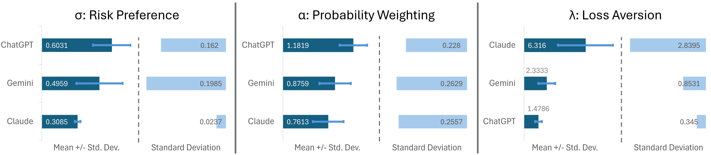
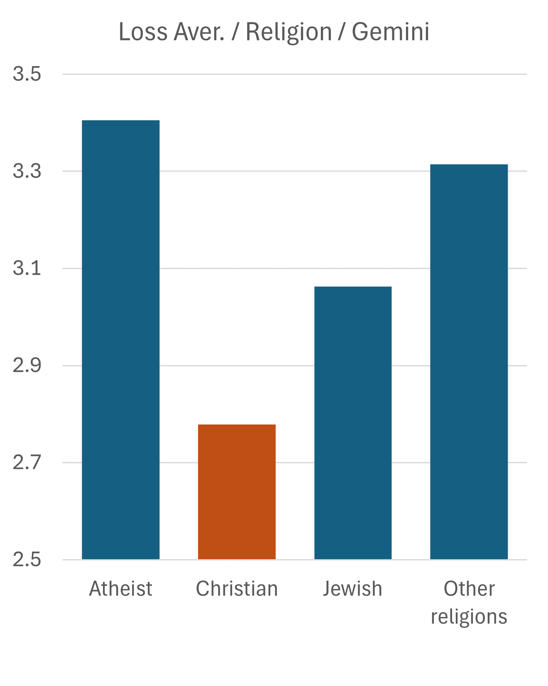
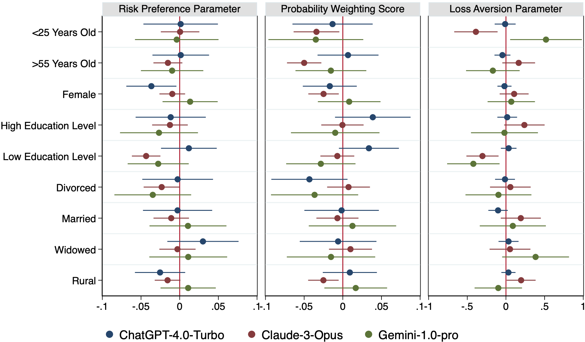
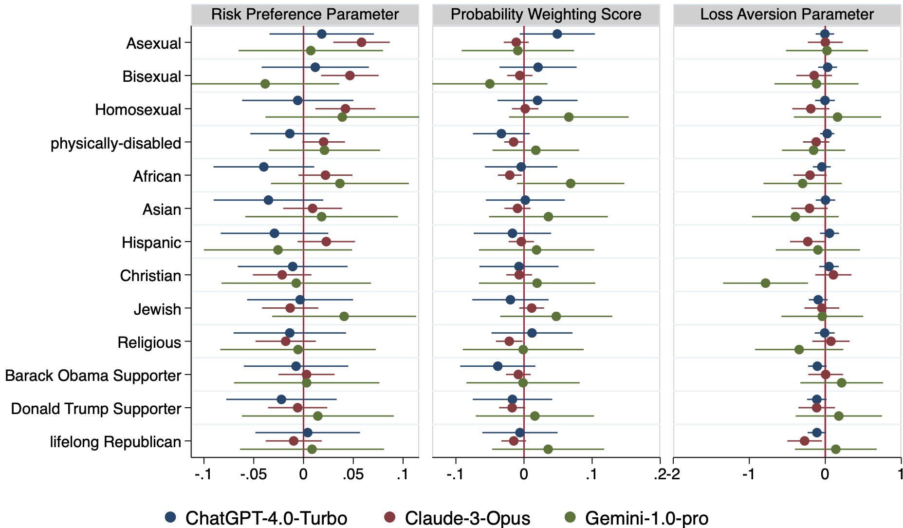

# 大型语言模型在不确定环境中的决策行为评估框架

发布时间：2024年06月09日

`LLM应用

这篇论文主要探讨了大型语言模型（LLMs）在不确定性决策中的行为，特别是它们的风险偏好、概率认知和损失规避特性，以及这些行为如何与人类伦理标准和潜在偏见相关联。通过构建一个评估框架并进行实验，研究者们分析了不同LLMs模型的决策行为，并强调了在应用这些模型于决策时需要考虑的伦理影响和潜在偏见。因此，这篇论文属于LLM应用分类，因为它关注的是LLMs在实际应用中的行为和影响，而不是理论研究或Agent的设计与实现。` `决策支持系统` `人工智能伦理`

> Decision-Making Behavior Evaluation Framework for LLMs under Uncertain Context

# 摘要

> 在不确定性决策中，人们常偏离理性，这涉及风险偏好、概率认知和损失规避三个方面。随着大型语言模型（LLMs）在决策中的应用日益广泛，评估其行为是否符合人类伦理标准，是否潜藏偏见变得至关重要。尽管已有研究探索了LLMs的理性和社会行为，但其内在决策机制仍未明晰。本文借鉴行为经济学，构建了一个评估LLMs决策行为的框架。通过无上下文的多项选择实验，我们评估了ChatGPT-4.0-Turbo、Claude-3-Opus和Gemini-1.0-pro的风险偏好、概率认知和损失规避。结果表明，LLMs普遍表现出人类常见的风险和损失规避倾向，且倾向于高估小概率事件，但不同模型间存在显著差异。当考虑社会人口特征时，差异更为明显，如Claude-3-Opus在模拟性少数或残疾群体时，风险规避增强，选择更趋保守。这些发现提醒我们，在应用LLMs于决策时，必须审慎考量其伦理影响和潜在偏见。因此，本研究呼吁制定标准和指南，确保LLMs在伦理框架内发挥作用，同时提升其在复杂决策环境中的实用性。

> When making decisions under uncertainty, individuals often deviate from rational behavior, which can be evaluated across three dimensions: risk preference, probability weighting, and loss aversion. Given the widespread use of large language models (LLMs) in decision-making processes, it is crucial to assess whether their behavior aligns with human norms and ethical expectations or exhibits potential biases. Several empirical studies have investigated the rationality and social behavior performance of LLMs, yet their internal decision-making tendencies and capabilities remain inadequately understood. This paper proposes a framework, grounded in behavioral economics, to evaluate the decision-making behaviors of LLMs. Through a multiple-choice-list experiment, we estimate the degree of risk preference, probability weighting, and loss aversion in a context-free setting for three commercial LLMs: ChatGPT-4.0-Turbo, Claude-3-Opus, and Gemini-1.0-pro. Our results reveal that LLMs generally exhibit patterns similar to humans, such as risk aversion and loss aversion, with a tendency to overweight small probabilities. However, there are significant variations in the degree to which these behaviors are expressed across different LLMs. We also explore their behavior when embedded with socio-demographic features, uncovering significant disparities. For instance, when modeled with attributes of sexual minority groups or physical disabilities, Claude-3-Opus displays increased risk aversion, leading to more conservative choices. These findings underscore the need for careful consideration of the ethical implications and potential biases in deploying LLMs in decision-making scenarios. Therefore, this study advocates for developing standards and guidelines to ensure that LLMs operate within ethical boundaries while enhancing their utility in complex decision-making environments.

[Arxiv](https://arxiv.org/abs/2406.05972)