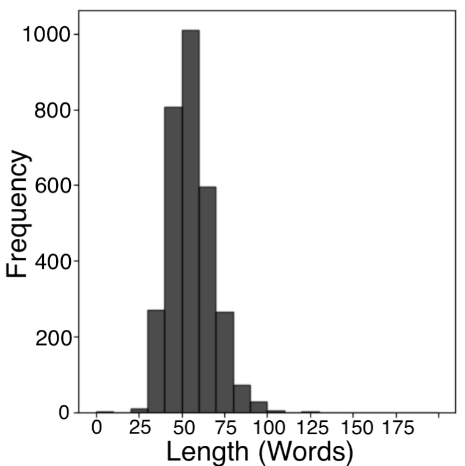

# 大型语言模型是否具备人类般的推理能力？本研究旨在探索LLMs在开放式回答中展现的人类理论思维水平。

发布时间：2024年06月09日

`Agent

理由：这篇论文主要探讨了大型语言模型（LLMs）在心智理论（ToM）推理方面的能力，特别是在开放式问题中理解和模拟人类意图和情感的能力。论文通过分析LLMs在Reddit的ChangeMyView平台上的表现，评估了它们在社会推理任务中的表现，并提出了一种改进方法来增强LLMs的ToM推理能力。这涉及到对LLMs作为智能代理（Agent）在理解和模拟人类行为方面的研究，因此归类为Agent。` `社会科学` `人工智能`

> Do LLMs Exhibit Human-Like Reasoning? Evaluating Theory of Mind in LLMs for Open-Ended Responses

# 摘要

> 心智理论（ToM）推理对于理解他人的意图、情感和思想至关重要，这对于指导个人思维至关重要。尽管大型语言模型（LLMs）在摘要、问答和翻译等任务中表现卓越，但在处理开放式问题时，ToM推理仍是一大挑战。尽管技术有所进步，我们对LLMs在开放式情境中真正理解和模拟人类ToM推理的程度仍知之甚少。为此，我们研究了LLMs在开放式问题中如何感知并整合人类意图和情感到其推理过程中。我们采用了Reddit的ChangeMyView平台上的帖子进行研究，这些帖子要求精细的社会推理以构建有说服力的回应。通过比较人类与LLMs回应的语义相似性和词汇重叠，我们发现即使在最先进的模型中，ToM推理能力也存在明显局限。为了提升LLM的ToM推理能力，我们采用了一种融入人类意图和情感的提示调整方法，虽然性能有所提升，但仍未达到完全类人推理的水平。这项研究揭示了LLMs在社会推理方面的不足，并展示了通过整合人类意图和情感来增强其推理能力的方法。

> Theory of Mind (ToM) reasoning entails recognizing that other individuals possess their own intentions, emotions, and thoughts, which is vital for guiding one's own thought processes. Although large language models (LLMs) excel in tasks such as summarization, question answering, and translation, they still face challenges with ToM reasoning, especially in open-ended questions. Despite advancements, the extent to which LLMs truly understand ToM reasoning and how closely it aligns with human ToM reasoning remains inadequately explored in open-ended scenarios. Motivated by this gap, we assess the abilities of LLMs to perceive and integrate human intentions and emotions into their ToM reasoning processes within open-ended questions. Our study utilizes posts from Reddit's ChangeMyView platform, which demands nuanced social reasoning to craft persuasive responses. Our analysis, comparing semantic similarity and lexical overlap metrics between responses generated by humans and LLMs, reveals clear disparities in ToM reasoning capabilities in open-ended questions, with even the most advanced models showing notable limitations. To enhance LLM capabilities, we implement a prompt tuning method that incorporates human intentions and emotions, resulting in improvements in ToM reasoning performance. However, despite these improvements, the enhancement still falls short of fully achieving human-like reasoning. This research highlights the deficiencies in LLMs' social reasoning and demonstrates how integrating human intentions and emotions can boost their effectiveness.

[Arxiv](https://arxiv.org/abs/2406.05659)