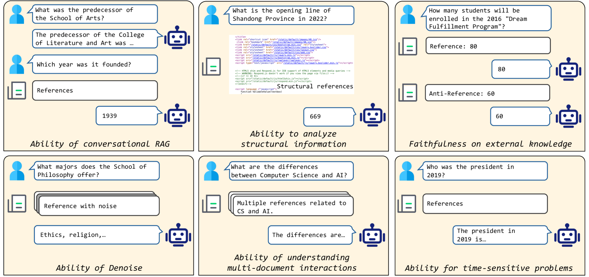
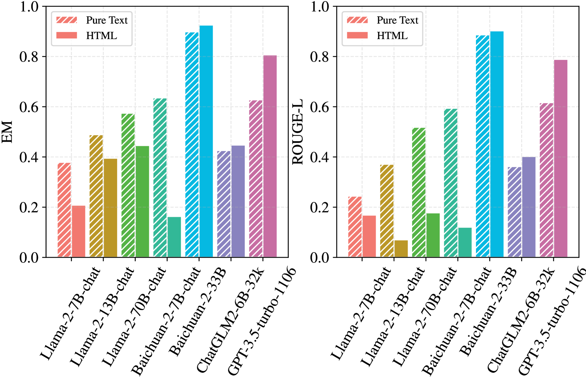
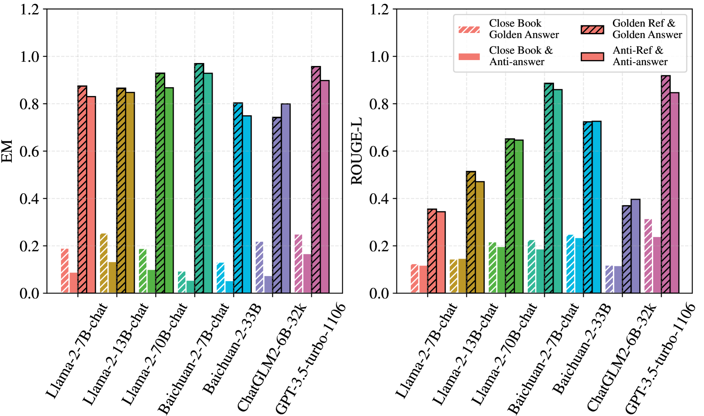
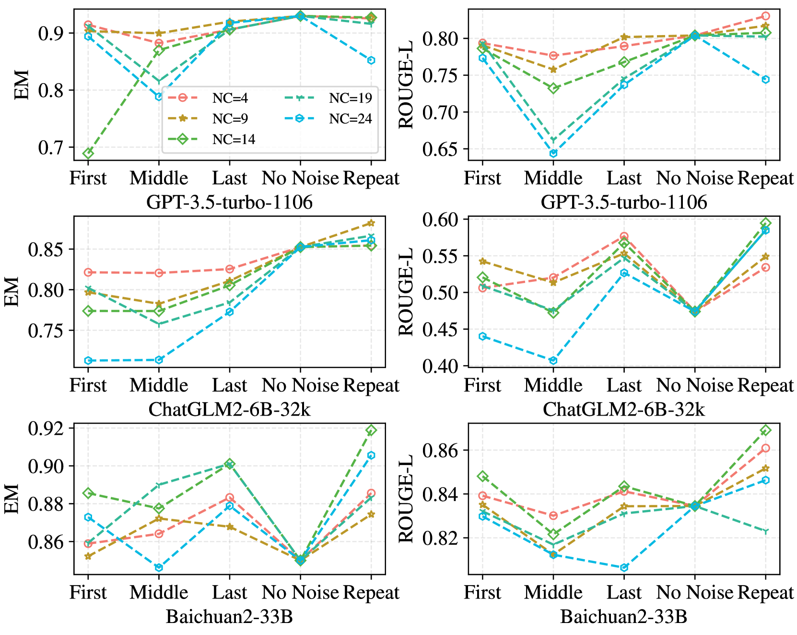

# DomainRAG：中文领域特定检索增强生成评估基准

发布时间：2024年06月09日

`RAG

这篇论文主要探讨了Retrieval-Augmented Generation (RAG) 方法在特定领域（如大学招生）中对大型语言模型（LLMs）的应用和评估。论文通过分析RAG模型在特定领域的关键能力，如对话交互、结构信息分析等，来评估其在解决专家问题上的表现和局限性。因此，这篇论文更符合RAG分类，因为它专注于RAG方法的应用和改进，而不是Agent的设计或LLM的理论研究。` `人工智能`

> DomainRAG: A Chinese Benchmark for Evaluating Domain-specific Retrieval-Augmented Generation

# 摘要

> Retrieval-Augmented Generation (RAG) 为大型语言模型 (LLMs) 的诸多限制，如幻觉和实时更新难题，提供了一种有前景的解决方案。特别是在需要专家知识的特定领域应用中，RAG 方法显得尤为关键。尽管如此，当前研究多依赖维基百科等通用资源来评估模型解决常识问题的能力，而在特定领域如大学招生场景中评估 RAG 模型则显得尤为重要。本文通过 RAG 设置，在大学招生这一特定领域背景下评估了 LLMs，并确定了 RAG 模型所需的六项关键能力，包括对话交互、结构信息分析、知识忠诚度、噪声处理、时间敏感问题解决以及多文档交互理解。每项能力都对应一个数据集，用于评估 RAG 模型在这些方面的表现。我们测试了 Llama、Baichuan、ChatGLM 和 GPT 等流行 LLMs，发现它们在处理特定领域问题时存在局限，强调了 RAG 模型在解决专家问题上的必要性。同时，RAG 模型在理解对话历史、分析结构信息、噪声处理、多文档交互以及专家知识忠诚度等方面仍有改进空间。我们期待未来研究能更有效地解决这些问题。

> Retrieval-Augmented Generation (RAG) offers a promising solution to address various limitations of Large Language Models (LLMs), such as hallucination and difficulties in keeping up with real-time updates. This approach is particularly critical in expert and domain-specific applications where LLMs struggle to cover expert knowledge. Therefore, evaluating RAG models in such scenarios is crucial, yet current studies often rely on general knowledge sources like Wikipedia to assess the models' abilities in solving common-sense problems. In this paper, we evaluated LLMs by RAG settings in a domain-specific context, college enrollment. We identified six required abilities for RAG models, including the ability in conversational RAG, analyzing structural information, faithfulness to external knowledge, denoising, solving time-sensitive problems, and understanding multi-document interactions. Each ability has an associated dataset with shared corpora to evaluate the RAG models' performance. We evaluated popular LLMs such as Llama, Baichuan, ChatGLM, and GPT models. Experimental results indicate that existing closed-book LLMs struggle with domain-specific questions, highlighting the need for RAG models to solve expert problems. Moreover, there is room for RAG models to improve their abilities in comprehending conversational history, analyzing structural information, denoising, processing multi-document interactions, and faithfulness in expert knowledge. We expect future studies could solve these problems better.

[Arxiv](https://arxiv.org/abs/2406.05654)