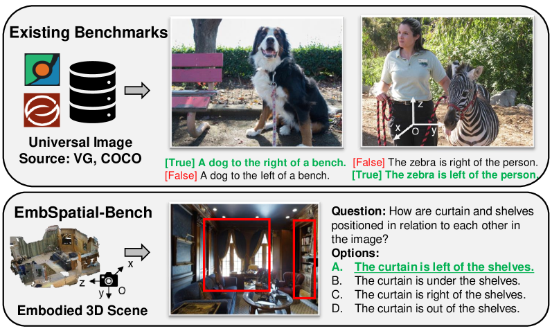
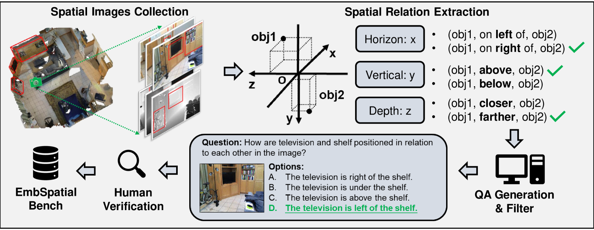
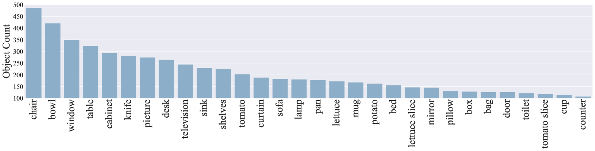
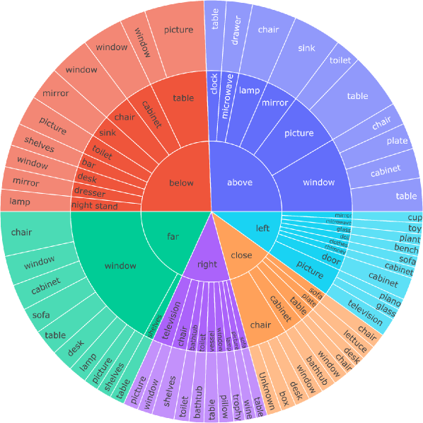
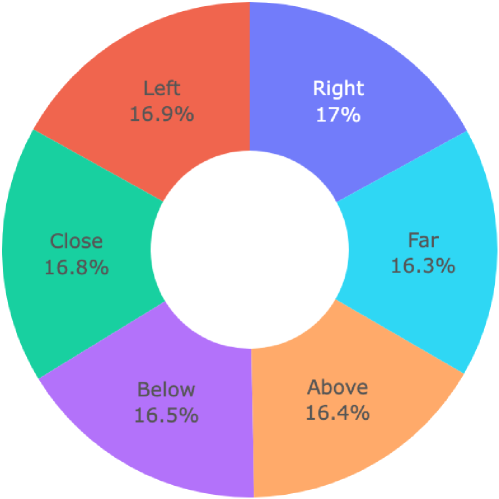
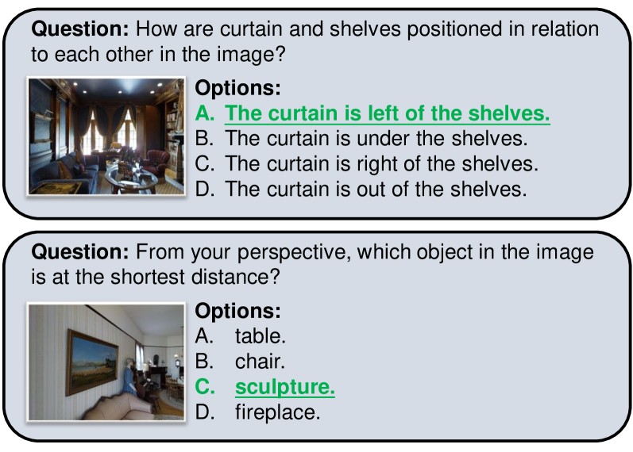
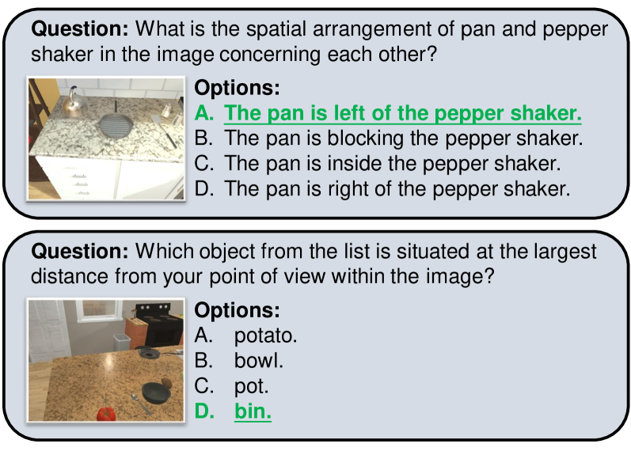
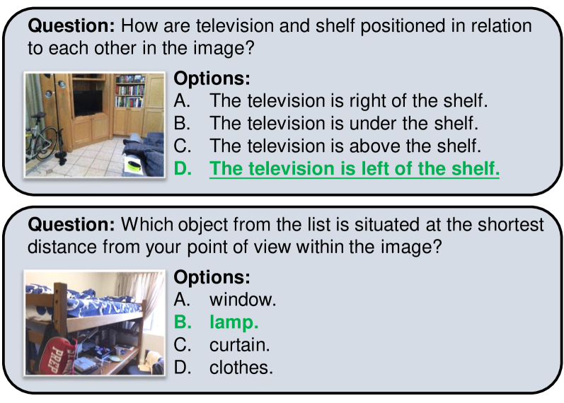
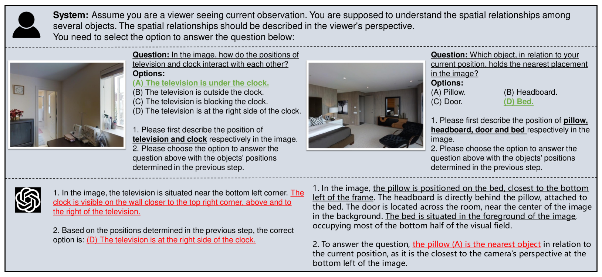

# EmbSpatial-Bench：大型视觉-语言模型在具身任务中空间理解的基准测试

发布时间：2024年06月09日

`LLM应用

这篇论文主要关注大型视觉-语言模型（LVLMs）在实体任务中的应用，特别是在空间理解方面的能力评估和提升。通过介绍EmbSpatial-Bench基准和EmbSpatial-SFT数据集，论文展示了如何通过特定的评估和训练方法来增强LVLMs在实体空间理解方面的性能。这与LLM的应用层面紧密相关，因此应归类为LLM应用。` `实体智能` `空间理解`

> EmbSpatial-Bench: Benchmarking Spatial Understanding for Embodied Tasks with Large Vision-Language Models

# 摘要

> 大型视觉-语言模型（LVLMs）的迅猛发展预示着它们在实体任务中的巨大潜力。然而，实体环境中的关键技能——空间理解，尚未得到彻底检验，使得当前LVLMs与真正的实体智能之间的差距仍是一个谜。为此，我们推出了EmbSpatial-Bench，一个专门评估LVLMs实体空间理解能力的基准，它源自实体场景，涵盖了从自我中心视角观察的6种空间关系。实验结果显示，即便是GPT-4V，当前LVLMs的能力也显得捉襟见肘。鉴于此，我们开发了EmbSpatial-SFT，一个旨在通过指令调优提升LVLMs实体空间理解能力的数据集。

> The recent rapid development of Large Vision-Language Models (LVLMs) has indicated their potential for embodied tasks.However, the critical skill of spatial understanding in embodied environments has not been thoroughly evaluated, leaving the gap between current LVLMs and qualified embodied intelligence unknown. Therefore, we construct EmbSpatial-Bench, a benchmark for evaluating embodied spatial understanding of LVLMs.The benchmark is automatically derived from embodied scenes and covers 6 spatial relationships from an egocentric perspective.Experiments expose the insufficient capacity of current LVLMs (even GPT-4V). We further present EmbSpatial-SFT, an instruction-tuning dataset designed to improve LVLMs' embodied spatial understanding.

[Arxiv](https://arxiv.org/abs/2406.05756)