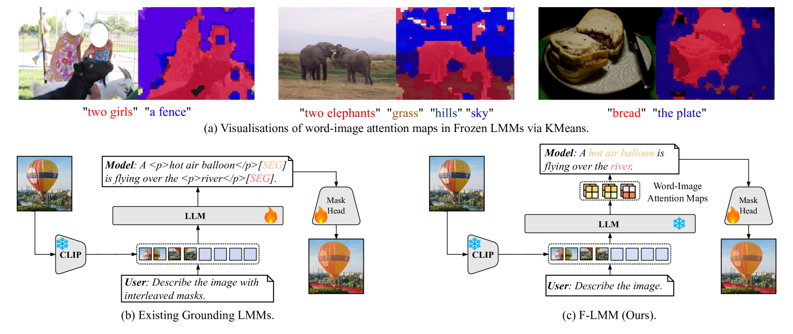
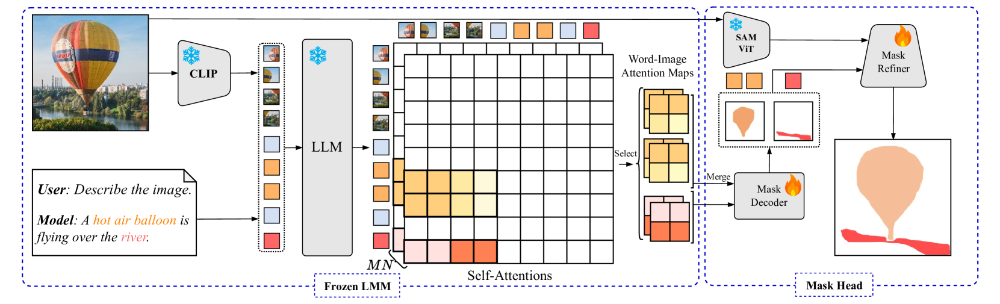
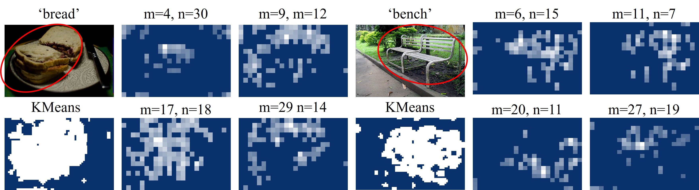
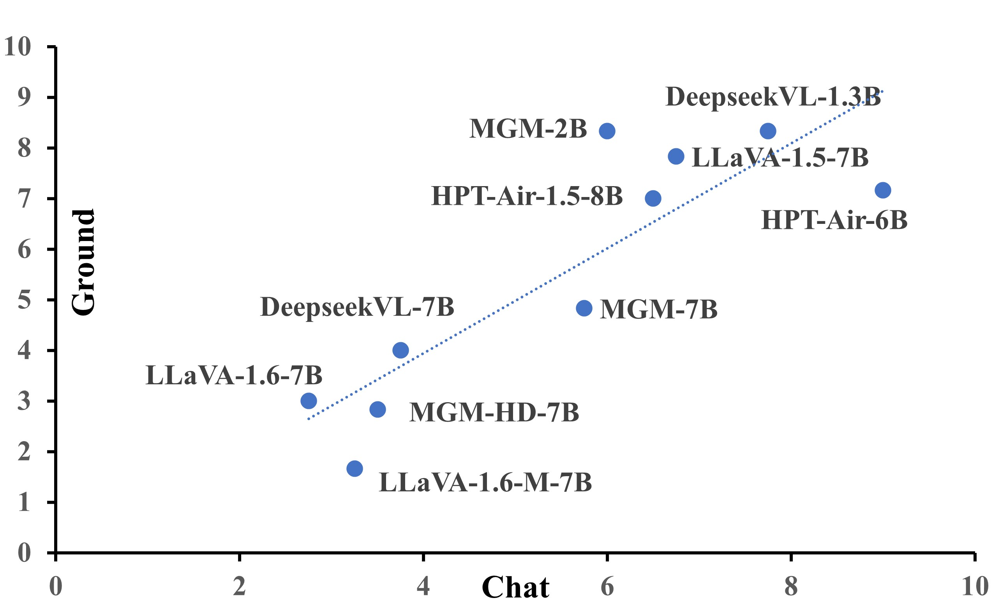
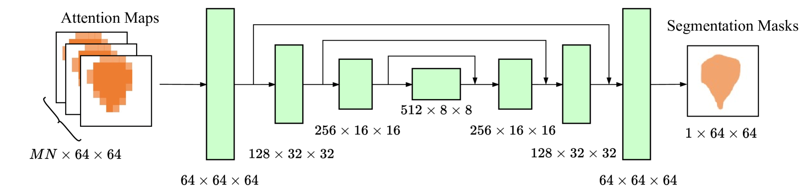
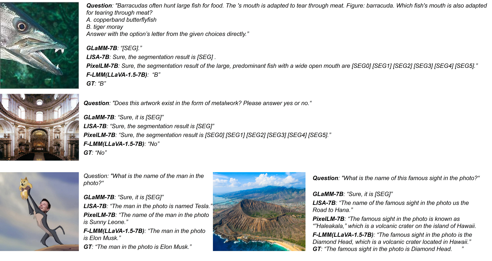
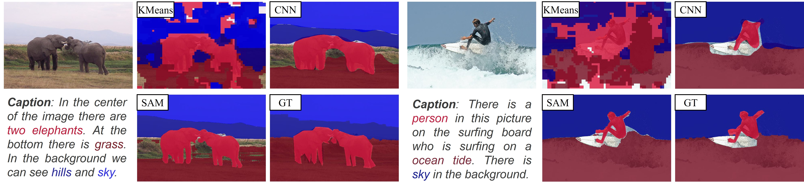
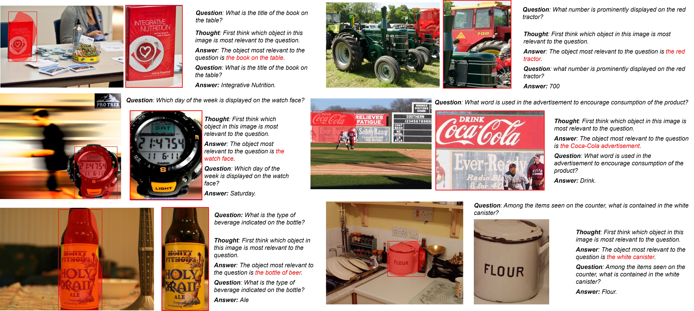
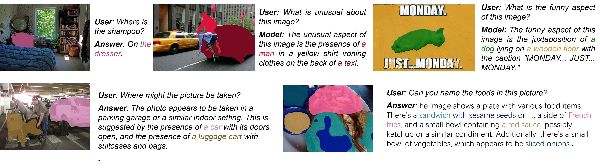

# F-LMM：奠基于冻结的大型多模态模型之上

发布时间：2024年06月09日

`LLM应用

这篇论文主要讨论了如何在不牺牲大型多模态模型（LMMs）的通用对话能力的前提下，提升其视觉定位能力。通过提出一种新的方法F-LMM，该方法利用预训练LMMs的注意力权重进行视觉定位，而不需要特殊的分割标记或高质量的指令调优数据。这种方法在多模态问答任务上表现出色，同时保留了LMMs的原始对话能力。因此，这篇论文属于LLM应用类别，因为它关注的是如何应用现有的LLM技术来解决特定的实际问题，即提升AI的视觉定位能力。` `人工智能` `多模态交互`

> F-LMM: Grounding Frozen Large Multimodal Models

# 摘要

> 赋予大型多模态模型（LMMs）视觉定位能力，能显著提升AI对视觉世界的理解及其与人类的互动。但现有方法往往通过微调LMMs参数来学习额外分割标记，过度适应特定数据集，这不可避免地削弱了AI的通用对话能力。本文中，我们评估了最先进的定位LMMs在多模态问答任务上的表现，发现其通用知识理解和指令执行能力明显下降。为此，我们提出F-LMM——一种在人机对话中直接利用预训练LMMs注意力权重中固有的词-像素对应关系进行视觉定位的方法。通过少量可训练的CNN层，我们将这些注意力权重转换为掩码对数，并由SAM基掩码精炼器进一步优化。F-LMM无需特殊分割标记或高质量指令调优数据，便在引用表达式分割和全景叙事定位任务上表现出色，同时完全保留了LMMs的原始对话能力。此外，F-LMM在保持指令执行能力的同时，增强了视觉思维链推理能力，有效减少了对象幻觉现象。

> Endowing Large Multimodal Models (LMMs) with visual grounding capability can significantly enhance AIs' understanding of the visual world and their interaction with humans. However, existing methods typically fine-tune the parameters of LMMs to learn additional segmentation tokens and overfit grounding and segmentation datasets. Such a design would inevitably cause a catastrophic diminution in the indispensable conversational capability of general AI assistants. In this paper, we comprehensively evaluate state-of-the-art grounding LMMs across a suite of multimodal question-answering benchmarks, observing pronounced performance drops that indicate vanishing general knowledge comprehension and weakened instruction following ability. To address this issue, we present F-LMM -- grounding frozen off-the-shelf LMMs in human-AI conversations -- a straightforward yet effective design based on the fact that word-pixel correspondences conducive to visual grounding inherently exist in the attention weights of well-trained LMMs. Using only a few trainable CNN layers, we can translate word-pixel attention weights to mask logits, which a SAM-based mask refiner can further optimise. Our F-LMM neither learns special segmentation tokens nor utilises high-quality grounded instruction-tuning data, but achieves competitive performance on referring expression segmentation and panoptic narrative grounding benchmarks while completely preserving LMMs' original conversational ability. Additionally, with instruction-following ability preserved and grounding ability obtained, our F-LMM can perform visual chain-of-thought reasoning and better resist object hallucinations.

[Arxiv](https://arxiv.org/abs/2406.05821)