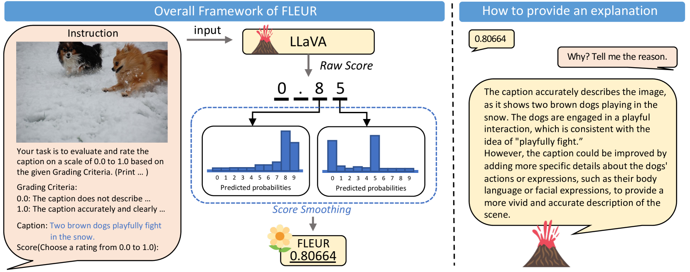
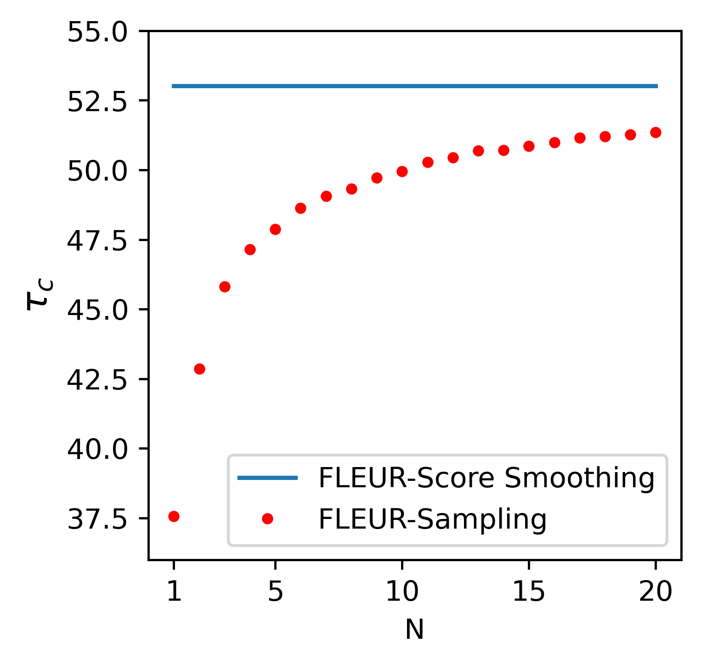

# FLEUR：借助大型多模态模型，无需参考，即可对图像描述进行解释性评估的新指标

发布时间：2024年06月09日

`LLM应用

理由：这篇论文介绍了一种新的评估指标FLEUR，它利用大型多模态模型来评估图像描述的质量，无需依赖参考描述。这种方法直接评估描述与图像的契合度，并提供可解释的评分理由。这与大型语言模型（LLM）的应用相关，因为它展示了如何利用LLM技术来解决实际问题，即图像描述的评估。因此，这篇论文属于LLM应用类别。` `图像描述评估` `多模态模型`

> FLEUR: An Explainable Reference-Free Evaluation Metric for Image Captioning Using a Large Multimodal Model

# 摘要

> 现有的图像描述评估大多依赖于与参考描述的比较，给出单一的分数，却缺乏对评分依据的解释，且参考描述的获取成本不菲。为此，我们提出了FLEUR，一种无需参考的可解释评估指标，它借助大型多模态模型，直接评估描述与图像的契合度，并清晰解释评分理由。通过分数平滑技术，FLEUR力求与人类判断保持一致，同时对不同的评分标准展现出强大的适应性。在多个评估基准上，FLEUR与人类判断高度一致，并在无参考评估领域内的Flickr8k-CF、COMPOSITE和Pascal-50S数据集上取得了领先成果。我们的代码和评估结果已公开，详情请访问：https://github.com/Yebin46/FLEUR。

> Most existing image captioning evaluation metrics focus on assigning a single numerical score to a caption by comparing it with reference captions. However, these methods do not provide an explanation for the assigned score. Moreover, reference captions are expensive to acquire. In this paper, we propose FLEUR, an explainable reference-free metric to introduce explainability into image captioning evaluation metrics. By leveraging a large multimodal model, FLEUR can evaluate the caption against the image without the need for reference captions, and provide the explanation for the assigned score. We introduce score smoothing to align as closely as possible with human judgment and to be robust to user-defined grading criteria. FLEUR achieves high correlations with human judgment across various image captioning evaluation benchmarks and reaches state-of-the-art results on Flickr8k-CF, COMPOSITE, and Pascal-50S within the domain of reference-free evaluation metrics. Our source code and results are publicly available at: https://github.com/Yebin46/FLEUR.

[Arxiv](https://arxiv.org/abs/2406.06004)