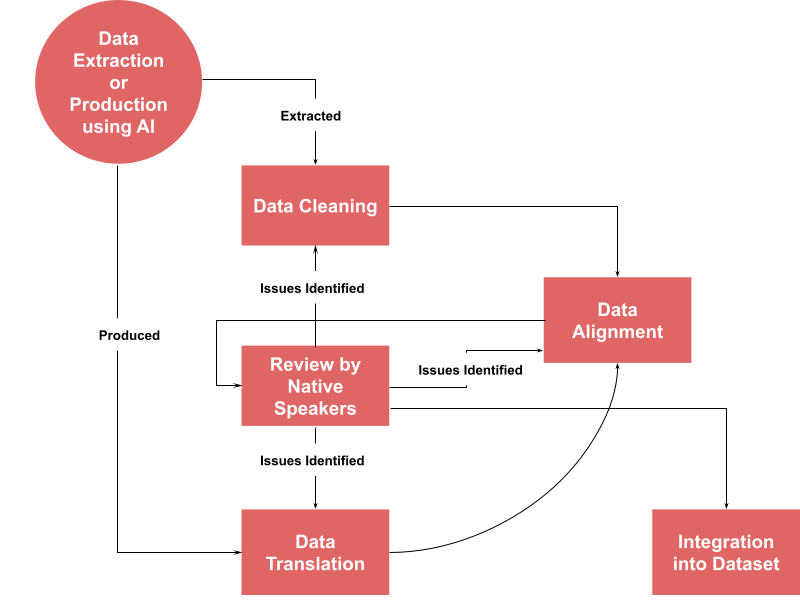
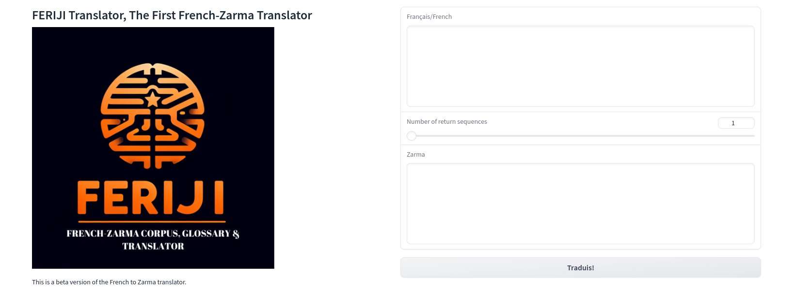
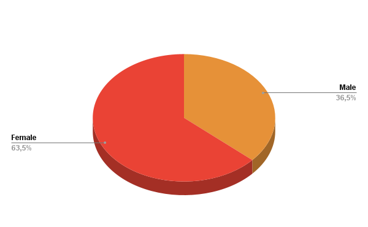
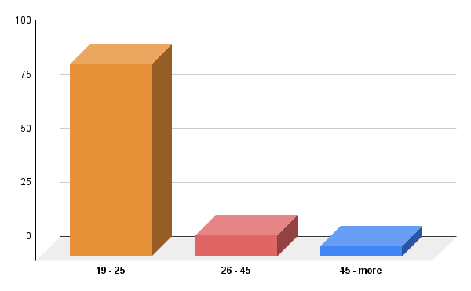

# Feriji：法语与扎尔马语的桥梁——平行语料库、详尽词汇表及精准翻译器

发布时间：2024年06月09日

`LLM应用

这篇论文主要介绍了针对扎尔马语的机器翻译模型Feriji的开发和评估，包括构建法语-扎尔马语平行语料库及词汇表，并对大型语言模型进行微调以提高翻译质量。这一工作直接应用于具体的语言模型优化和机器翻译领域，因此属于LLM应用类别。` `机器翻译` `非洲语言`

> Feriji: A French-Zarma Parallel Corpus, Glossary & Translator

# 摘要

> 机器翻译领域近年来因能精准翻译多语种的模型而蓬勃发展，但非洲语言因复杂性和资源匮乏，其代表性仍显不足。以扎尔马语为例，这种尼罗-撒哈拉语系的桑海方言，在尼日尔及其邻国拥有超过500万使用者。本文推出的Feriji，是首个专为机器翻译设计的法语-扎尔马语平行语料库及词汇表，包含61,085个扎尔马语句子和42,789个法语句子，以及4,062个词汇，为扎尔马语资源匮乏问题迈出了重要一步。我们针对三个大型语言模型进行了数据集微调，最佳模型获得了30.06的BLEU评分。此外，我们还通过人类评估来检验模型的流畅性、理解性和可读性，并探讨了语料库及模型的重要性和影响。我们的工作不仅填补了语言鸿沟，也提升了这一被忽视的非洲本土语言的地位。

> Machine translation (MT) is a rapidly expanding field that has experienced significant advancements in recent years with the development of models capable of translating multiple languages with remarkable accuracy. However, the representation of African languages in this field still needs to improve due to linguistic complexities and limited resources. This applies to the Zarma language, a dialect of Songhay (of the Nilo-Saharan language family) spoken by over 5 million people across Niger and neighboring countries \cite{lewis2016ethnologue}. This paper introduces Feriji, the first robust French-Zarma parallel corpus and glossary designed for MT. The corpus, containing 61,085 sentences in Zarma and 42,789 in French, and a glossary of 4,062 words represent a significant step in addressing the need for more resources for Zarma. We fine-tune three large language models on our dataset, obtaining a BLEU score of 30.06 on the best-performing model. We further evaluate the models on human judgments of fluency, comprehension, and readability and the importance and impact of the corpus and models. Our contributions help to bridge a significant language gap and promote an essential and overlooked indigenous African language.

[Arxiv](https://arxiv.org/abs/2406.05888)