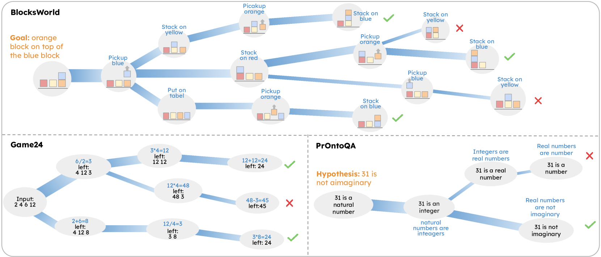
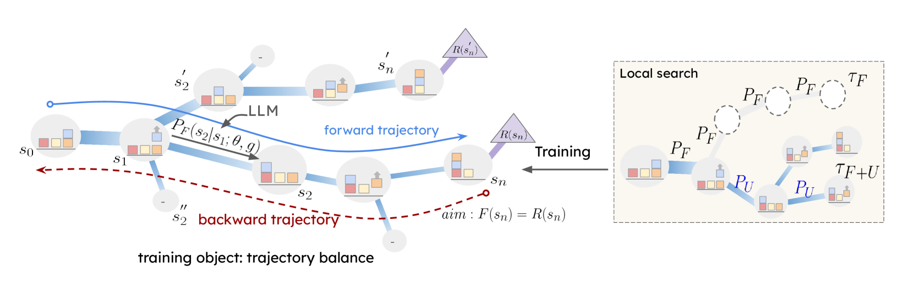
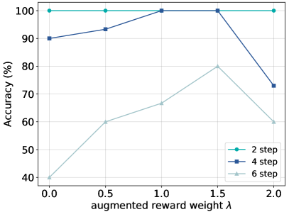
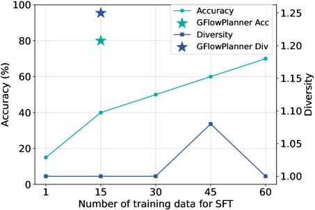
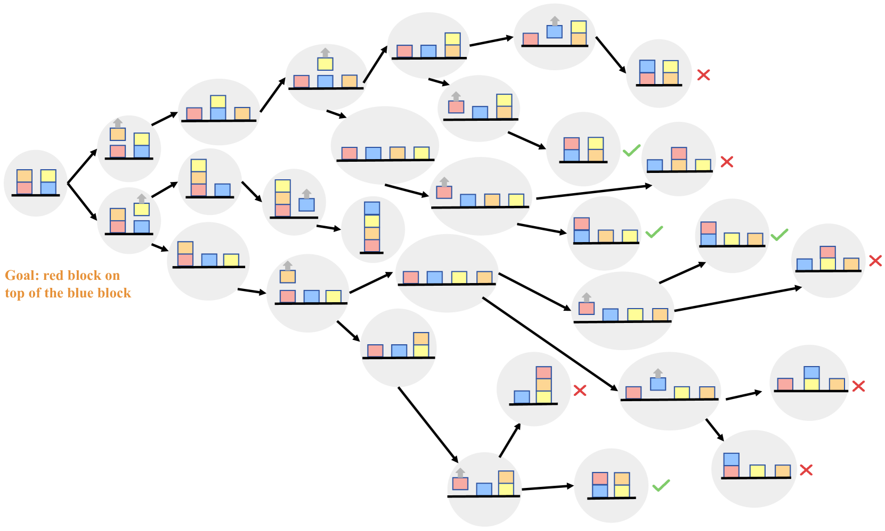
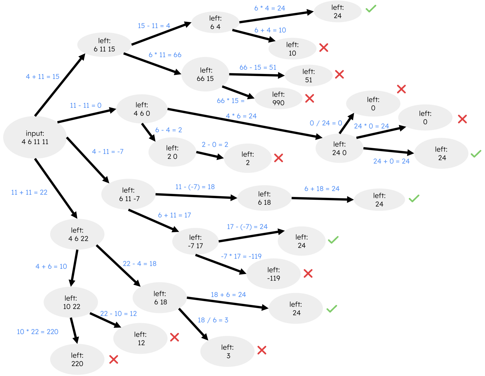

# 推理之流：借助发散思维，优化大型语言模型策略的训练效率

发布时间：2024年06月09日

`LLM应用

这篇论文介绍了一种新的训练策略——推理流（FoR），用于提升大型语言模型（LLMs）在复杂推理任务中生成高质量且多样化解法的能力。该策略通过引入GFlowNet原则，将LLM的多步推理视为马尔可夫流，并训练LLM以未归一化奖励为权重探索多条推理路径。这种方法旨在以最少的数据驱动多样化的推理，并在多个任务中展示了其有效性。因此，这篇论文属于LLM应用类别，因为它专注于改进LLM在特定应用场景下的性能。` `人工智能`

> Flow of Reasoning: Efficient Training of LLM Policy with Divergent Thinking

# 摘要

> 发散思维，即创造性地产生多种解决方案的过程，是人类智慧的体现。机器在复杂推理中探索多样化解法，对提升结果的稳健性、数据增强和模型泛化至关重要。然而，大型语言模型（LLMs）在生成高质量且多样化的推理方面常显乏力。监督微调虽能提升质量，却需大量数据以涵盖解法的广泛多样性；而强化学习方法如PPO则追求高奖励解法，却牺牲了多样性，类似收敛思维。为此，我们提出推理流（FoR）——一种精简的LLM训练策略，以最少数据驱动多样推理。FoR将LLM的多步推理视为从初始至终点的马尔可夫流，借此引入GFlowNet原则，训练LLM作为策略，能以未归一化奖励为权重，探索多条推理路径。实验证明，即便仅用15个示例，FoR也能在BlocksWorld、Game24和PrOntoQA等任务中，发掘出超越现有技术的多样化优质解法。代码已公开于https://github.com/Yu-Fangxu/FoR。

> Divergent thinking, the cognitive process of generating diverse solutions, is a hallmark of human creativity and problem-solving. For machines, sampling diverse solution trajectories in complex reasoning problems is crucial for robust outcomes, data augmentation, and enhanced model generalization. Large language models (LLMs) often struggle with generating high-quality, diverse reasoning. While supervised fine-tuning helps with quality, it requires extensive supervision data to capture the full diversity of solutions. Alternatively, reinforcement learning methods like PPO aim to find limited highest-reward solutions while neglecting the solution diversity, akin to convergent thinking. To address these limitations, we propose Flow of Reasoning (FoR) -- an efficient LLM training approach enabling diverse reasoning with minimal data. FoR formulates multi-step LLM reasoning as a Markovian flow from an initial state to terminal states. The formulation allows to adapt principled GFlowNet approaches to train the LLM as a policy, which is able to sample multiple reasoning paths with probabilities proportional to the unnormalized reward. Empirical results show that, with limited training data (e.g., 15 examples), FoR can discover diverse high-quality solutions that excel greatly beyond current state-of-the-art methods across three tasks, including embodied reasoning (BlocksWorld), math puzzle solving (Game24), and logical reasoning (PrOntoQA). Code is available at https://github.com/Yu-Fangxu/FoR.

[Arxiv](https://arxiv.org/abs/2406.05673)