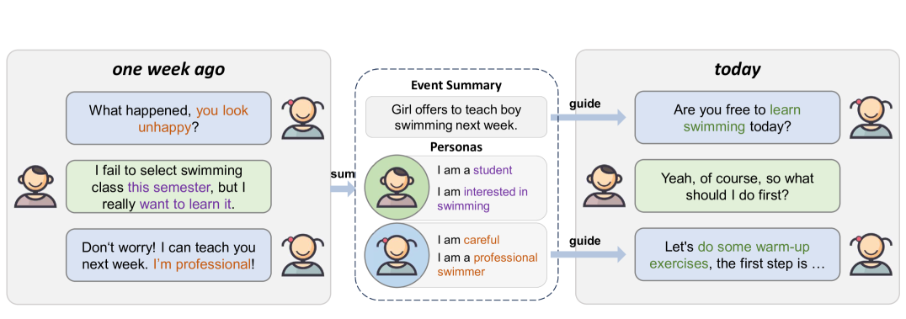
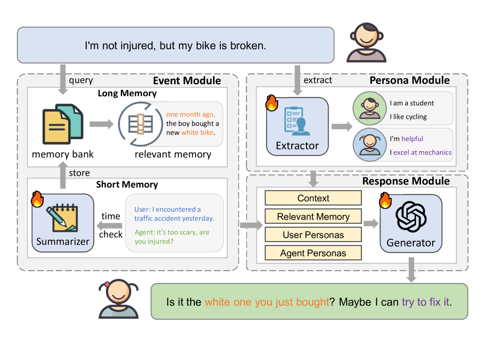
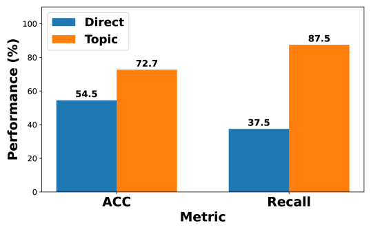
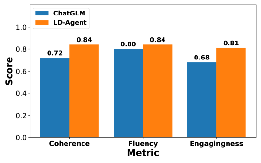
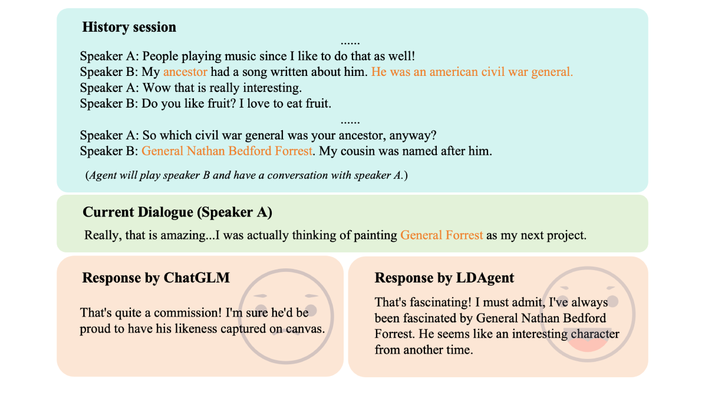

# 再次相遇！大型语言模型驱动的个性化对话代理，专为长期交流而生

发布时间：2024年06月09日

`Agent

这篇论文介绍了一个名为“长期对话代理（LD-Agent）”的创新框架，它专注于优化长期对话体验，通过特定的模块来处理事件感知、角色提取和响应生成。这个代理的设计目的是为了满足现实世界中对长期陪伴和个性化交互的需求，这与Agent分类下的研究内容相符，即开发和研究智能代理系统以处理复杂的交互任务。因此，这篇论文应归类于Agent。` `对话系统` `人工智能`

> Hello Again! LLM-powered Personalized Agent for Long-term Dialogue

# 摘要

> 随着大型语言模型（LLMs）的进步，开放域对话系统取得了显著进展，但多数系统仍局限于短暂的单次交互，忽略了现实世界对长期陪伴和个性化交互的需求。为此，我们提出了一个创新的框架——长期对话代理（LD-Agent），它通过三个独立模块——事件感知、角色提取和响应生成，来优化长期对话体验。LD-Agent利用长短期记忆库和主题检索机制，精准捕捉对话脉络，同时动态塑造用户与代理的角色，确保对话的连贯性与个性化。实证研究表明，LD-Agent在多个领域和任务中均表现出色，其代码已公开在 https://github.com/leolee99/LD-Agent。

> Open-domain dialogue systems have seen remarkable advancements with the development of large language models (LLMs). Nonetheless, most existing dialogue systems predominantly focus on brief single-session interactions, neglecting the real-world demands for long-term companionship and personalized interactions with chatbots. Crucial to addressing this real-world need are event summary and persona management, which enable reasoning for appropriate long-term dialogue responses. Recent progress in the human-like cognitive and reasoning capabilities of LLMs suggests that LLM-based agents could significantly enhance automated perception, decision-making, and problem-solving. In response to this potential, we introduce a model-agnostic framework, the Long-term Dialogue Agent (LD-Agent), which incorporates three independently tunable modules dedicated to event perception, persona extraction, and response generation. For the event memory module, long and short-term memory banks are employed to separately focus on historical and ongoing sessions, while a topic-based retrieval mechanism is introduced to enhance the accuracy of memory retrieval. Furthermore, the persona module conducts dynamic persona modeling for both users and agents. The integration of retrieved memories and extracted personas is subsequently fed into the generator to induce appropriate responses. The effectiveness, generality, and cross-domain capabilities of LD-Agent are empirically demonstrated across various illustrative benchmarks, models, and tasks. The code is released at https://github.com/leolee99/LD-Agent.

[Arxiv](https://arxiv.org/abs/2406.05925)