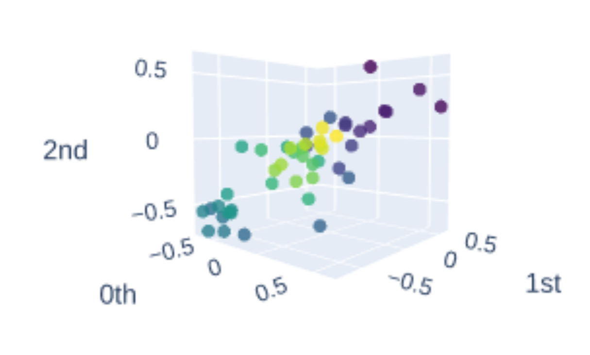
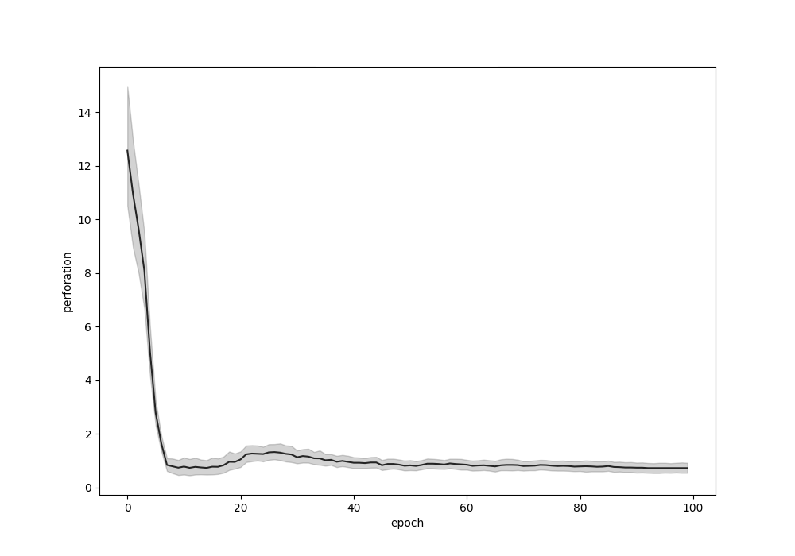

# 语言模型中的隐秘漏洞：探索其拓扑特性

发布时间：2024年06月09日

`LLM理论

这篇论文主要探讨了自回归神经语言模型（如GPT模型）在处理文本数据时形成的表示流形的拓扑特性，并引入了计算代数拓扑工具来分析这些特性。研究关注的是模型的理论基础和数学特性，而不是具体的应用或安全性问题，因此最合适的分类是LLM理论。` `机器学习`

> Hidden Holes: topological aspects of language models

# 摘要

> 本文深入探讨了自回归神经语言模型在处理原始文本数据时形成的表示流形的拓扑特性。我们引入了计算代数拓扑工具，定义了一种名为“穿孔度”的拓扑复杂度衡量标准。通过这一标准，我们追踪了GPT模型在训练期间深度和时间上的拓扑结构变化，并与门控循环模型进行了对比，发现后者展现出更高的拓扑复杂性，且这种变化模式在所有自然语言中普遍存在，而在人工合成数据中则不见踪影。文章详细剖析了这些模型如何根据自然语言文本库中的句子，塑造出向量云的形态，从而形成表示流形。本研究采用的方法新颖，基于可能对读者较为陌生的数学理论。为此，我们简要介绍了必要的理论基础，并在附录中提供了额外的视觉辅助材料。文章的核心发现是，与基于LSTM的架构相比，变换器的拓扑结构呈现出显著差异，这提示我们，要深入理解大型变换器语言模型的运作，必须进一步探索其数学特性。我们期待这一研究能激发NLP领域内更多相关探索。

> We explore the topology of representation manifolds arising in autoregressive neural language models trained on raw text data. In order to study their properties, we introduce tools from computational algebraic topology, which we use as a basis for a measure of topological complexity, that we call perforation.
  Using this measure, we study the evolution of topological structure in GPT based large language models across depth and time during training. We then compare these to gated recurrent models, and show that the latter exhibit more topological complexity, with a distinct pattern of changes common to all natural languages but absent from synthetically generated data. The paper presents a detailed analysis of the representation manifolds derived by these models based on studying the shapes of vector clouds induced by them as they are conditioned on sentences from corpora of natural language text.
  The methods developed in this paper are novel in the field and based on mathematical apparatus that might be unfamiliar to the target audience. To help with that we introduce the minimum necessary theory, and provide additional visualizations in the appendices.
  The main contribution of the paper is a striking observation about the topological structure of the transformer as compared to LSTM based neural architectures. It suggests that further research into mathematical properties of these neural networks is necessary to understand the operation of large transformer language models. We hope this work inspires further explorations in this direction within the NLP community.

[Arxiv](https://arxiv.org/abs/2406.05798)