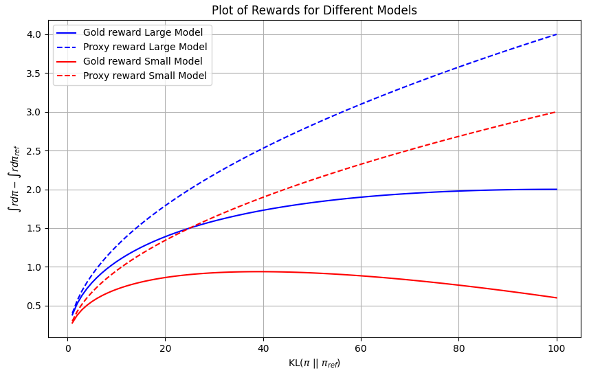

# 大型语言模型策略对齐的信息理论保障

发布时间：2024年06月09日

`LLM理论

这篇论文主要探讨了大型语言模型（LLM）中策略对齐的理论问题，包括KL散度、奖励分布的性质以及策略优化中的信息论上界。这些内容属于对LLM工作原理和性能优化的深入理论分析，因此归类为LLM理论。` `人工智能` `信息论`

> Information Theoretic Guarantees For Policy Alignment In Large Language Models

# 摘要

> 大型语言模型的策略对齐涉及在保持与参考策略接近的同时优化策略以最大化奖励，其中KL散度等f-散度被用作衡量标准。最近研究表明，对齐策略相对于参考策略的奖励提升与$\sqrt{\mathsf{KL}}$成正比，并且对于最佳的n个策略，KL散度有一个明确的n上的界。本文进一步证明，如果参考策略下的奖励分布具有次高斯尾部，这一信息论上界成立。此外，通过序统计的Rényi表示和数据处理不等式，我们证明了对于任何f-散度，最佳的n个策略的KL上界都是可得的。如果对对齐策略的尾部有额外了解，我们可以通过Rényi散度获得更精确的奖励改进控制。最后，我们展示了这些上界如何从代理奖励转移到黄金奖励，揭示了由于代理奖励的高估和近似误差导致的黄金奖励改进的减少。

> Policy alignment of large language models refers to constrained policy optimization, where the policy is optimized to maximize a reward while staying close to a reference policy with respect to an $f$-divergence such as the $\mathsf{KL}$ divergence. The best of $n$ alignment policy selects a sample from the reference policy that has the maximum reward among $n$ independent samples. For both cases (policy alignment and best of $n$), recent works showed empirically that the reward improvement of the aligned policy on the reference one scales like $\sqrt{\mathsf{KL}}$, with an explicit bound in $n$ on the $\mathsf{KL}$ for the best of $n$ policy. We show in this paper that the $\sqrt{\mathsf{KL}}$ information theoretic upper bound holds if the reward under the reference policy has sub-gaussian tails. Moreover, we prove for the best of $n$ policy, that the $\mathsf{KL}$ upper bound can be obtained for any $f$-divergence via a reduction to exponential order statistics owing to the Rényi representation of order statistics, and a data processing inequality. If additional information is known on the tails of the aligned policy we show that tighter control on the reward improvement can be obtained via the Rényi divergence. Finally we demonstrate how these upper bounds transfer from proxy rewards to golden rewards which results in a decrease in the golden reward improvement due to overestimation and approximation errors of the proxy reward.

[Arxiv](https://arxiv.org/abs/2406.05883)