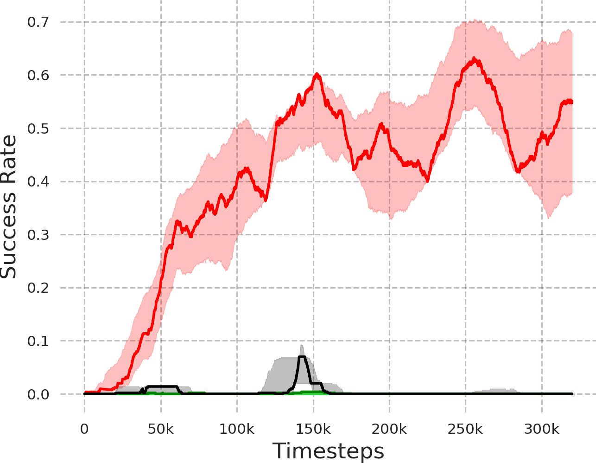

# LGR2：借助语言引导的奖励重标记，加速分层强化学习进程

发布时间：2024年06月09日

`Agent

这篇论文主要讨论了如何利用大型语言模型（LLMs）和分层强化学习（HRL）来解决机器人控制任务中的复杂性问题。特别是，论文提出了一个名为LGR2的框架，该框架利用语言指令为高级策略创造稳定的奖励函数，从而有效缓解了HRL中常见的非平稳性问题。这种方法使得机器人能够通过自然语言指令执行复杂的控制任务，并在实际环境中展示了强大的泛化能力。因此，这篇论文更符合Agent分类，因为它涉及到了如何构建和优化能够执行复杂任务的智能代理（Agent）。` `机器人技术`

> LGR2: Language Guided Reward Relabeling for Accelerating Hierarchical Reinforcement Learning

# 摘要

> 开发能够通过自然语言指令解决复杂机器人控制任务的交互系统，一直是机器人领域的梦想。大型语言模型（LLMs）在处理复杂任务，如逻辑推理、情境学习和代码生成方面表现出色。但用LLMs预测机器人低级动作却困难重重。这些任务的复杂性要求策略能够执行多样子任务并整合以达成目标。分层强化学习（HRL）为此提供了一种优雅解决方案，它通过时间抽象和增强探索带来直观优势。但HRL常因基本行为的不稳定而遭遇非平稳性问题。我们提出的LGR2框架，利用语言指令为高级策略创造稳定奖励函数，因其不受低级行为影响，有效缓解了非平稳性，成为解决机器人控制任务的优雅方法。通过实证分析，我们验证了LGR2在HRL中有效减轻非平稳性，并在挑战性的稀疏奖励环境中实现了超过70%的成功率，远超基线方法。此外，现实世界的机器人操作实验也展示了CRISP在实际场景中的强大泛化能力。

> Developing interactive systems that leverage natural language instructions to solve complex robotic control tasks has been a long-desired goal in the robotics community. Large Language Models (LLMs) have demonstrated exceptional abilities in handling complex tasks, including logical reasoning, in-context learning, and code generation. However, predicting low-level robotic actions using LLMs poses significant challenges. Additionally, the complexity of such tasks usually demands the acquisition of policies to execute diverse subtasks and combine them to attain the ultimate objective. Hierarchical Reinforcement Learning (HRL) is an elegant approach for solving such tasks, which provides the intuitive benefits of temporal abstraction and improved exploration. However, HRL faces the recurring issue of non-stationarity due to unstable lower primitive behaviour. In this work, we propose LGR2, a novel HRL framework that leverages language instructions to generate a stationary reward function for the higher-level policy. Since the language-guided reward is unaffected by the lower primitive behaviour, LGR2 mitigates non-stationarity and is thus an elegant method for leveraging language instructions to solve robotic control tasks. To analyze the efficacy of our approach, we perform empirical analysis and demonstrate that LGR2 effectively alleviates non-stationarity in HRL. Our approach attains success rates exceeding 70$\%$ in challenging, sparse-reward robotic navigation and manipulation environments where the baselines fail to achieve any significant progress. Additionally, we conduct real-world robotic manipulation experiments and demonstrate that CRISP shows impressive generalization in real-world scenarios.

[Arxiv](https://arxiv.org/abs/2406.05881)