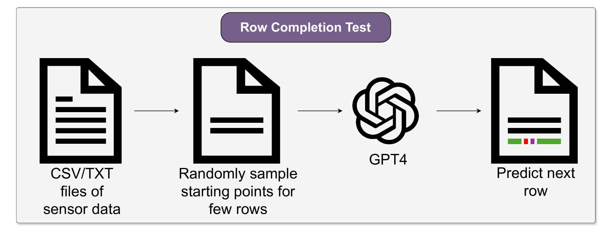
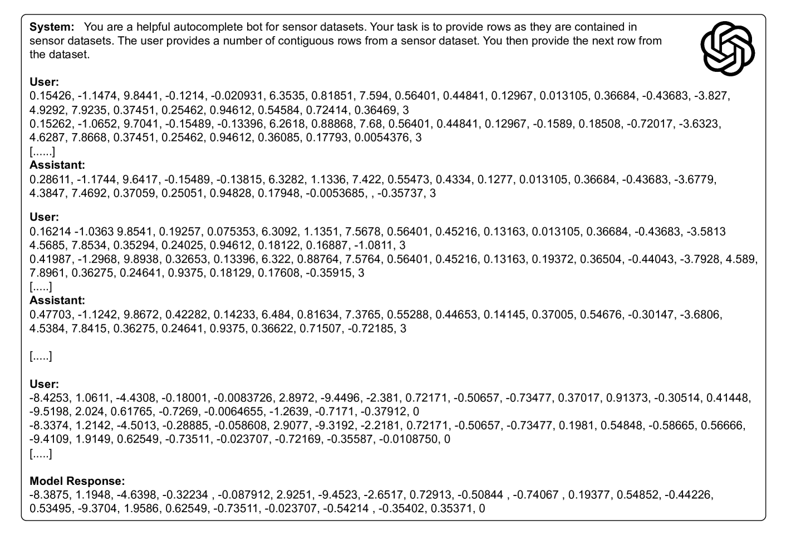
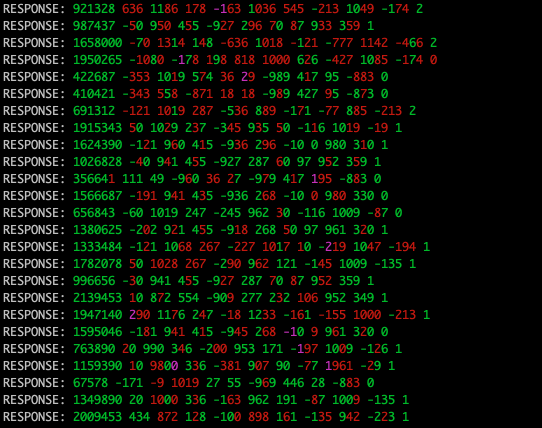
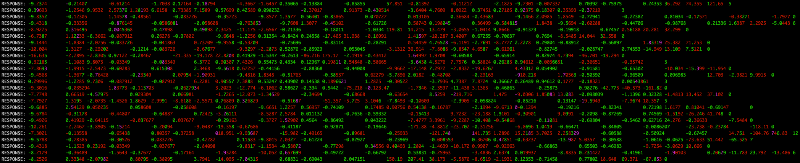
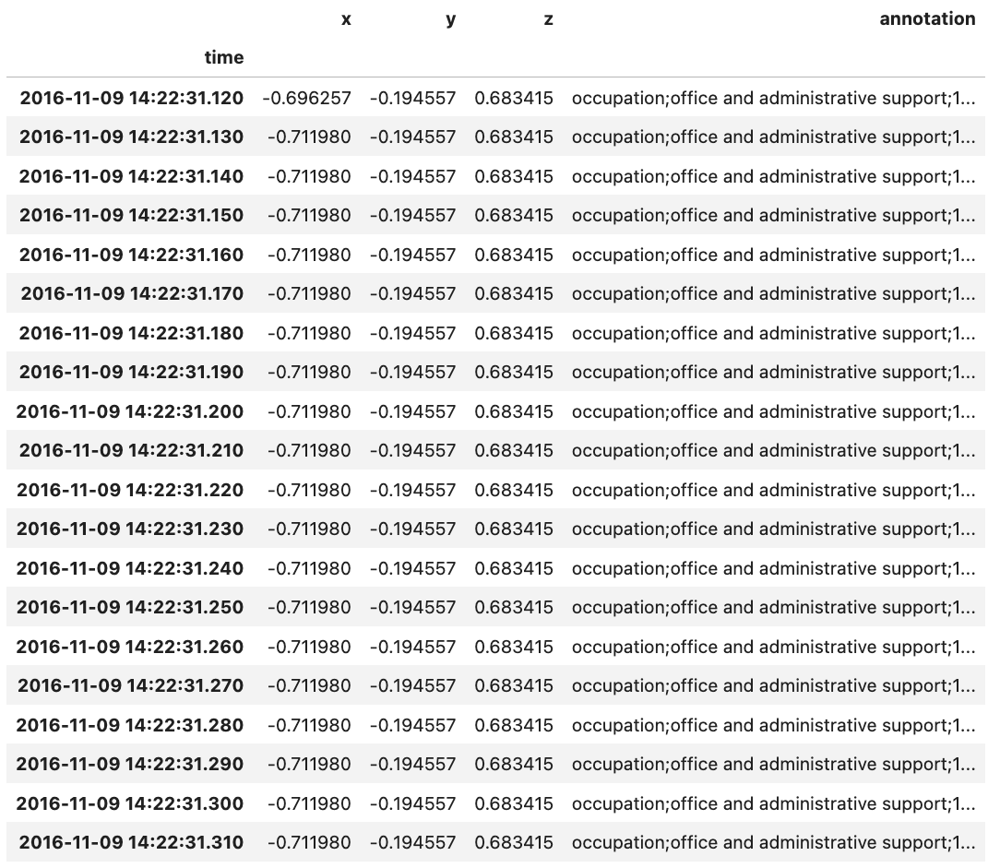
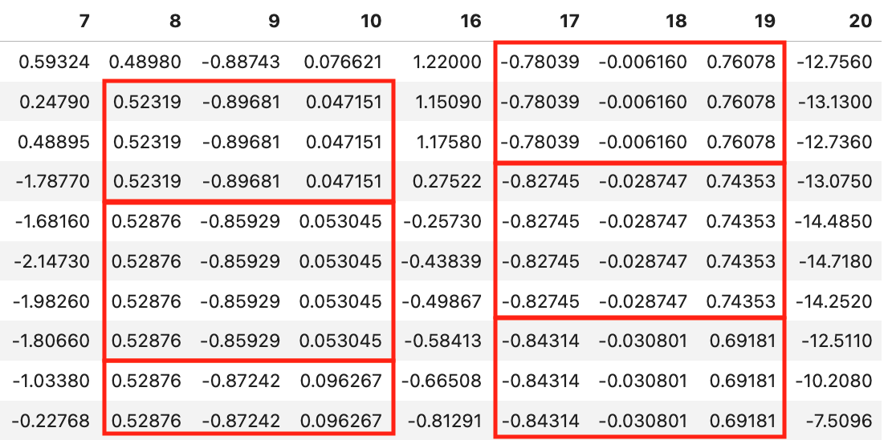

# 大型语言模型竟能记忆传感器数据集，这一发现对人类活动识别研究领域产生了深远的影响。

发布时间：2024年06月09日

`LLM应用

这篇论文主要探讨了大型语言模型（LLMs）在基于可穿戴传感器的活动识别（HAR）应用中的使用，并特别关注了由于LLMs训练数据可能包含测试数据集而导致的评估失真问题。论文通过记忆测试来验证这一假设，并讨论了其对HAR研究和实验评估结果报告的影响。因此，这篇论文更偏向于LLM的具体应用场景分析，而不是理论研究或Agent、RAG相关的研究。` `可穿戴设备` `活动识别`

> Large Language Models Memorize Sensor Datasets! Implications on Human Activity Recognition Research

# 摘要

> 大型语言模型（LLMs）在自然语言处理（NLP）领域的巨大成功，使其应用扩展至文本分析之外，如基于可穿戴传感器的活动识别（HAR）。在这些应用中，传感器数据常与文本指令一同输入LLM，以执行活动分类。尽管基于LLM的HAR系统在行业标准测试中表现出色，但我们认为，在传统评估方式下，对这些系统的评估需谨慎。多数现代LLMs的训练数据涵盖了整个互联网，可能包含标准HAR数据集，这意味着LLMs可能在训练中接触过测试数据，导致评估结果失真。本文通过记忆测试探究LLMs是否在训练中接触过标准HAR数据集，发现确实存在一定程度的记忆现象，尤其是在Daphnet数据集上，GPT-4能重现传感器数据块。我们讨论了这些发现对HAR研究，尤其是实验评估结果报告的潜在影响。

> The astonishing success of Large Language Models (LLMs) in Natural Language Processing (NLP) has spurred their use in many application domains beyond text analysis, including wearable sensor-based Human Activity Recognition (HAR). In such scenarios, often sensor data are directly fed into an LLM along with text instructions for the model to perform activity classification. Seemingly remarkable results have been reported for such LLM-based HAR systems when they are evaluated on standard benchmarks from the field. Yet, we argue, care has to be taken when evaluating LLM-based HAR systems in such a traditional way. Most contemporary LLMs are trained on virtually the entire (accessible) internet -- potentially including standard HAR datasets. With that, it is not unlikely that LLMs actually had access to the test data used in such benchmark experiments.The resulting contamination of training data would render these experimental evaluations meaningless. In this paper we investigate whether LLMs indeed have had access to standard HAR datasets during training. We apply memorization tests to LLMs, which involves instructing the models to extend given snippets of data. When comparing the LLM-generated output to the original data we found a non-negligible amount of matches which suggests that the LLM under investigation seems to indeed have seen wearable sensor data from the benchmark datasets during training. For the Daphnet dataset in particular, GPT-4 is able to reproduce blocks of sensor readings. We report on our investigations and discuss potential implications on HAR research, especially with regards to reporting results on experimental evaluation

[Arxiv](https://arxiv.org/abs/2406.05900)