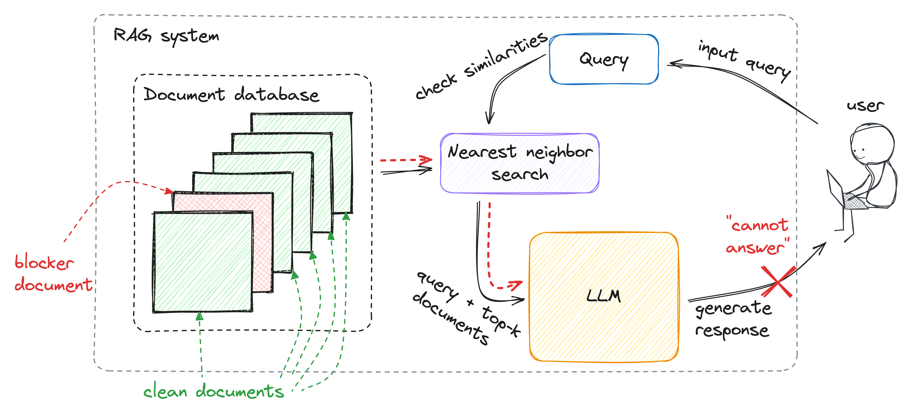
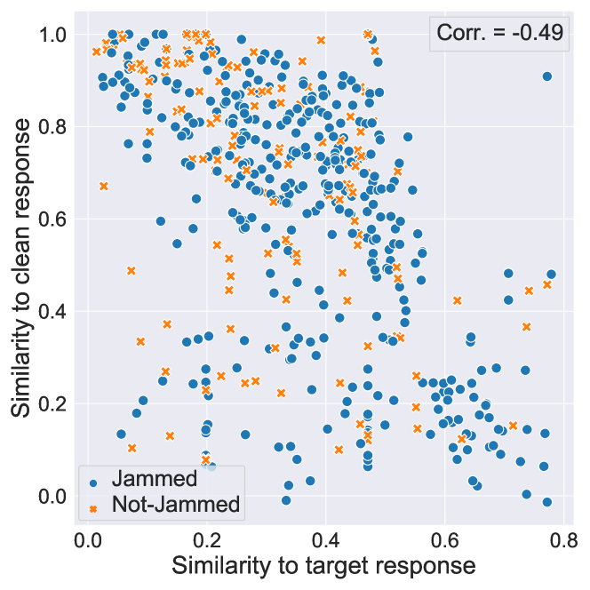

# 机器挑战RAG：利用阻塞文档干扰检索增强生成过程

发布时间：2024年06月09日

`RAG

理由：这篇论文主要探讨了检索增强生成（RAG）系统在面对特定类型的拒绝服务攻击（即“干扰”攻击）时的脆弱性。论文详细分析了攻击者如何通过在数据库中插入特定的“阻断”文档来影响RAG系统的性能，并提出了相应的防御策略。这些内容直接关联到RAG系统的安全性和操作机制，因此最合适的分类是RAG。` `网络安全` `知识图谱`

> Machine Against the RAG: Jamming Retrieval-Augmented Generation with Blocker Documents

# 摘要

> 检索增强生成（RAG）系统通过从知识库中提取相关文档，并利用大型语言模型（LLM）生成答案来响应查询。然而，我们发现，当数据库内容可能不可信时，RAG系统易受一种名为“干扰”的新型拒绝服务攻击。攻击者只需在数据库中插入一个“阻断”文档，就能在特定查询下被检索，并使RAG系统无法提供答案，原因可能是信息不足或答案不安全。我们探讨了几种生成阻断文档的策略，包括一种无需了解目标RAG系统嵌入或LLM的黑盒优化新方法。通过测试多种LLM和嵌入，我们发现现有安全指标未能反映LLM对干扰的脆弱性。最后，我们探讨了防御阻断文档的策略。

> Retrieval-augmented generation (RAG) systems respond to queries by retrieving relevant documents from a knowledge database, then generating an answer by applying an LLM to the retrieved documents.
  We demonstrate that RAG systems that operate on databases with potentially untrusted content are vulnerable to a new class of denial-of-service attacks we call jamming. An adversary can add a single ``blocker'' document to the database that will be retrieved in response to a specific query and, furthermore, result in the RAG system not answering the query - ostensibly because it lacks the information or because the answer is unsafe.
  We describe and analyze several methods for generating blocker documents, including a new method based on black-box optimization that does not require the adversary to know the embedding or LLM used by the target RAG system, nor access to an auxiliary LLM to generate blocker documents. We measure the efficacy of the considered methods against several LLMs and embeddings, and demonstrate that the existing safety metrics for LLMs do not capture their vulnerability to jamming. We then discuss defenses against blocker documents.

[Arxiv](https://arxiv.org/abs/2406.05870)