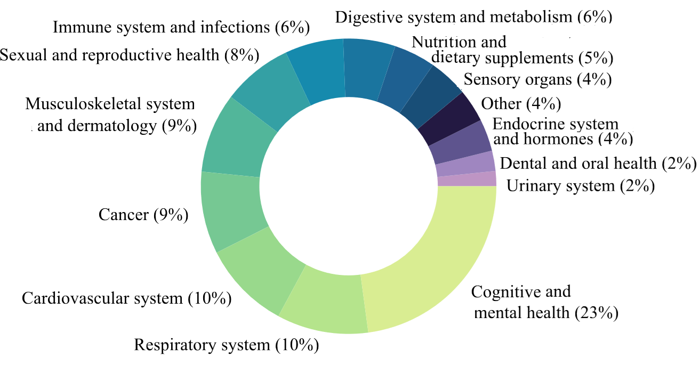

# MedREQAL：探究大型语言模型在问答中展现的医学知识回忆能力

发布时间：2024年06月09日

`LLM应用

这篇论文摘要讨论了大型语言模型（LLMs）在医学知识回忆方面的应用，特别是在处理复杂健康主题的问答任务中的表现。研究通过创建一个专门的数据集来评估这些模型在医学知识应用方面的能力，并分析了不同模型在该数据集上的表现。这表明研究关注的是LLMs在特定应用场景（即医学问答）中的实际应用和性能评估，因此属于LLM应用分类。` `生物医学研究`

> MedREQAL: Examining Medical Knowledge Recall of Large Language Models via Question Answering

# 摘要

> 近年来，大型语言模型（LLMs）在处理复杂健康主题的问答任务中展现了卓越的知识应用能力。鉴于其在未来临床工作中的巨大潜力，探究这些模型中编码的医学知识质量及其回忆能力显得尤为关键。本研究通过创建一个基于系统评价的新数据集，专门用于评估LLMs在医学知识回忆方面的表现。我们通过实验分析了包括GPT和Mixtral在内的六种模型在MedREQAL数据集上的表现，该数据集由严格的系统评价中提取的问答对组成。实验结果揭示了LLMs在生物医学问答任务中仍面临的挑战。

> In recent years, Large Language Models (LLMs) have demonstrated an impressive ability to encode knowledge during pre-training on large text corpora. They can leverage this knowledge for downstream tasks like question answering (QA), even in complex areas involving health topics. Considering their high potential for facilitating clinical work in the future, understanding the quality of encoded medical knowledge and its recall in LLMs is an important step forward. In this study, we examine the capability of LLMs to exhibit medical knowledge recall by constructing a novel dataset derived from systematic reviews -- studies synthesizing evidence-based answers for specific medical questions. Through experiments on the new MedREQAL dataset, comprising question-answer pairs extracted from rigorous systematic reviews, we assess six LLMs, such as GPT and Mixtral, analyzing their classification and generation performance. Our experimental insights into LLM performance on the novel biomedical QA dataset reveal the still challenging nature of this task.

[Arxiv](https://arxiv.org/abs/2406.05845)