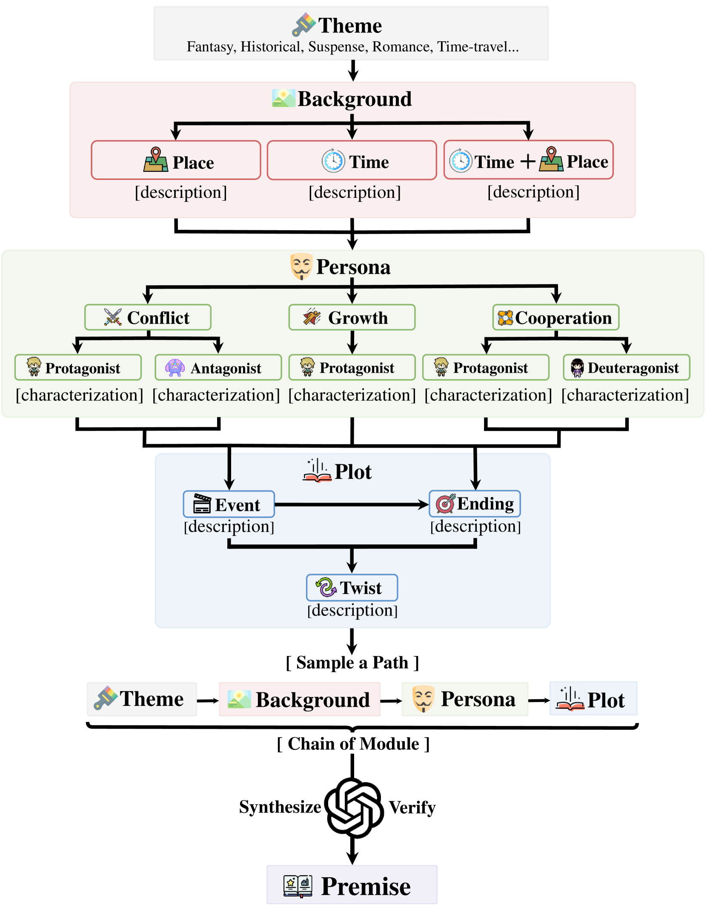
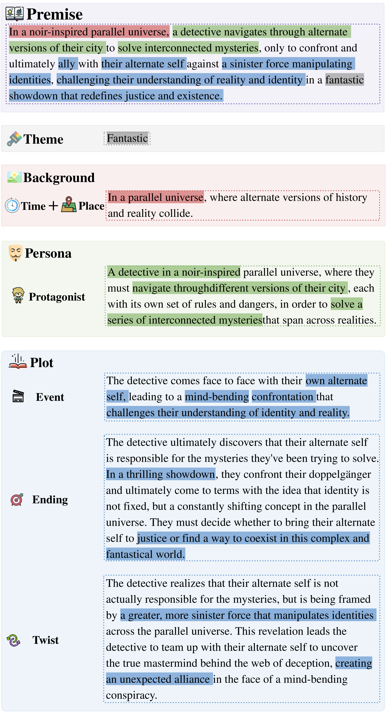
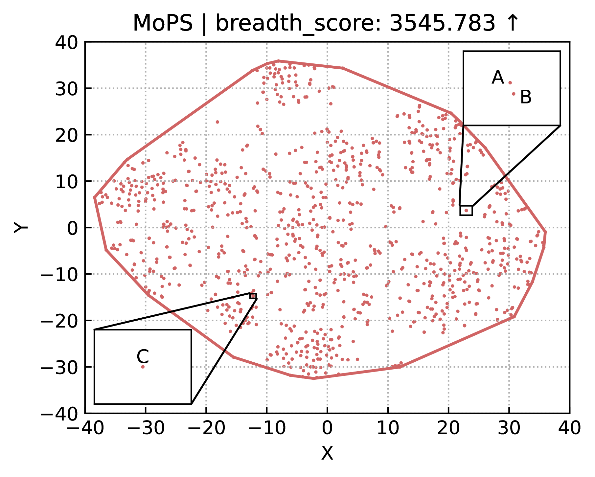
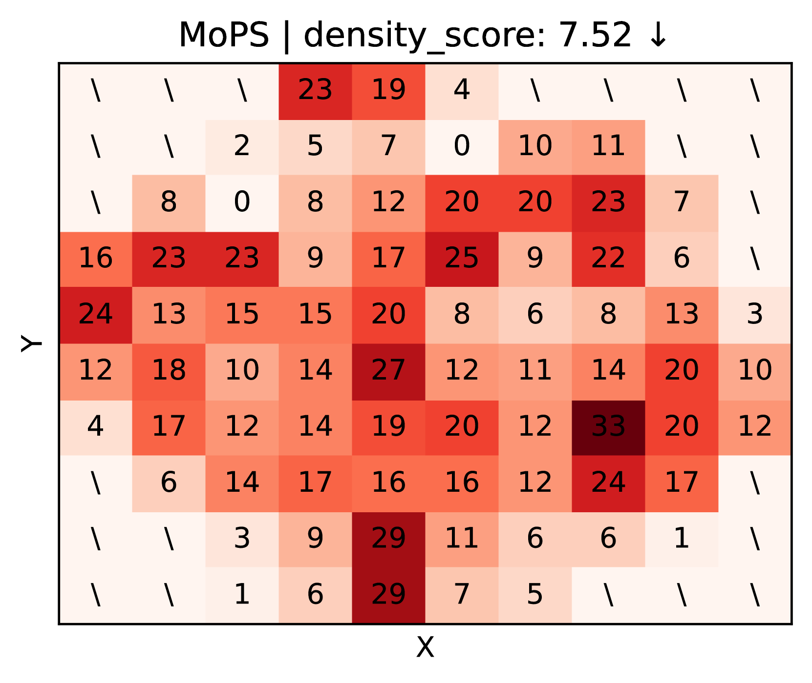
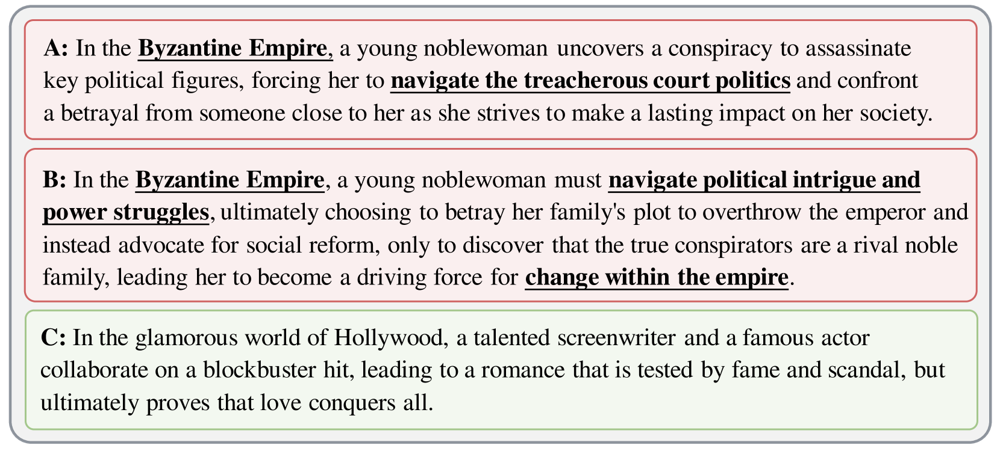
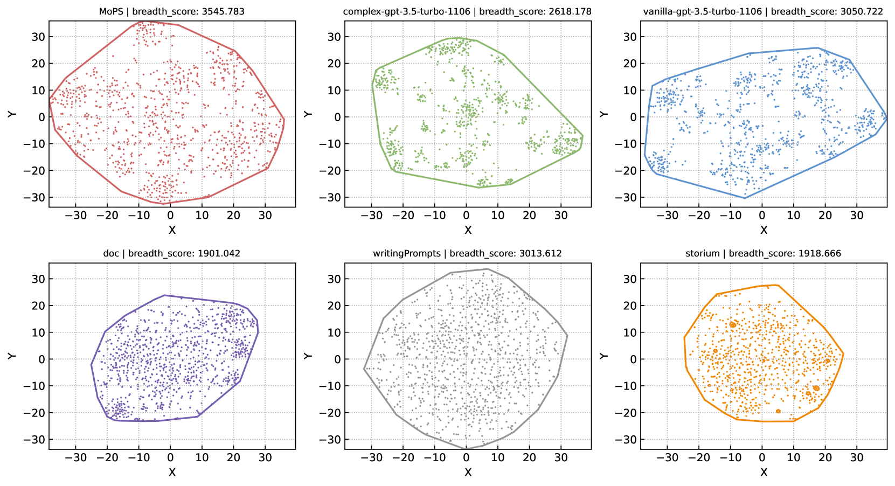
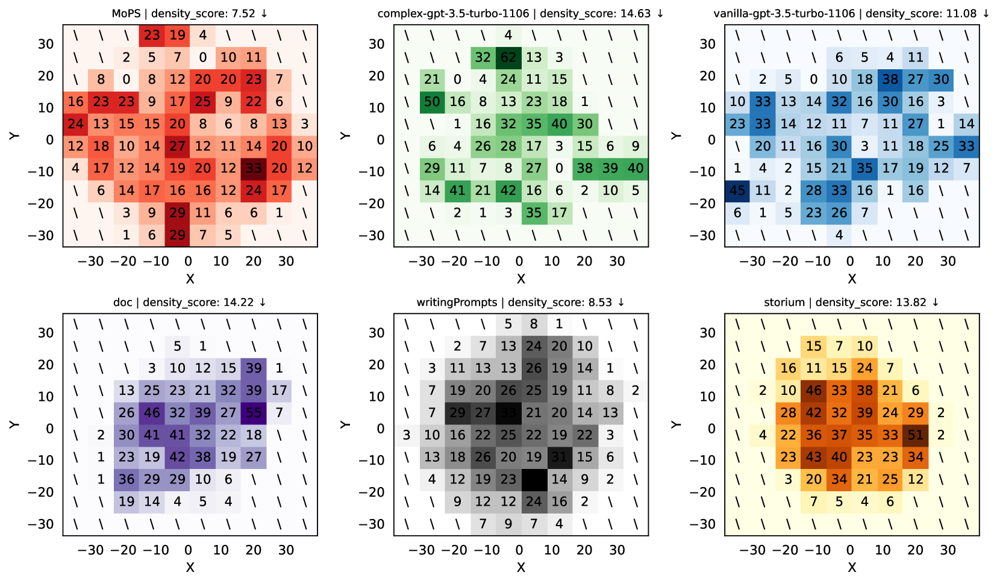
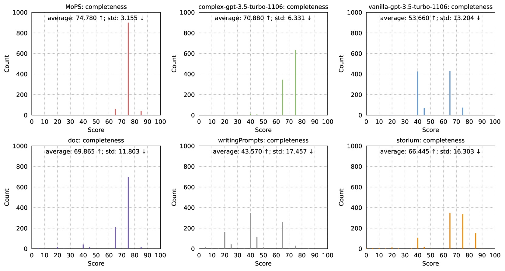
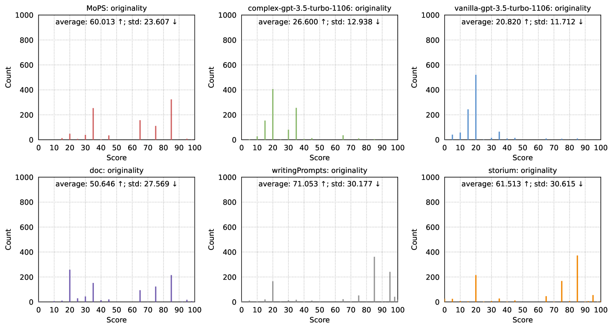

# MoPS：开放式自动故事生成的模块化故事前提创作

发布时间：2024年06月09日

`LLM应用

理由：这篇论文介绍了一种名为模块化故事前提合成（MoPS）的新方法，该方法利用大型语言模型（LLM）来自动化生成故事前提。这种方法通过将故事前提分解为多个模块，并利用LLM将这些模块组合成连贯的故事前提，从而提高了故事前提的多样性、吸引力、完整性和原创性。论文中提到的评估结果显示，这种方法在生成高质量故事前提方面优于现有方法，并且能够提升基于这些前提创作的小说和剧本的质量。因此，这篇论文属于LLM应用类别，因为它展示了如何将LLM技术应用于实际的文本生成任务中。` `文学创作` `人工智能`

> MoPS: Modular Story Premise Synthesis for Open-Ended Automatic Story Generation

# 摘要

> 故事前提是故事的灵魂，它勾勒出故事的核心思想与发展脉络。然而，现有故事前提的来源因缺乏多样性、质量不一和高昂成本而难以广泛应用。为此，我们创新性地提出了模块化故事前提合成（MoPS），通过将故事前提拆分为背景、人物等模块，实现自动化生成。MoPS流程分为三步：首先，为每个模块预收集候选集，构建嵌套字典；其次，从字典中提取关键路径，形成前提设计；最后，利用大型语言模型将设计转化为连贯的故事前提。评估显示，MoPS生成的故事前提在多样性、吸引力、完整性和原创性上均超越了现有方法。此外，基于这些前提创作的小说和剧本质量也显著提升。我们还提供了MoPS的代码套件，以及7.6k个故事前提和1k个扩展故事，详情请见：https://github.com/GAIR-NLP/MoPS。

> A story premise succinctly defines a story's main idea, foundation, and trajectory. It serves as the initial trigger in automatic story generation. Existing sources of story premises are limited by a lack of diversity, uneven quality, and high costs that make them difficult to scale. In response, we introduce Modular Story Premise Synthesis (MoPS) which breaks down story premises into modules like background and persona for automated design and generation. MoPS consists of three phases: (1) Precollect a consistent set of candidates for each module to form a nested dictionary. (2) Extract a key path from the nested dictionary as the premise design. (3) Instruct an LLM to integrate the design into a coherent premise sentence. Thorough evaluations demonstrate that our synthesized premises excel in diversity, fascination, completeness, and originality compared to those induced from large language models and captured from public story datasets. Similarly, the extended novels and scripts generated from our premises also exhibit higher quality. In supplementary materials, we provide the MoPS code suite, along with 7.6k generated premises and 1k extended stories. Code: https://github.com/GAIR-NLP/MoPS.

[Arxiv](https://arxiv.org/abs/2406.05690)