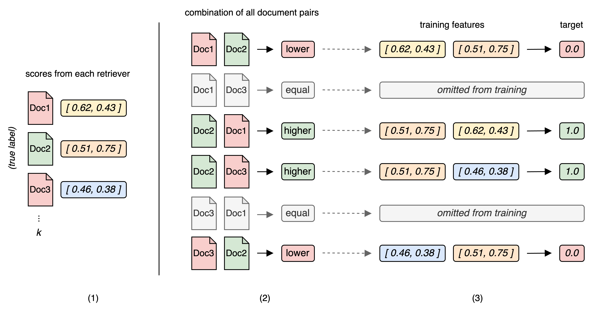
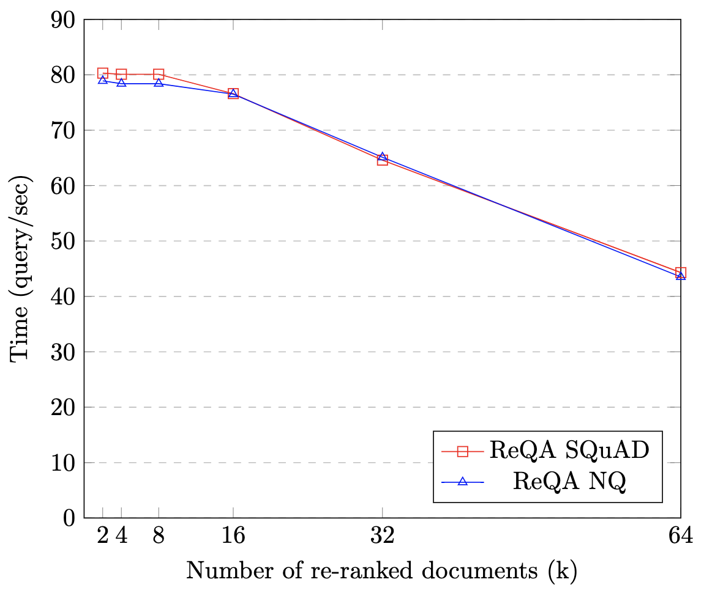

# MrRank：借助多结果排序模型，优化问答检索系统性能

发布时间：2024年06月09日

`RAG

这篇论文主要关注的是信息检索（IR）系统与大型语言模型（LLMs）的结合，特别是在解决LLMs中的幻觉和过时信息问题。论文提出了一种新的方法，即结合学习排序技术的异构IR系统整合，以提高检索问答（ReQA）任务的性能。这与RAG（Retrieval-Augmented Generation）的概念相符，RAG是一种结合了检索和生成的方法，旨在通过实时信息检索来增强语言模型的性能。因此，这篇论文应归类为RAG。` `信息检索` `问答系统`

> MrRank: Improving Question Answering Retrieval System through Multi-Result Ranking Model

# 摘要

> 大型语言模型（LLMs）常受幻觉和过时信息困扰，信息检索（IR）系统能为其注入新鲜知识，但现有技术缺陷导致性能瓶颈。面对众多IR系统，融合多元策略颇具前景，但过往尝试效果有限。本研究提出一种结合学习排序技术的异构IR系统整合方法，并在两项检索问答（ReQA）任务中验证其效能。实证结果显著优于以往方法，在ReQA SQuAD上刷新了记录。

> Large Language Models (LLMs) often struggle with hallucinations and outdated information. To address this, Information Retrieval (IR) systems can be employed to augment LLMs with up-to-date knowledge. However, existing IR techniques contain deficiencies, posing a performance bottleneck. Given the extensive array of IR systems, combining diverse approaches presents a viable strategy. Nevertheless, prior attempts have yielded restricted efficacy. In this work, we propose an approach that leverages learning-to-rank techniques to combine heterogeneous IR systems. We demonstrate the method on two Retrieval Question Answering (ReQA) tasks. Our empirical findings exhibit a significant performance enhancement, outperforming previous approaches and achieving state-of-the-art results on ReQA SQuAD.

[Arxiv](https://arxiv.org/abs/2406.05733)