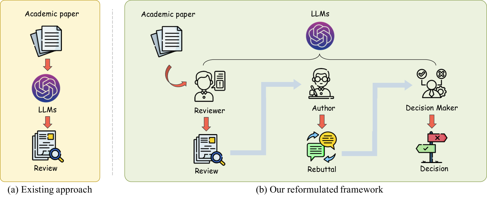
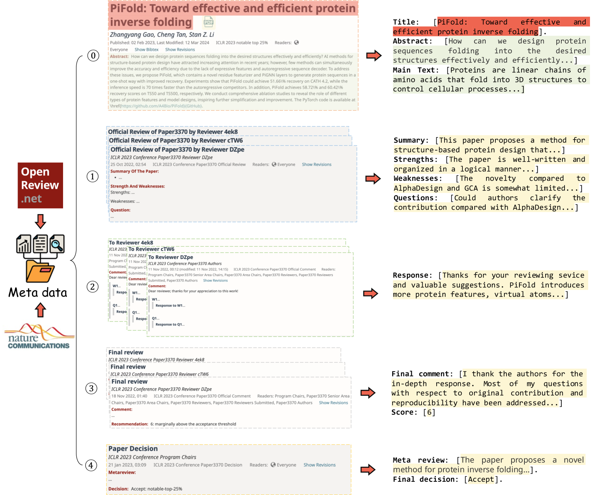
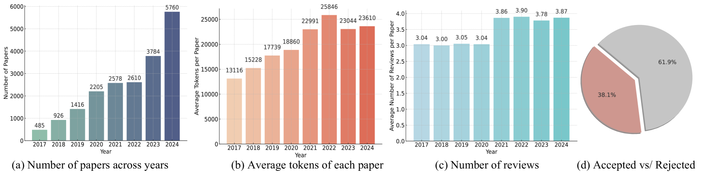
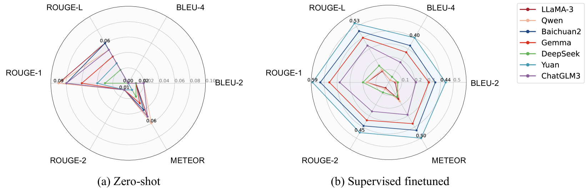
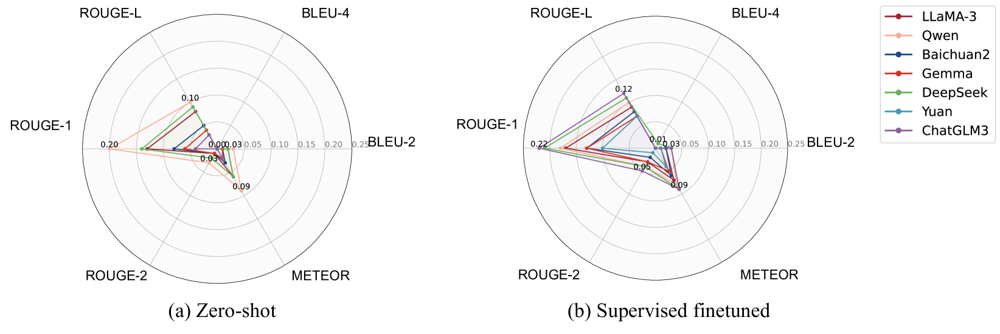

# 同行评审：一场基于角色互动的多轮长篇对话

发布时间：2024年06月09日

`LLM应用

这篇论文主要探讨了大型语言模型（LLMs）在学术同行评审中的应用，特别是在多轮对话环境下的应用。研究通过构建一个包含大量论文和评审数据的数据集，并设计了一套评估指标，来模拟和评估LLMs在同行评审过程中的表现。这种方法不仅限于静态评审生成，而是模拟了真实评审的动态和迭代特性，通过引入动态角色交互来提升LLM在同行评审中的应用。因此，这篇论文属于LLM应用类别。` `学术评审` `对话系统`

> Peer Review as A Multi-Turn and Long-Context Dialogue with Role-Based Interactions

# 摘要

> 大型语言模型（LLMs）在多个领域展现出广泛应用，尤其在学术同行评审中潜力巨大。但现有应用多局限于静态评审生成，未能体现真实评审的动态与迭代。本研究将同行评审重构为多轮长对话，区分作者、评审与决策者角色，并构建了包含26,841篇论文与92,017条评审的详尽数据集，涵盖顶级会议与期刊。此数据集专为LLMs在多轮对话中的应用设计，精确模拟了同行评审全过程。我们还提出了一套评估指标，确保在重构的评审环境中对LLMs进行公平全面的评价。我们相信，通过引入动态角色交互，这项工作为提升LLM驱动的同行评审提供了新视角，紧密契合学术评审的迭代交互本质，为未来研究奠定了坚实基础。数据集已开源于https://github.com/chengtan9907/ReviewMT。

> Large Language Models (LLMs) have demonstrated wide-ranging applications across various fields and have shown significant potential in the academic peer-review process. However, existing applications are primarily limited to static review generation based on submitted papers, which fail to capture the dynamic and iterative nature of real-world peer reviews. In this paper, we reformulate the peer-review process as a multi-turn, long-context dialogue, incorporating distinct roles for authors, reviewers, and decision makers. We construct a comprehensive dataset containing over 26,841 papers with 92,017 reviews collected from multiple sources, including the top-tier conference and prestigious journal. This dataset is meticulously designed to facilitate the applications of LLMs for multi-turn dialogues, effectively simulating the complete peer-review process. Furthermore, we propose a series of metrics to evaluate the performance of LLMs for each role under this reformulated peer-review setting, ensuring fair and comprehensive evaluations. We believe this work provides a promising perspective on enhancing the LLM-driven peer-review process by incorporating dynamic, role-based interactions. It aligns closely with the iterative and interactive nature of real-world academic peer review, offering a robust foundation for future research and development in this area. We open-source the dataset at https://github.com/chengtan9907/ReviewMT.

[Arxiv](https://arxiv.org/abs/2406.05688)