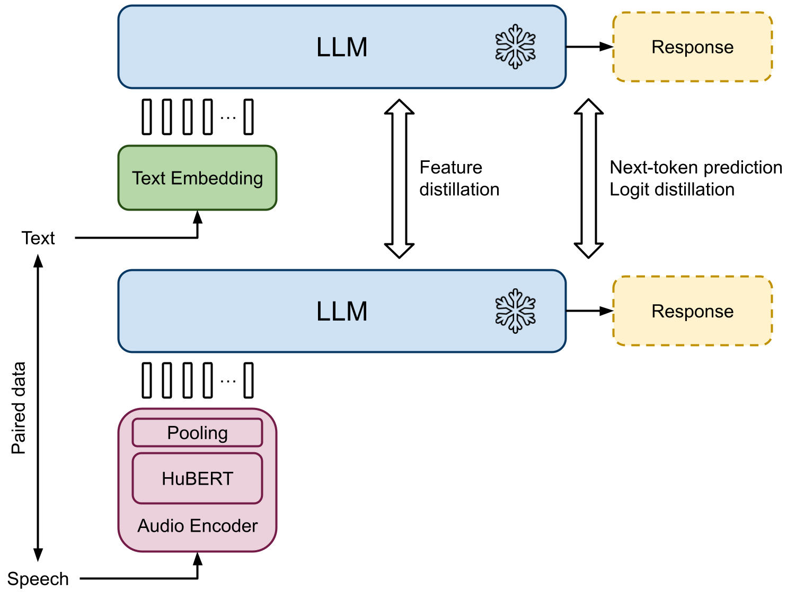

# 借助音频提示，大型语言模型可实现通用语音摘要功能

发布时间：2024年06月09日

`LLM应用

这篇论文介绍了一种利用大型语言模型（LLMs）进行语音摘要的新框架。它通过结合一个经过指令调优的LLM和一个音频编码器，实现了对语音输入的处理和摘要生成。这种方法展示了LLM在处理非文本输入（如语音）方面的应用潜力，并且通过实验证明了其在性能上的优越性。因此，这篇论文属于LLM应用类别。` `语音处理`

> Prompting Large Language Models with Audio for General-Purpose Speech Summarization

# 摘要

> 本研究引入了一种新颖的语音摘要框架，该框架利用了大型语言模型（LLMs）的强大处理和推理能力。我们设计了一个端到端的系统，它将一个经过指令调优的LLM与一个音频编码器相结合，后者将语音转换成LLM能够理解的令牌形式。通过使用包含配对语音-文本数据的训练集，我们的系统能够针对具有相同语义信息的提示生成一致的响应，无论输入是语音还是文本。这一创新框架使得LLM能够像处理文本一样处理语音输入，简化了语音摘要的过程。与以往方法相比，我们的技术能够从任意领域提取口语内容进行摘要，并可通过调整LLM的提示策略来生成不同风格的摘要。实验结果显示，我们的方法在性能上超越了传统的语音识别后接LLM文本处理的级联方法。

> In this work, we introduce a framework for speech summarization that leverages the processing and reasoning capabilities of large language models (LLMs). We propose an end-to-end system that combines an instruction-tuned LLM with an audio encoder that converts speech into token representations that the LLM can interpret. Using a dataset with paired speech-text data, the overall system is trained to generate consistent responses to prompts with the same semantic information regardless of the input modality. The resulting framework allows the LLM to process speech inputs in the same way as text, enabling speech summarization by simply prompting the LLM. Unlike prior approaches, our method is able to summarize spoken content from any arbitrary domain, and it can produce summaries in different styles by varying the LLM prompting strategy. Experiments demonstrate that our approach outperforms a cascade baseline of speech recognition followed by LLM text processing.

[Arxiv](https://arxiv.org/abs/2406.05968)