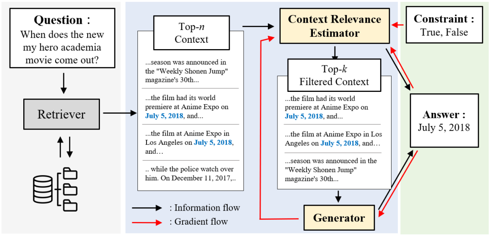
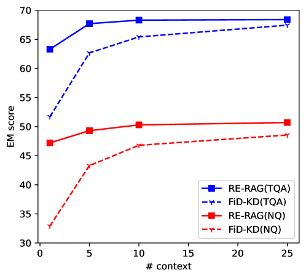
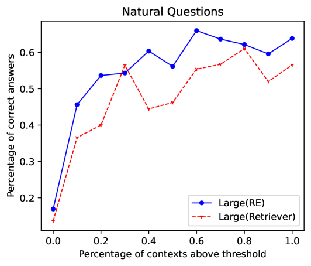
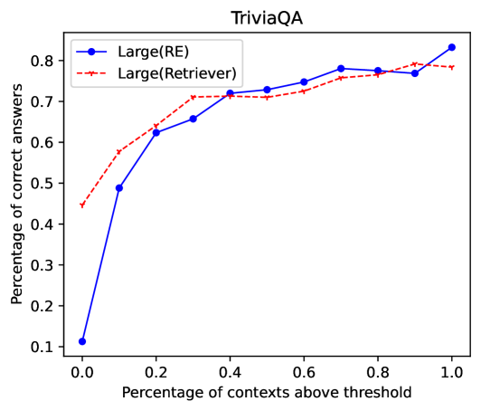
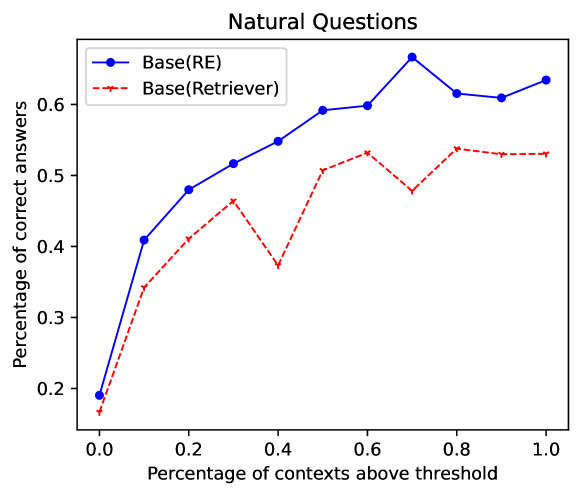
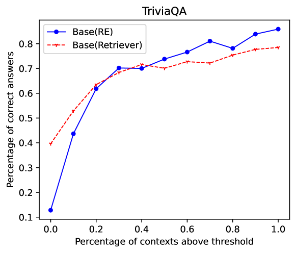

# RE-RAG：借助检索增强生成中的相关性估计器，提升开放域问答的性能与可解释性

发布时间：2024年06月09日

`RAG

理由：这篇论文主要讨论了检索增强生成（RAG）框架的改进，即引入了明确的上下文相关性估计器（RE）来提高RAG系统的性能。论文中提到的RE-RAG框架是对现有RAG框架的增强，通过无监督学习方法训练的RE来重新评估和筛选上下文信息，从而提高系统性能和可解释性。这与RAG框架的核心目标和应用紧密相关，因此归类为RAG。` `问答系统`

> RE-RAG: Improving Open-Domain QA Performance and Interpretability with Relevance Estimator in Retrieval-Augmented Generation

# 摘要

> 检索增强生成（RAG）框架借助外部知识，在开放领域问答任务中表现卓越。但当面对低相关性上下文或错误评估上下文相关性时，RAG系统性能会受影响。为此，我们提出了RE-RAG框架，引入了一个明确的上下文相关性估计器（RE）。RE-RAG通过RE重新评估上下文，筛选出更相关的信息并传递给生成器。我们采用无监督学习方法训练RE，无需依赖标记文档排名数据。在Natural Questions和TriviaQA数据集上的测试表明，RE-RAG在减少上下文使用（仅为0.25倍）的同时，性能与FiD变体相当。此外，我们发现用T5模型训练的RE同样能提升RAG与LLMs（如ChatGPT）的性能，分别在NQ和TQA上提升了6.4EM和2.8EM。RE的引入还增强了RAG的可解释性，其得分与系统准确性高度相关，能有效识别并过滤掉无法回答的问题，准确率达38.9%-51.3%。

> Retrieval-augmented generation (RAG) frame work is showing state-of-the-art performance on open-domain question answering tasks by referencing external knowledge. However, the RAG system faces challenges with performance degradation when it is fed contexts of low relevance or when the relative relevance among the input contexts is inaccurately assessed. In this work, we propose a RE-RAG framework that injects an explicit context relevance estimator (RE) into the RAG system. RE-RAG re-evaluates the retrieved contexts with the proposed context RE and passes the more relevant contexts along with their measure importance to the generator. To train context RE, we propose an unsupervised learning method, which does not utilize any labeled document ranking data to train the context RE. To examine the efficacy of RE-RAG, we examine its performance on Natural Questions and TriviaQA datasets. RE-RAG achieves on-par performance compared to the FiD variants while utilizing fewer contexts (0.25x). We show that the proposed context RE, which was trained with the T5 model, is also applicable to RAG with LLMs(ChatGPT) by improving the performance on NQ (+6.4EM) and TQA (+2.8EM), respecitvely. Lastly, we display that RE can add interpretability to RAG framework as RE score highly correlates with the RE-RAG accuracy. Consequently, RE can be utilized to filter out unanswerable scenarios where context does not contain answers with 38.9%-51.3% accuracy just by examining a set of retrieved contexts.

[Arxiv](https://arxiv.org/abs/2406.05794)