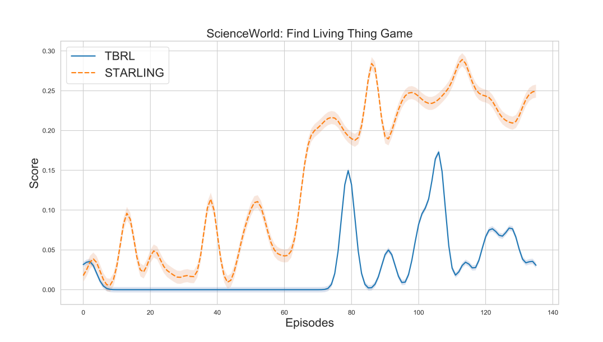

# STARLING：大语言模型驱动下的文本强化学习代理自监督训练

发布时间：2024年06月09日

`Agent

这篇论文主要介绍了STARLING，一个专为文本游戏设计的自监督RL环境，旨在提升基于语言的强化学习代理的泛化能力和性能。论文通过自动化框架生成游戏，以训练RL代理掌握特定技能，并测试其在不同情境下的表现。这表明论文的核心内容是关于开发和应用一个特定的环境来训练和测试RL代理，因此属于Agent分类。`

> STARLING: Self-supervised Training of Text-based Reinforcement Learning Agent with Large Language Models

# 摘要

> 交互式小说游戏已成为提升基于语言的强化学习（RL）代理泛化能力的关键应用。然而，现有环境要么过于特定，要么生成耗时，且未能训练RL代理掌握特定技能。为此，我们推出了STARLING，一个自监督RL的交互环境，专为文本游戏设计，通过自动生成的游戏（源自游戏想法的种子集）提升RL代理的性能与泛化能力，使其达到目标环境的要求。这些游戏让代理在预设任务上精进技艺。我们利用自动化框架（结合GPT-3与Inform7游戏引擎）创建并测试了包含100个游戏的环境，实现了在极少人工干预下生成新游戏。实验结果显示，即便是最先进的文本基础RL代理，在新情境中运用先前技能的能力也远不及人类。这凸显了STARLING作为自监督文本基础RL研究沙盒的巨大潜力。

> Interactive fiction games have emerged as an important application to improve the generalization capabilities of language-based reinforcement learning (RL) agents. Existing environments for interactive fiction games are domain-specific or time-consuming to generate and do not train the RL agents to master a specific set of skills. In this work, we introduce an interactive environment for self-supervised RL, STARLING, for text-based games that bootstraps the text-based RL agents with automatically generated games (based on the seed set of game ideas) to boost the performance and generalization capabilities to reach a goal of the target environment. These games let the agent hone their skills on a predefined set of tasks. We create and test an environment with 100 games, generated using this automated framework that uses large language models (GPT-3) and an interactive fiction game engine (based on Inform7) to provide the user with the ability to generate more games under minimal human supervision. Experimental results based on both the human participants and baseline text-based RL agents reveal that current state-of-the-art text-based RL agents cannot use previously learned skills in new situations at the level humans can. These results enforce STARLING's potential to serve as a sandbox environment for further research in self-supervised text-based RL.

[Arxiv](https://arxiv.org/abs/2406.05872)