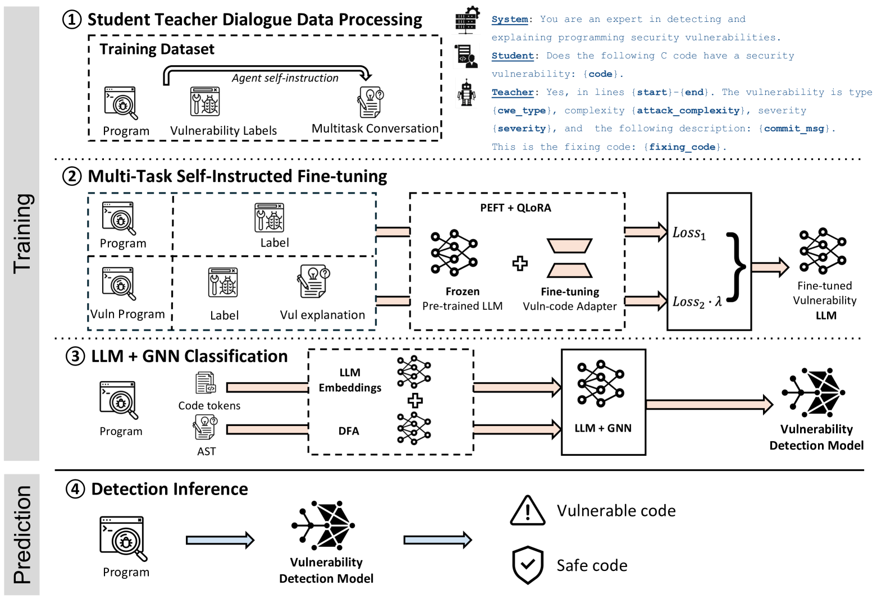
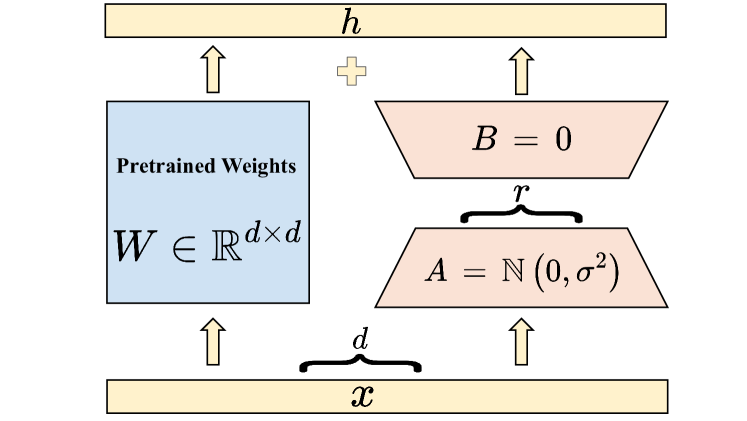
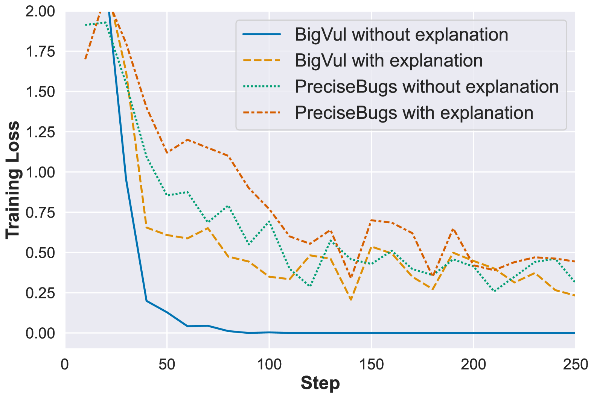

# 利用大型语言模型进行多任务自指导微调以检测安全漏洞

发布时间：2024年06月09日

`LLM应用

这篇论文主要探讨了如何利用大型语言模型（LLM）和图神经网络（GNNs）结合的方法来提高软件安全漏洞检测的准确性。论文中提出的MSIVD系统通过多任务自我指导微调，结合了代码令牌和程序控制流图的信息，以实现更高效的漏洞检测。这种方法在实际数据集上的表现优于现有的LLM基线漏洞检测器，显示了其在实际应用中的潜力。因此，这篇论文属于LLM应用类别，因为它关注的是LLM在特定领域（即软件安全漏洞检测）的应用和改进。` `软件安全` `漏洞检测`

> Security Vulnerability Detection with Multitask Self-Instructed Fine-Tuning of Large Language Models

# 摘要

> 软件安全漏洞为攻击者提供了破坏软件操作的机会。基于Transformer的语言模型近期在漏洞检测领域取得了突破，超越了传统的基于静态分析的深度学习模型。然而，仅依赖代码令牌训练的语言模型未能捕捉到漏洞类型解释及代码数据流结构，这两者对精准检测至关重要。我们提出了一种创新方法，结合多任务序列到序列的大型语言模型与编码为图神经网络的程序控制流图，以实现高效的序列到分类漏洞检测。我们开发的MSIVD系统，通过多任务自我指导微调，灵感源自思维链提示与LLM自我指导，实验证明其在BigVul数据集上F1分数高达0.92，在PreciseBugs数据集上达到0.48，显著优于现有的LLM基线漏洞检测器（LineVul）。通过整合代码与脆弱程序的解释性指标，同时训练LLMs与GNNs，MSIVD展现了推广至未知数据的前景，为LLM基漏洞检测开辟了新方向。鉴于这些成果，我们强调了构建新标记安全漏洞数据集的紧迫性，因为现有LLMs可能已接触或记忆了过往数据集的评估数据。

> Software security vulnerabilities allow attackers to perform malicious activities to disrupt software operations. Recent Transformer-based language models have significantly advanced vulnerability detection, surpassing the capabilities of static analysis based deep learning models. However, language models trained solely on code tokens do not capture either the explanation of vulnerability type or the data flow structure information of code, both of which are crucial for vulnerability detection. We propose a novel technique that integrates a multitask sequence-to-sequence LLM with pro-gram control flow graphs encoded as a graph neural network to achieve sequence-to-classification vulnerability detection. We introduce MSIVD, multitask self-instructed fine-tuning for vulnerability detection, inspired by chain-of-thought prompting and LLM self-instruction. Our experiments demonstrate that MSIVD achieves superior performance, outperforming the highest LLM-based vulnerability detector baseline (LineVul), with a F1 score of 0.92 on the BigVul dataset, and 0.48 on the PreciseBugs dataset. By training LLMs and GNNs simultaneously using a combination of code and explanatory metrics of a vulnerable program, MSIVD represents a promising direction for advancing LLM-based vulnerability detection that generalizes to unseen data. Based on our findings, we further discuss the necessity for new labelled security vulnerability datasets, as recent LLMs have seen or memorized prior datasets' held-out evaluation data.

[Arxiv](https://arxiv.org/abs/2406.05892)