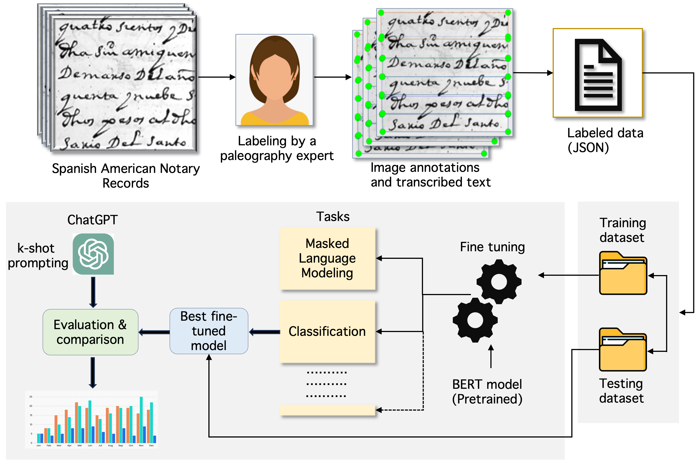

# 利用十七世纪西班牙美洲的公证记录，微调西班牙大型语言模型，以提升其性能。

发布时间：2024年06月09日

`LLM应用

这篇论文主要介绍了针对西班牙语的大型语言模型（LLM）进行微调的资源和方法，特别是在处理历史文本数据集方面的应用。论文中提到的资源包括来自阿根廷国家档案馆的17世纪手写公证记录，这些记录被用于微调西班牙语LLM，以提升特定任务如分类和掩码语言建模的性能。这种微调方法和资源的开发，直接应用于改进LLM在特定语言和领域的表现，属于LLM应用的范畴。` `历史文本分析` `语言模型微调`

> Seventeenth-Century Spanish American Notary Records for Fine-Tuning Spanish Large Language Models

# 摘要

> 大型语言模型在多个领域如电子商务、金融、医疗保健和教育中广受欢迎。微调是定制LLM以适应特定领域数据集和下游任务的常用方法。本文介绍了一个针对西班牙语LLM进行微调的宝贵资源，涵盖了分类、掩码语言建模、聚类等多种任务。该资源包含来自阿根廷国家档案馆的17世纪手写公证记录，由两位公证人Estenban Agreda de Vergara和Nicolas de Valdivia y Brisuela在近400年前手写，共计160多页的原始图像和转录文本（及元数据）。实证评估显示，这些记录可用于微调西班牙语LLM，提升分类和掩码语言建模等任务的性能，超越现有预训练模型和ChatGPT-3.5/ChatGPT-4o。此资源对历史文本分析极为重要，已在GitHub上公开。

> Large language models have gained tremendous popularity in domains such as e-commerce, finance, healthcare, and education. Fine-tuning is a common approach to customize an LLM on a domain-specific dataset for a desired downstream task. In this paper, we present a valuable resource for fine-tuning LLMs developed for the Spanish language to perform a variety of tasks such as classification, masked language modeling, clustering, and others. Our resource is a collection of handwritten notary records from the seventeenth century obtained from the National Archives of Argentina. This collection contains a combination of original images and transcribed text (and metadata) of 160+ pages that were handwritten by two notaries, namely, Estenban Agreda de Vergara and Nicolas de Valdivia y Brisuela nearly 400 years ago. Through empirical evaluation, we demonstrate that our collection can be used to fine-tune Spanish LLMs for tasks such as classification and masked language modeling, and can outperform pre-trained Spanish models and ChatGPT-3.5/ChatGPT-4o. Our resource will be an invaluable resource for historical text analysis and is publicly available on GitHub.

[Arxiv](https://arxiv.org/abs/2406.05812)