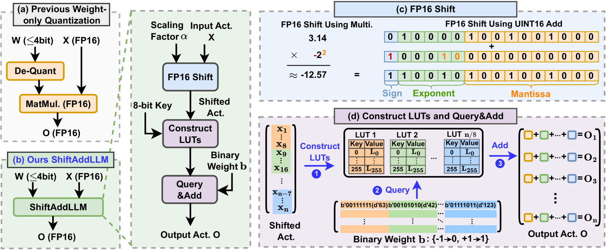
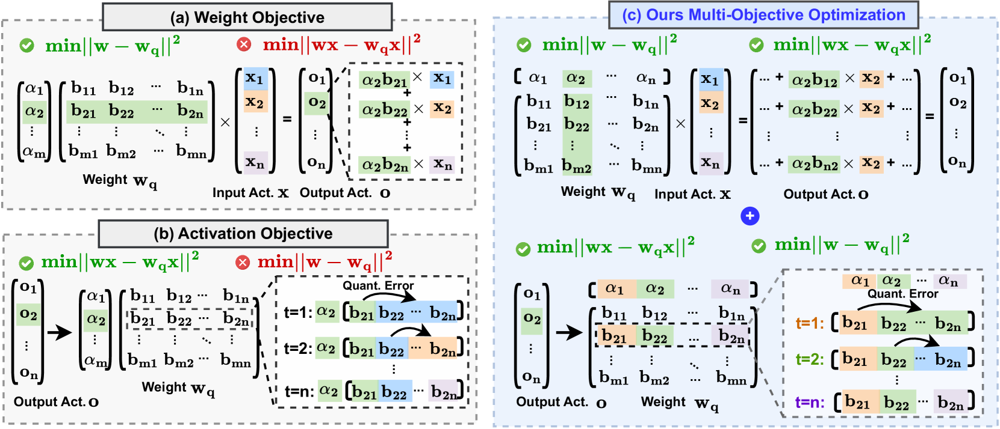
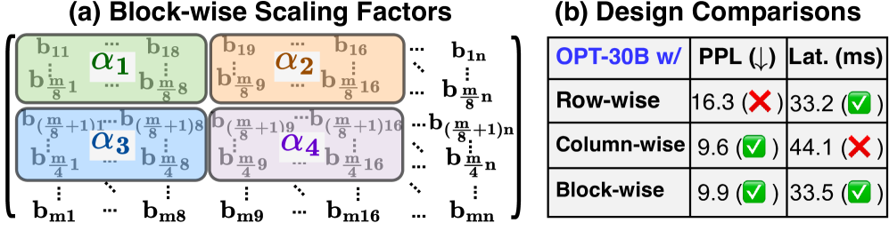
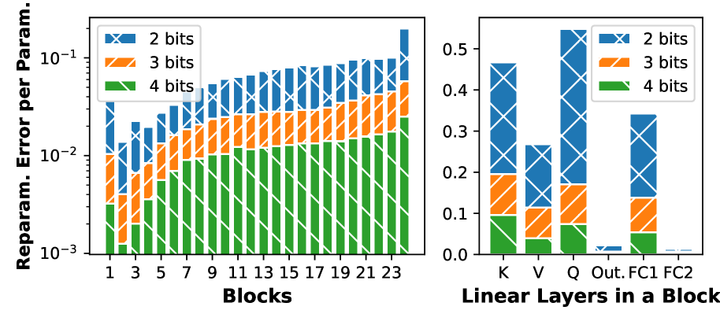
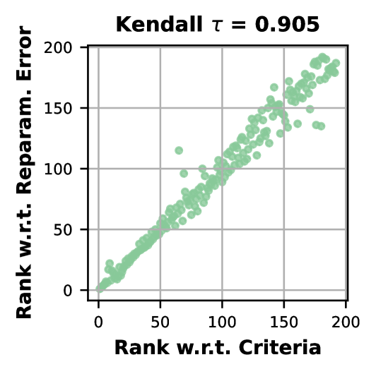
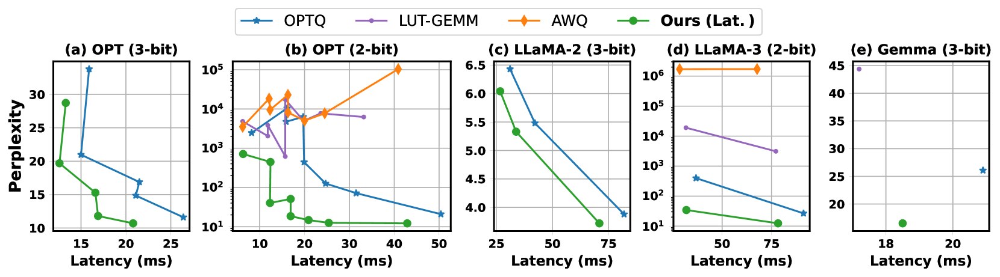
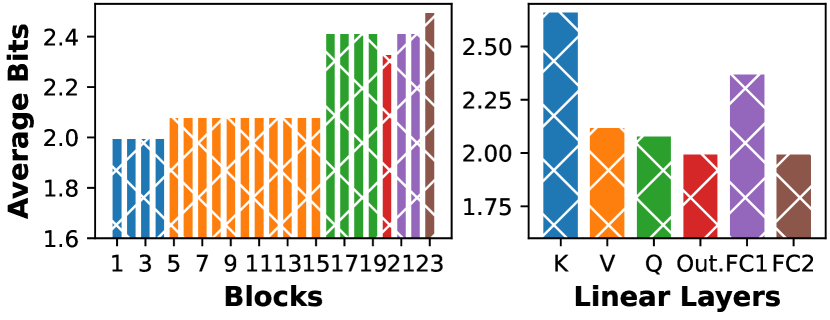
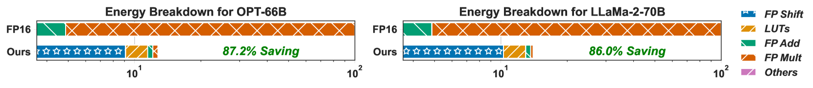

# ShiftAddLLM：借助后训练乘法无关重参数化，加速预训练大型语言模型

发布时间：2024年06月09日

`LLM应用

这篇论文主要探讨了大型语言模型（LLMs）在资源受限设备上的部署问题，并提出了一种名为ShiftAddLLM的高效免乘法模型。通过使用Shift-and-add重参数化技术，该论文解决了LLMs在内存和延迟方面的挑战，同时保持了模型的性能。这种方法特别适用于资源受限的环境，因此属于LLM应用类别。` `移动设备` `模型优化`

> ShiftAddLLM: Accelerating Pretrained LLMs via Post-Training Multiplication-Less Reparameterization

# 摘要

> 大型语言模型（LLMs）在语言任务上表现卓越，但因其庞大的参数和密集乘法需求，在资源受限设备上的部署面临挑战，导致内存需求激增和延迟问题。Shift-and-add重参数化技术提供了一种创新解决方案，通过在LLM的注意力和MLP层中用硬件友好的操作替换昂贵的乘法。尽管如此，现有的重参数化方法需要耗费大量资源的重新训练或全面微调。为此，我们提出了一种后训练的Shift-and-add重参数化方法，以加速预训练的LLMs，并创建了名为ShiftAddLLM的高效免乘法模型。我们通过将权重矩阵量化为二进制矩阵并配以分组缩放因子，将乘法操作转化为移位和加法。为了保持准确性，我们采用了多目标优化策略，最小化重参数化过程中的误差。此外，我们还开发了一种自动位分配策略，根据各层对重参数化的敏感性差异，进一步优化内存和延迟。实验结果显示，ShiftAddLLM在五个LLM家族和八个任务上均表现出色，与同类量化LLMs相比，在保持或降低延迟的同时，困惑度分别提升了5.6和22.7点，且内存和能源消耗减少了超过80%。相关代码和模型已公开在https://github.com/GATECH-EIC/ShiftAddLLM。

> Large language models (LLMs) have shown impressive performance on language tasks but face challenges when deployed on resource-constrained devices due to their extensive parameters and reliance on dense multiplications, resulting in high memory demands and latency bottlenecks. Shift-and-add reparameterization offers a promising solution by replacing costly multiplications with hardware-friendly primitives in both the attention and multi-layer perceptron (MLP) layers of an LLM. However, current reparameterization techniques require training from scratch or full parameter fine-tuning to restore accuracy, which is resource-intensive for LLMs. To address this, we propose accelerating pretrained LLMs through post-training shift-and-add reparameterization, creating efficient multiplication-free models, dubbed ShiftAddLLM. Specifically, we quantize each weight matrix into binary matrices paired with group-wise scaling factors. The associated multiplications are reparameterized into (1) shifts between activations and scaling factors and (2) queries and adds according to the binary matrices. To reduce accuracy loss, we present a multi-objective optimization method to minimize both weight and output activation reparameterization errors. Additionally, based on varying sensitivity across layers to reparameterization, we develop an automated bit allocation strategy to further reduce memory usage and latency. Experiments on five LLM families and eight tasks consistently validate the effectiveness of ShiftAddLLM, achieving average perplexity improvements of 5.6 and 22.7 points at comparable or lower latency compared to the most competitive quantized LLMs at 3 and 2 bits, respectively, and more than 80% memory and energy reductions over the original LLMs. Codes and models are available at https://github.com/GATECH-EIC/ShiftAddLLM.

[Arxiv](https://arxiv.org/abs/2406.05981)