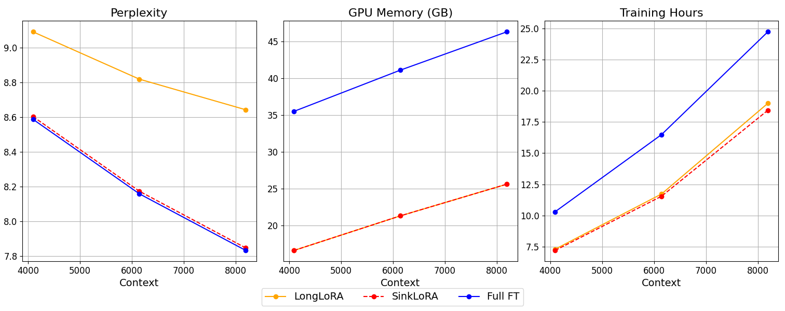
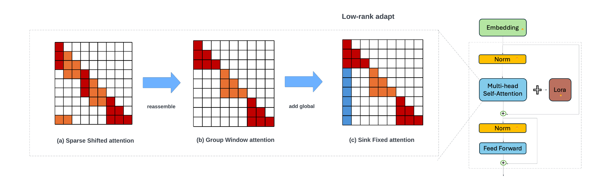
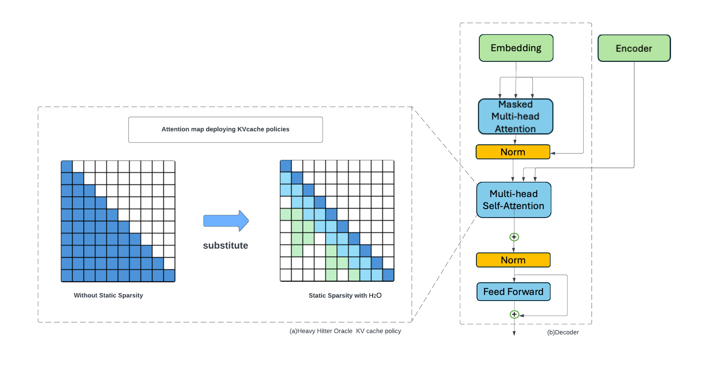
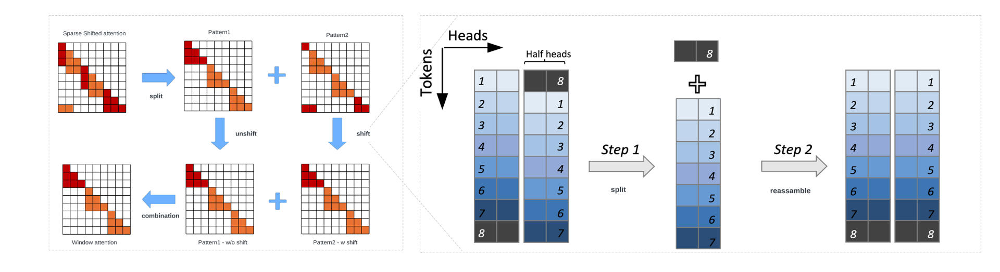
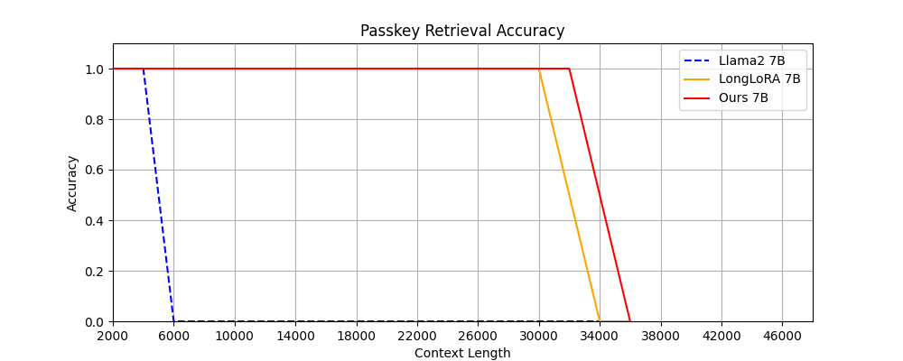
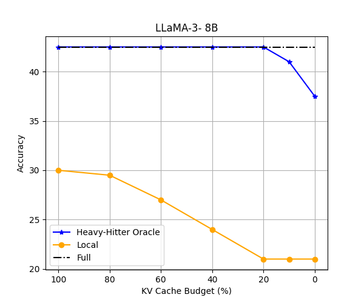
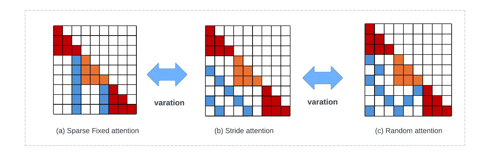
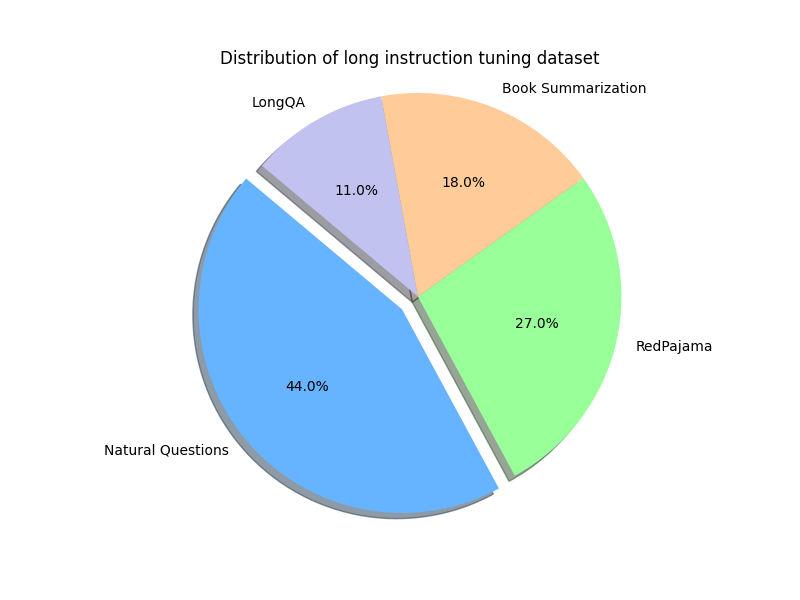
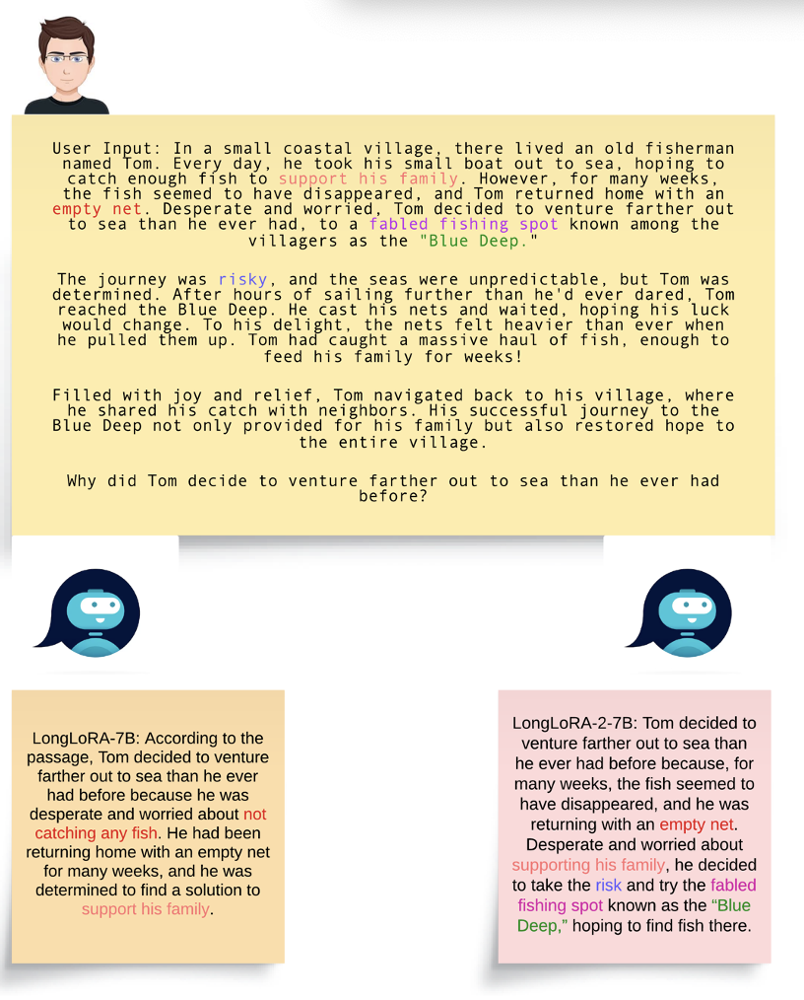

# SinkLoRA：优化长上下文大型语言模型的效率与对话能力

发布时间：2024年06月09日

`LLM应用

理由：这篇论文主要关注于扩展Transformer模型以处理更长的序列，并提出了新的方法（SinkLoRA）来优化这一过程。这涉及到具体的模型改进和应用，如聊天机器人、代码生成和多媒体创作等，这些都是大型语言模型（LLM）的实际应用场景。因此，这篇论文更适合归类于LLM应用。` `聊天机器人` `多媒体创作`

> SinkLoRA: Enhanced Efficiency and Chat Capabilities for Long-Context Large Language Models

# 摘要

> 扩展Transformer以处理更长序列已成为关键挑战，这不仅关乎提升如语言翻译和长上下文处理等任务，还涉及开启聊天机器人、代码生成及多媒体创作等新应用。自注意力机制的计算和内存需求随序列长度二次增长，成为主要障碍。LongLoRA通过移位稀疏注意力（S\(^2\)-Attn）有效延长了上下文，虽节省了计算资源，但效率仍不及普通注意力，仅达到全注意力改进的39%。这源于不同注意力头模式中的循环移位，导致结构混乱或不必要的信息交换。为此，我们推出了**SinkLoRA**，通过优化工作分区解决此问题。我们开发了SF-Attn，利用分割重组算法恢复注意力头至原始状态，并引入“sink注意力令牌”的全局注意力，微调后达到全注意力改进的92%。同时，采用SOTA KV缓存压缩算法H$_2$O加速推理。我们还利用自收集的LongAlpaca-plus数据集对SinkLoRA进行了监督微调。所有资源，包括代码、模型、数据集和演示，均已公开于\url{https://github.com/Dexter-GT-86/SinkLoRA}。

> Extending the functionality of the Transformer model to accommodate longer sequence lengths has become a critical challenge. This extension is crucial not only for improving tasks such as language translation and long-context processing but also for enabling novel applications like chatbots, code generation, and multimedia content creation. The primary obstacle is the self-attention mechanism, which scales quadratically with sequence length in terms of computation time and memory requirements. LongLoRA proposed shifted sparse attention (S\(^2\)-Attn), effectively enabling context extension and leading to non-trivial computation savings with similar performance to fine-tuning with vanilla attention. However, LongLoRA is still not as efficient as vanilla attention, reaching only 39\% of the perplexity improvement compared to full attention. This inefficiency is due to the cyclic shift applied within different attention head patterns, causing either chaos in the attention head structure or unnecessary information exchange between token groups. To address these issues, We propose \textbf{SinkLoRA}, which features better work partitioning. Specifically, (1) we developed SF-Attn with a segmentation and reassembly algorithm to proportionally return cyclically shifted groups of attention heads to their un-shifted state together with global attention of "sink attention tokens", achieving 92\% of the perplexity improvement compared to full attention after fine tuning, and (2) applied a SOTA KV cache compression algorithm H$_2$O to accelerate inference. Furthermore, We conducted supervised fine-tuning with SinkLoRA using a self collected LongAlpaca-plus dataset. All our code, models, datasets, and demos are available at \url{https://github.com/Dexter-GT-86/SinkLoRA}.

[Arxiv](https://arxiv.org/abs/2406.05678)