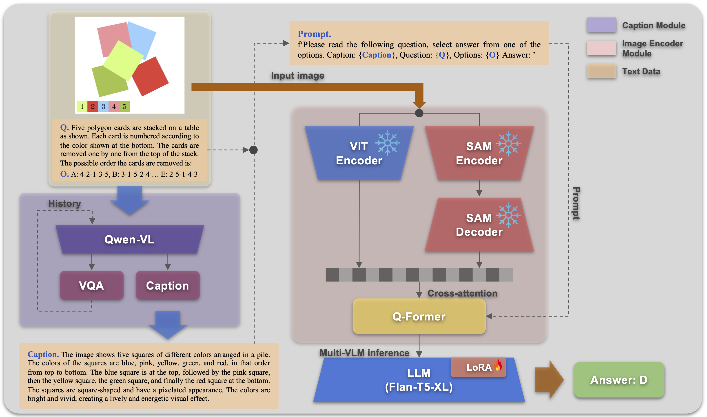
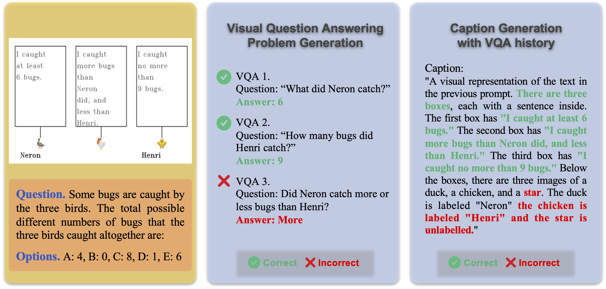
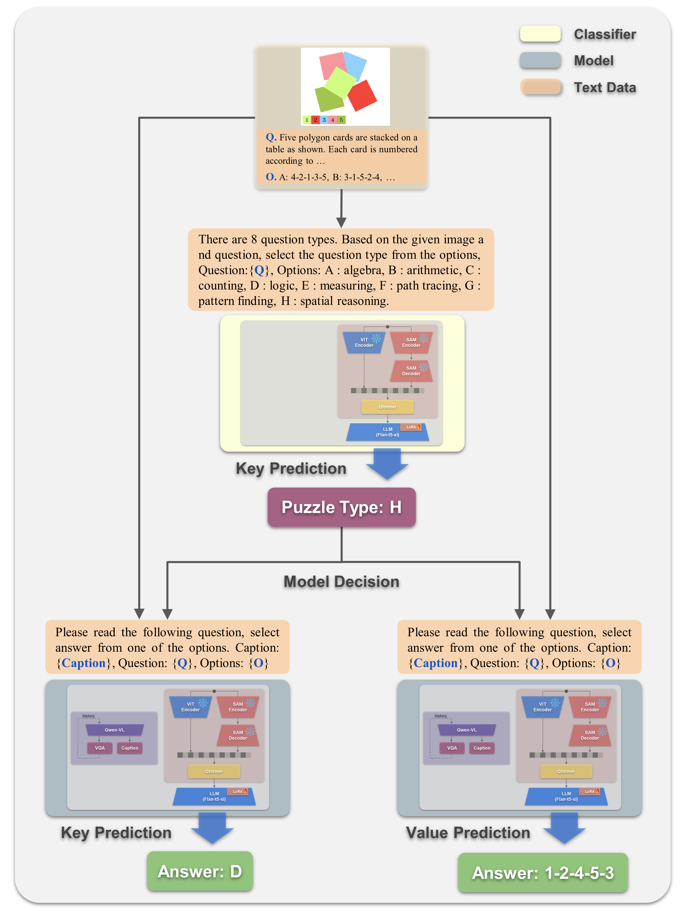

# CVPR 2024 多模态算法推理 SMART-101 挑战解决方案

发布时间：2024年06月09日

`Agent

理由：这篇论文描述了一个具体的解决方案，该方案利用大型语言模型（LLM）和特定的算法（如SAM）来解决一个多模态算法推理任务。这个解决方案更像是一个智能代理（Agent）的行为，因为它涉及到对环境的感知（通过图像视觉线索）和决策（通过LLM的推理能力），以完成特定的任务（解决视觉语言谜题）。这与Agent的定义相符，即一个能够感知环境并采取行动以达到目标的系统。因此，这篇论文更适合归类为Agent。` `计算机视觉`

> Solution for SMART-101 Challenge of CVPR Multi-modal Algorithmic Reasoning Task 2024

# 摘要

> 本文展示了HYU MLLAB KT团队在CVPR 2024 SMART-101挑战中，针对多模态算法推理任务的解决方案。该挑战超越了常规的视觉问答，旨在通过解决专为6至8岁儿童设计的复杂视觉语言谜题，达到人类级别的多模态理解。我们的策略包括：首先，利用大型语言模型（LLM）的推理能力，将图像视觉线索转化为详细的文本描述，以此作为LLM的输入；其次，鉴于谜题图像中常含多种几何视觉模式，我们运用SAM算法进行对象检测，确保这些模式在文本描述中不被忽视。通过这种方法，我们在测试集上达到了29.5%的选项选择准确率，在挑战集上达到了27.1%的加权选项选择准确率。

> In this paper, the solution of HYU MLLAB KT Team to the Multimodal Algorithmic Reasoning Task: SMART-101 CVPR 2024 Challenge is presented. Beyond conventional visual question-answering problems, the SMART-101 challenge aims to achieve human-level multimodal understanding by tackling complex visio-linguistic puzzles designed for children in the 6-8 age group. To solve this problem, we suggest two main ideas. First, to utilize the reasoning ability of a large-scale language model (LLM), the given visual cues (images) are grounded in the text modality. For this purpose, we generate highly detailed text captions that describe the context of the image and use these captions as input for the LLM. Second, due to the nature of puzzle images, which often contain various geometric visual patterns, we utilize an object detection algorithm to ensure these patterns are not overlooked in the captioning process. We employed the SAM algorithm, which can detect various-size objects, to capture the visual features of these geometric patterns and used this information as input for the LLM. Under the puzzle split configuration, we achieved an option selection accuracy Oacc of 29.5 on the test set and a weighted option selection accuracy (WOSA) of 27.1 on the challenge set.

[Arxiv](https://arxiv.org/abs/2406.05963)