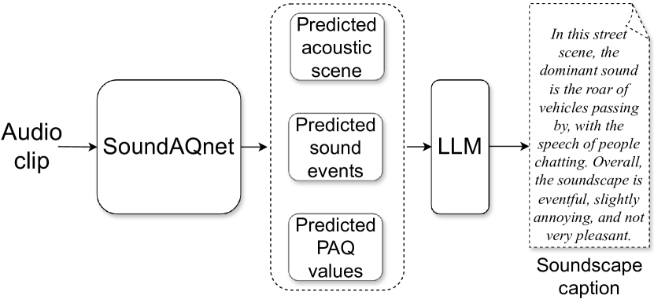
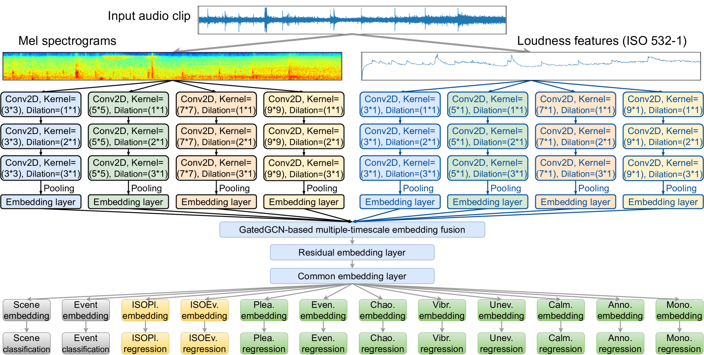
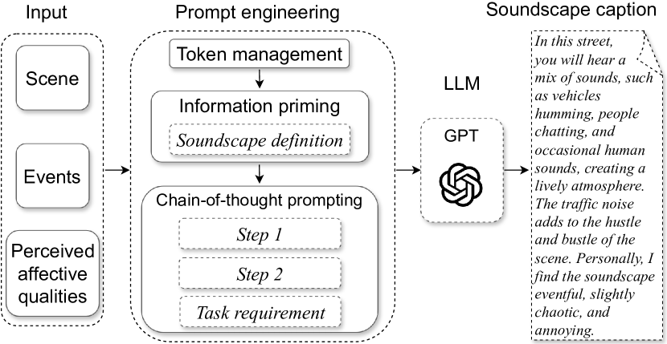
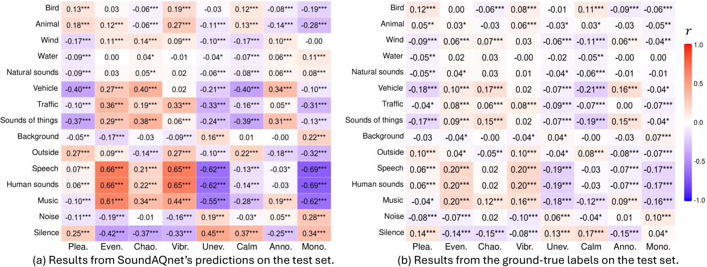
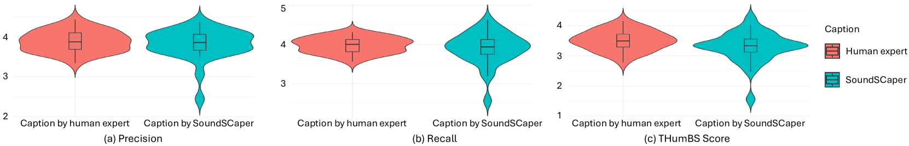
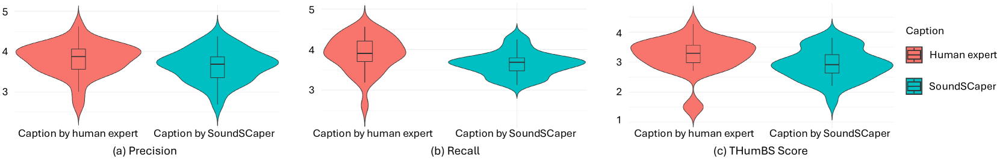

# 借助声音情感质量网络与大语言模型，实现声音场景的情感化标注

发布时间：2024年06月09日

`LLM应用

这篇论文介绍了一个名为SoundSCaper的自动声景字幕生成器，它结合了声学模型SoundAQnet和大型语言模型（LLM）来生成情境感知的声景描述。这个系统通过捕捉声学场景、事件及人类情感反应，将这些信息转化为语言描述。因此，这项工作属于LLM的应用范畴，因为它展示了如何将LLM用于特定的任务——声景字幕生成。` `情感分析`

> Soundscape Captioning using Sound Affective Quality Network and Large Language Model

# 摘要

> 我们身处一个声学丰富多变的世界，这个世界的声景由个人或社区共同体验。计算听觉场景分析专注于声音的客观属性，如类别和时间特性，却忽视了声音对人的情感影响及其在特定情境中的情感联系。为了弥补这一缺失，并实现声景分析的自动化，我们提出了声景字幕（SoundSCap）任务。该任务通过捕捉声学场景、事件及人类情感反应，生成情境感知的声景描述。我们开发了自动声景字幕生成器（SoundSCaper），它结合了声学模型SoundAQnet和大型语言模型（LLM）。SoundAQnet能同时处理声学场景、事件和情感的多尺度信息，而LLM则将这些信息转化为通用的语言描述。由16位音频/声景专家组成的评审团评估显示，SoundSCaper生成的字幕虽略逊于专家作品，但差异不显著，展现出良好的前景。所有模型资源、评估数据及统计均已公开。

> We live in a rich and varied acoustic world, which is experienced by individuals or communities as a soundscape. Computational auditory scene analysis, disentangling acoustic scenes by detecting and classifying events, focuses on objective attributes of sounds, such as their category and temporal characteristics, ignoring the effect of sounds on people and failing to explore the relationship between sounds and the emotions they evoke within a context. To fill this gap and to automate soundscape analysis, which traditionally relies on labour-intensive subjective ratings and surveys, we propose the soundscape captioning (SoundSCap) task. SoundSCap generates context-aware soundscape descriptions by capturing the acoustic scene, event information, and the corresponding human affective qualities. To this end, we propose an automatic soundscape captioner (SoundSCaper) composed of an acoustic model, SoundAQnet, and a general large language model (LLM). SoundAQnet simultaneously models multi-scale information about acoustic scenes, events, and perceived affective qualities, while LLM generates soundscape captions by parsing the information captured by SoundAQnet to a common language. The soundscape caption's quality is assessed by a jury of 16 audio/soundscape experts. The average score (out of 5) of SoundSCaper-generated captions is lower than the score of captions generated by two soundscape experts by 0.21 and 0.25, respectively, on the evaluation set and the model-unknown mixed external dataset with varying lengths and acoustic properties, but the differences are not statistically significant. Overall, SoundSCaper-generated captions show promising performance compared to captions annotated by soundscape experts. The models' code, LLM scripts, human assessment data and instructions, and expert evaluation statistics are all publicly available.

[Arxiv](https://arxiv.org/abs/2406.05914)