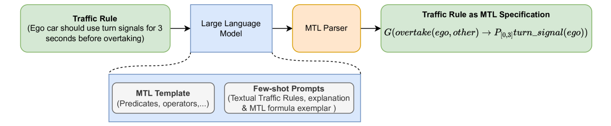
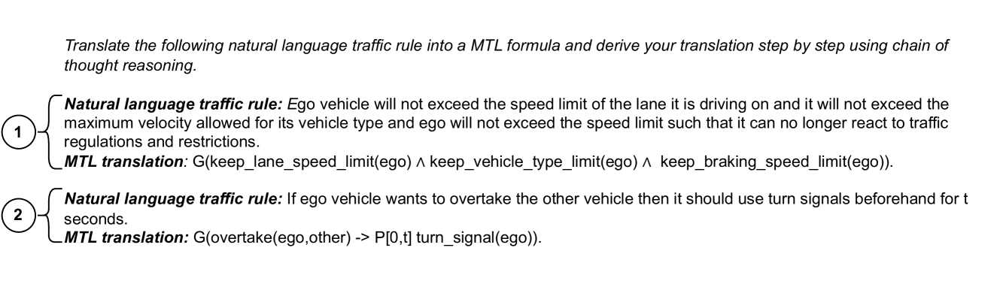
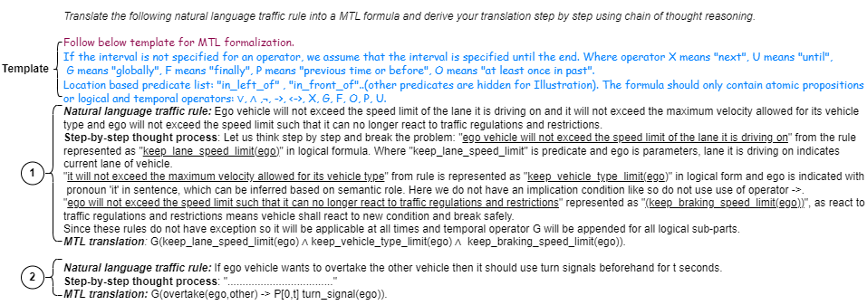
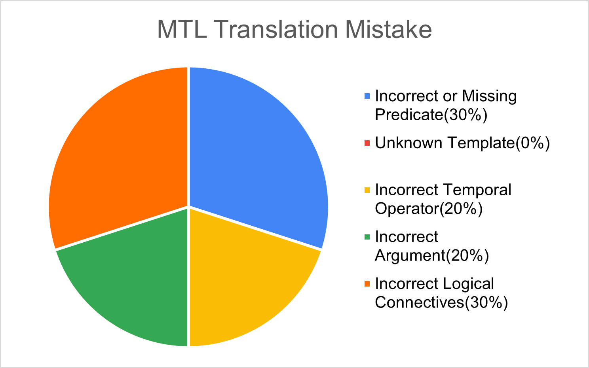

# TR2MTL：利用大型语言模型构建的交通规则度量时间逻辑形式化框架

发布时间：2024年06月09日

`LLM应用

这篇论文介绍了一种利用大型语言模型（LLM）来自动化将交通规则转换为形式规范的方法，即TR2MTL框架。这种方法通过使用LLM来生成度量时间逻辑（MTL）公式，从而简化了将自然语言交通规则转换为形式化规范的过程。这种方法的应用性质明显，因为它直接利用LLM来解决实际问题，即自动驾驶车辆的安全验证。因此，这篇论文应归类为LLM应用。` `自动驾驶` `交通规则`

> TR2MTL: LLM based framework for Metric Temporal Logic Formalization of Traffic Rules

# 摘要

> 交通规则的形式化对于自动驾驶车辆的安全验证至关重要。然而，将自然语言规则转化为形式规范的传统方法受限于专业知识的需求。本文提出的TR2MTL框架，利用大型语言模型自动将交通规则转换为度量时间逻辑，为人机协作的自动驾驶规则形式化提供了一种新途径。该框架通过链式思维的上下文学习，引导模型逐步生成准确且语法正确的MTL公式，并能适应多种时间逻辑和规则。我们在一个多源的挑战性数据集上测试了TR2MTL，并与采用不同上下文学习策略的模型进行了比较。结果显示，TR2MTL不仅准确度高，且具有出色的泛化能力，即使在数据量有限的情况下也能有效预测逻辑和语义结构多变的交通规则公式。

> Traffic rules formalization is crucial for verifying the compliance and safety of autonomous vehicles (AVs). However, manual translation of natural language traffic rules as formal specification requires domain knowledge and logic expertise, which limits its adaptation. This paper introduces TR2MTL, a framework that employs large language models (LLMs) to automatically translate traffic rules (TR) into metric temporal logic (MTL). It is envisioned as a human-in-loop system for AV rule formalization. It utilizes a chain-of-thought in-context learning approach to guide the LLM in step-by-step translation and generating valid and grammatically correct MTL formulas. It can be extended to various forms of temporal logic and rules. We evaluated the framework on a challenging dataset of traffic rules we created from various sources and compared it against LLMs using different in-context learning methods. Results show that TR2MTL is domain-agnostic, achieving high accuracy and generalization capability even with a small dataset. Moreover, the method effectively predicts formulas with varying degrees of logical and semantic structure in unstructured traffic rules.

[Arxiv](https://arxiv.org/abs/2406.05709)