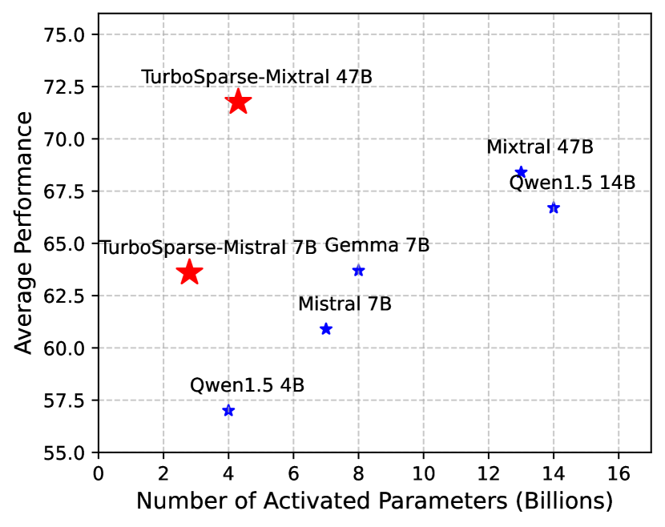
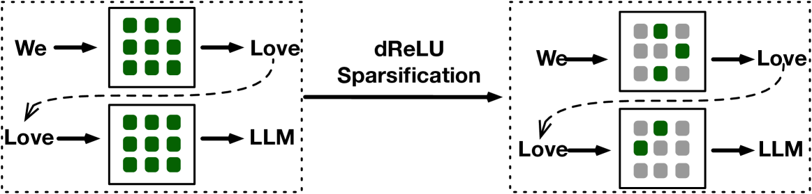
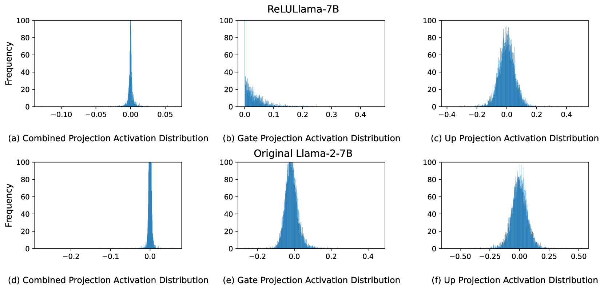
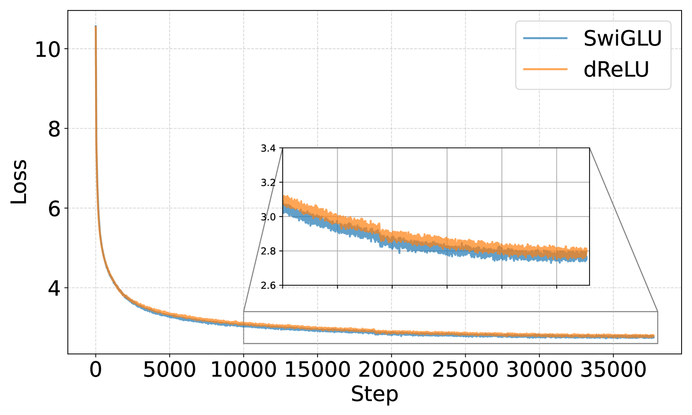
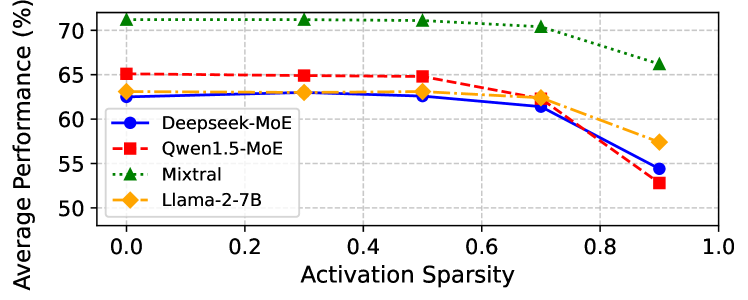
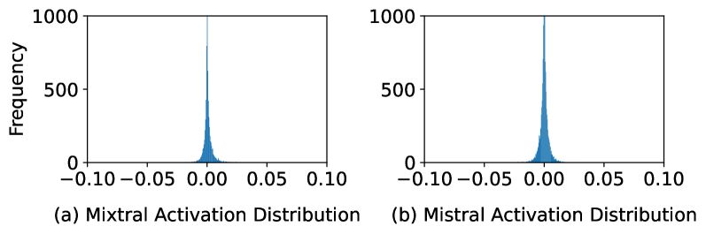
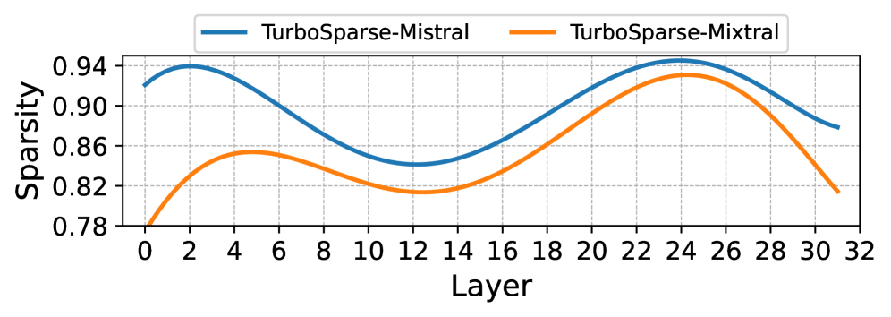
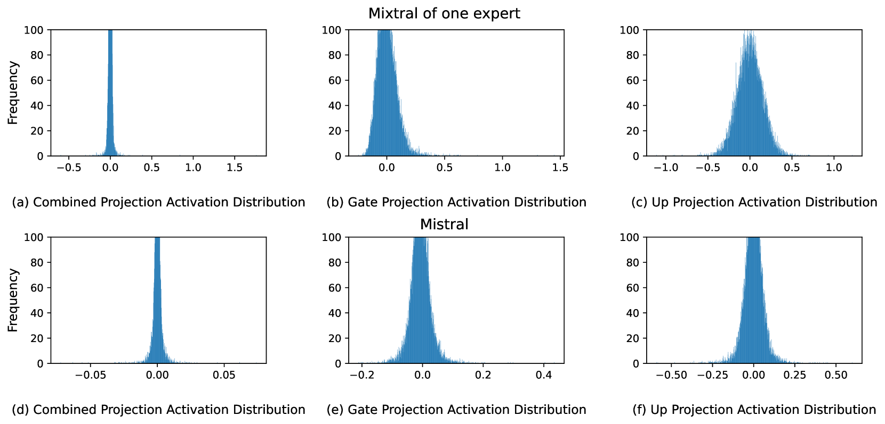

# Turbo Sparse：以精简激活参数，问鼎LLM性能巅峰

发布时间：2024年06月09日

`LLM应用

理由：这篇论文主要探讨了如何通过激活稀疏性来提升大型语言模型（LLMs）的推理速度，并介绍了一种新的dReLU函数以及混合专家（MoE）模型的应用，这些都是针对LLM的实际应用技术改进。论文中提到的技术和方法直接应用于现有的LLM模型（如Mistral和Mixtral），以提高其性能和效率，因此属于LLM应用类别。` `移动设备` `人工智能`

> Turbo Sparse: Achieving LLM SOTA Performance with Minimal Activated Parameters

# 摘要

> 通过利用激活稀疏性，我们可以在不损害性能的前提下，显著提升大型语言模型（LLMs）的推理速度。尽管激活稀疏性受激活函数影响，但常见的SwiGLU和GeGLU等函数稀疏性不足。直接替换为ReLU也无法达到理想的稀疏效果。此外，训练数据不足还可能加剧性能下降的风险。为此，我们开发了一种创新的dReLU函数，旨在增强LLM的激活稀疏性，并搭配高质量的训练数据混合比例，以实现更有效的稀疏化。我们还借助混合专家（MoE）模型中前馈网络（FFN）专家的稀疏激活模式，进一步提升效率。应用我们的神经元稀疏化技术于Mistral和Mixtral模型，每次推理迭代分别激活25亿和43亿参数，同时模型性能更上一层楼。评估表明，这种稀疏性带来了2-5倍的解码速度提升。特别地，在移动设备上，TurboSparse-Mixtral-47B实现了每秒11个令牌的推理速度。我们的模型现已开放，详情请访问\url{https://huggingface.co/PowerInfer}。

> Exploiting activation sparsity is a promising approach to significantly accelerating the inference process of large language models (LLMs) without compromising performance. However, activation sparsity is determined by activation functions, and commonly used ones like SwiGLU and GeGLU exhibit limited sparsity. Simply replacing these functions with ReLU fails to achieve sufficient sparsity. Moreover, inadequate training data can further increase the risk of performance degradation. To address these challenges, we propose a novel dReLU function, which is designed to improve LLM activation sparsity, along with a high-quality training data mixture ratio to facilitate effective sparsification. Additionally, we leverage sparse activation patterns within the Feed-Forward Network (FFN) experts of Mixture-of-Experts (MoE) models to further boost efficiency. By applying our neuron sparsification method to the Mistral and Mixtral models, only 2.5 billion and 4.3 billion parameters are activated per inference iteration, respectively, while achieving even more powerful model performance. Evaluation results demonstrate that this sparsity achieves a 2-5x decoding speedup. Remarkably, on mobile phones, our TurboSparse-Mixtral-47B achieves an inference speed of 11 tokens per second. Our models are available at \url{https://huggingface.co/PowerInfer}

[Arxiv](https://arxiv.org/abs/2406.05955)