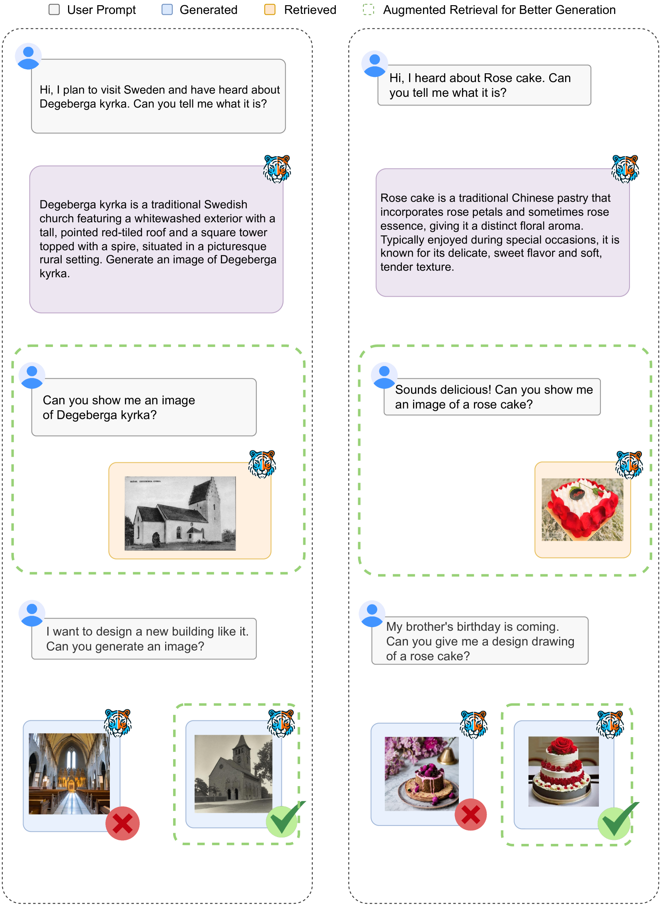

# 文本至图像生成与检索的统一方法

发布时间：2024年06月09日

`RAG

理由：这篇论文探讨了在多模态大型语言模型（MLLMs）框架下，如何结合生成与检索技术来提高图像检索的效率和创意性。文中提出的方法包括利用MLLMs的判别能力进行生成式检索，并通过自回归生成方式整合生成与检索，以及设计一个自主决策模块来选择最佳图像响应。这些内容与检索增强生成（RAG）的概念紧密相关，即通过增强检索过程来改善生成结果。因此，这篇论文最适合归类为RAG。` `图像检索` `多模态学习`

> Unified Text-to-Image Generation and Retrieval

# 摘要

> 人类如何高效获取图像一直是个难题。传统方法依赖数据库进行文本到图像检索，但这些数据库往往缺乏创意。而新兴的文本到图像生成技术虽能创造多样化的视觉内容，但在处理知识密集型图像时仍显不足。本研究在多模态大型语言模型（MLLMs）的框架下，重新审视了生成与检索的关系，并提出了一种结合两者的创新方法。我们首先利用MLLMs的判别能力，开发了一种无需训练的生成式检索技术。接着，通过自回归生成方式整合生成与检索，并设计了一个自主决策模块，以智能选择最佳图像作为文本查询的响应。为了评估这一方法，我们创建了TIGeR-Bench基准，涵盖创意与知识密集型领域。实验结果显示，我们的方法在TIGeR-Bench及Flickr30K、MS-COCO等基准上表现出色，证明了其有效性和优越性。

> How humans can efficiently and effectively acquire images has always been a perennial question. A typical solution is text-to-image retrieval from an existing database given the text query; however, the limited database typically lacks creativity. By contrast, recent breakthroughs in text-to-image generation have made it possible to produce fancy and diverse visual content, but it faces challenges in synthesizing knowledge-intensive images. In this work, we rethink the relationship between text-to-image generation and retrieval and propose a unified framework in the context of Multimodal Large Language Models (MLLMs). Specifically, we first explore the intrinsic discriminative abilities of MLLMs and introduce a generative retrieval method to perform retrieval in a training-free manner. Subsequently, we unify generation and retrieval in an autoregressive generation way and propose an autonomous decision module to choose the best-matched one between generated and retrieved images as the response to the text query. Additionally, we construct a benchmark called TIGeR-Bench, including creative and knowledge-intensive domains, to standardize the evaluation of unified text-to-image generation and retrieval. Extensive experimental results on TIGeR-Bench and two retrieval benchmarks, i.e., Flickr30K and MS-COCO, demonstrate the superiority and effectiveness of our proposed method.

[Arxiv](https://arxiv.org/abs/2406.05814)